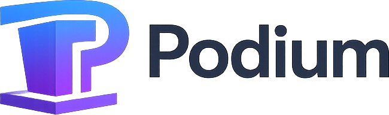

<picture>
  <source media="(prefers-color-scheme: dark)" srcset="brand/podium-logo-horizontal-light.png">
  
</picture>

An open-source alternative to SessionBoard, scoped to the jobs an **AI Engineer–style
conference** actually has to get done — not a full clone.

> Unrelated to podium.com (lead management) and to
> [podium-lib](https://podium-lib.io) (micro-frontends), both of which hold the obvious
> namespaces. The repository is still named `kms`.

Six capabilities:

1. **Multi-step submission forms** — abstracts from speakers, sessions from sponsors
2. **Submitter portal** — track proposals, complete onboarding tasks, manage a public profile
3. **Proposal evaluation** — rubrics, rounds, conflicts of interest, decisions
4. **Onboarding** — define what accepted speakers must do, chase it to completion
5. **Public schedule** — an embeddable, versioned, cacheable schedule for the marketing site
6. **APIs and webhooks** — integrate with everything else

Built for Cloudflare, with email and other providers attached as plugins behind capability
contracts.

## Status

**Built and running.** Every bounded context in the model is implemented end to end —
domain rules, repository layer, HTTP surface and UI — with 411 tests, a clean model↔code
drift check, and a seeded conference you can sign into in one command.

What that covers, beyond the six capabilities above: sponsor sessions as first-class
citizens with countable entitlements, an event roster, content approval and revision
history, assisted placement, campaigns and an auditable outbox, bulk import and export, and
a cross-event speaker directory.

The domain model is the specification, and code implements it. Read it first:

→ **[`docs/domain/`](docs/domain/README.md)**

Start with [`00-overview.md`](docs/domain/00-overview.md) for the jobs to be done, the
bounded contexts and the master ERD. Every open question is resolved — the decisions and
their reasoning are in [`13-open-questions.md`](docs/domain/13-open-questions.md), together
with the corrections that building it surfaced. The shape the code took is described in
[`docs/implementation.md`](docs/implementation.md).

## Running it locally

```bash
npm install
npm run dev          # resets local D1, applies migrations, seeds, starts on :8787,
                     # and publishes the seeded schedule so the public pages have content
```

`npm run dev:lan` binds `0.0.0.0` to test from another machine, setting `PUBLIC_BASE_URL`
to the LAN address so that invitation links and portal URLs in rendered messages point
somewhere the other machine can actually reach. `node scripts/dev.mjs --no-reset` keeps
whatever you have already entered.

The seed ships one live event mid-flight — DevFlow Conf 2027, with proposals in every state,
a review round with real scores, accepted sessions with onboarding under way, and a placed
agenda — plus an archived prior edition so the cross-event speaker directory has something
to say. An empty shell teaches you nothing about whether the product works.

Sign in with any of these ([R23](docs/domain/13-open-questions.md): password login is on in
the shipped seed, because a deployment nobody can sign into is worse than the marginal risk):

| Persona | Email | Password |
|---|---|---|
| Organizer / program chair | `sbek-organizer@example.com` | `SbekTest!2027-org` |
| Speaker | `sbek-speaker@example.com` | `SbekTest!2027-spk` |
| Second speaker | `sbek-speaker2@example.com` | `SbekTest!2027-spk2` |
| Reviewer | `sbek-reviewer@example.com` | `SbekTest!2027-rev` |

| Surface | Where |
|---|---|
| Public event and schedule | `/e/devflow-conf-2027` |
| Public call for proposals | `/e/devflow-conf-2027/cfp/main` |
| Speaker / submitter portal | `/portal` |
| Reviewer queue | `/review` |
| Organizer admin | `/admin` |
| Embed | `/embed/dfc27-main-sessions` |

One caveat while it is running: `npm run db:seed`, `npm run db:reset` and
`wrangler d1 execute --local` write the same SQLite file the dev server holds open. Stop the
server before running them, or just restart it — `npm run dev` reseeds anyway.

```bash
npm test                  # 411 tests: unit + integration
npm run test:unit         # pure domain, no I/O
npm run test:integration  # real local D1, KV, R2, Queues and Durable Objects
npm run typecheck
npm run drift             # model↔code consistency check; non-zero exit on a defect
node scripts/smoke.mjs    # walk every screen as each persona
```

The integration suite applies every migration from scratch and then exercises the real
bindings: idempotency replay, reaction idempotence on redelivery, PII redaction with and
without `pii:read`, and the Durable Object serialising concurrent placement writes.

## Built on Cloudflare

| Concern | Service |
|---|---|
| API, portal, admin and public site | Workers, one entry, surfaces separated as modules |
| Relational store | D1 behind a repository layer ([R16](docs/domain/13-open-questions.md)) |
| Assets | R2, presigned direct upload — the API never proxies file bytes |
| Published snapshot cache, idempotency replay | KV, keyed on `content_etag` |
| Domain events, webhooks, email | Queues with retry and a dead-letter queue |
| Reminders, sweeps, expiry | Cron Triggers producing queue messages |
| Schedule placement | A Durable Object per event — one writer per schedule |

Everything downstream of a decision is event-driven: `decision.published` creates the
session, which materialises the onboarding tasks, which gate the publication. The wiring is
the reaction map in [`10-domain-events.md`](docs/domain/10-domain-events.md), and every
reaction is idempotent on `DomainEvent.id`, because at-least-once delivery is assumed
everywhere.

## The marketing site

[`www/`](www) is the static site at [podiumstack.com](https://podiumstack.com) — an Astro
build deployed as its own Worker, `podium-www`. It shares this repository with the app and
nothing else: no imports from `packages/`, no bindings, and a separate job in
[`ci.yml`](.github/workflows/ci.yml) that cannot reach the production database. The app runs
at [app.podiumstack.com](https://app.podiumstack.com), and `www/public/_redirects` keeps every
link that pointed at the apex before the split working.

The app does not know either hostname. It reads `PUBLIC_BASE_URL`, which
[`scripts/deploy-config.mjs`](scripts/deploy-config.mjs) sets from `PODIUM_HOSTNAME` at deploy
time — which is what lets the same artifact serve your domain when you self-host.

## Brand

Logos, the web icon set and the usage rules live in [`brand/`](brand/README.md); the contents
of [`brand/web/`](brand/web) are served from both [`public/`](public) and
[`www/public/`](www/public).
