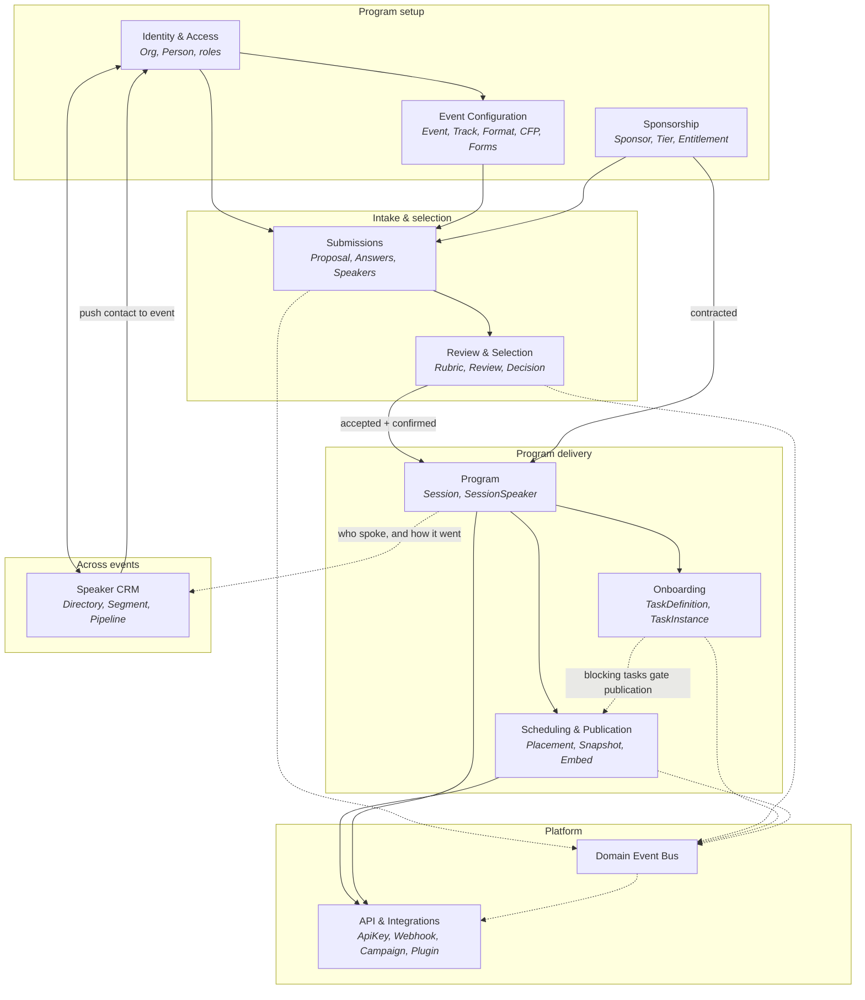
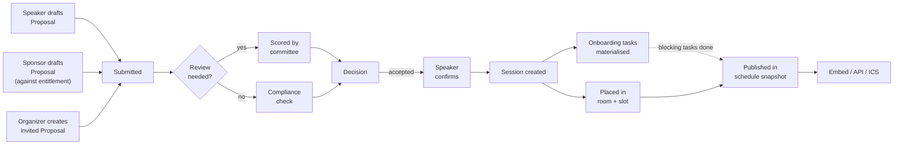

# 00 — Overview

## What this system is for

**BackStage** is an open-source alternative to SessionBoard, scoped deliberately to the jobs
an **AI Engineer–style conference** actually has to get done. It is not a general
event-management suite: there is no ticketing, no badge printing, no expo floor CRM, no
attendee app.

The organising insight is that these conferences run **two parallel intake pipelines that
converge on one program**:

- a **call for proposals** — individual speakers pitching talks and workshops, selected on
  merit by a program committee; and
- a **sponsor session pipeline** — sessions that a sponsor has already paid for as part of
  a package, which are not competing for selection but *do* need content review, the same
  onboarding, and the same slot on the schedule.

Most CFP tools model only the first and bolt the second on as "admin-created talks", which
is why sponsor session wrangling ends up in spreadsheets and email. Here both are first
class and share one downstream program model.

## Jobs to be done

| # | Job | Primary actor | Contexts involved |
|---|---|---|---|
| J1 | Submit a talk abstract through a guided multi-step form, save and resume | Speaker | Submissions, Event Configuration |
| J2 | Submit a contracted session against our sponsorship package | Sponsor contact | Submissions, Sponsorship |
| J3 | See where all my proposals stand, in one place | Submitter | Submissions, Review (read-only) |
| J4 | Keep a speaker profile that appears on the public schedule | Speaker | Identity, Program, Publication |
| J5 | Review and score proposals fairly, without conflicts of interest | Reviewer | Review |
| J6 | Decide the program and notify everyone | Program chair | Review, Program |
| J7 | Define what accepted speakers must do, and chase it to completion | Organizer | Onboarding |
| J8 | Complete my onboarding tasks before the deadlines | Speaker / sponsor contact | Onboarding |
| J9 | Place sessions in rooms and time slots without clashes | Organizer | Scheduling |
| J10 | Publish a schedule the marketing site can embed, and update it safely | Organizer | Publication |
| J11 | Pull program data into other systems, and react to changes | Integrator | API, Domain Events |
| J12 | Find and cultivate the speakers for next year's programme | Organizer | Speaker CRM, Identity |

## Bounded contexts

### Context map — relationship types

| Upstream | Downstream | Relationship | Notes |
|---|---|---|---|
| Identity | all | Shared kernel | `Person` and role grants are referenced everywhere; changes ripple, so this context is deliberately small and stable. |
| Event Configuration | Submissions | Customer/supplier | Forms, tracks and formats are configuration the submission runtime obeys. Config is versioned so in-flight drafts are not broken. |
| Sponsorship | Submissions | Customer/supplier | An entitlement authorises a sponsor session; submission consumes it. |
| Submissions | Review | Customer/supplier | Review reads a frozen snapshot of the proposal, not live content. |
| Review | Program | Conformist, event-driven | `decision.published` + speaker confirmation creates a `Session`. |
| Program | Onboarding | Customer/supplier | Session creation materialises task instances from definitions. |
| Program | Scheduling | Customer/supplier | Only confirmed sessions may be placed. |
| Scheduling | Public read model | Published language | The published snapshot is the only thing the outside world sees. |
| Identity | Speaker CRM | Shared kernel | The directory *is* `Person` at org scope. The CRM adds segments and a sourcing pipeline over it; it never forks the person record. |
| Speaker CRM | Identity | Customer/supplier | Pushing a contact into an event creates an `EventParticipant`. Nothing is copied — the org profile stays the source of truth. |
| everything | Domain events | Published language | The event catalogue is the stable integration contract. |

## The spine: proposal → session → schedule

The single most important modelling decision is the split between **`Proposal`** and
**`Session`**.

- A **`Proposal`** is a *request for a slot*. It belongs to the submitter, it is what gets
  reviewed, and its reviewed content is frozen at decision time so that the review record
  stays honest.
- A **`Session`** is a *confirmed item in the program*. It is created when a proposal is
  accepted and its speakers confirm. Its title and abstract can then be edited, cut,
  re-titled, and copy-edited for the website without rewriting history in the review
  record. Onboarding, scheduling and publication all hang off `Session`, never off
  `Proposal`.

Sponsor sessions and invited keynotes take the same road: they always create a `Proposal`
(so intake, audit and content review are uniform) but with review waived or replaced by a
compliance check.

## Master ERD

Relationships only; attributes live in each context's file.

```mermaid
erDiagram
  ORGANIZATION ||--o{ EVENT : hosts
  ORGANIZATION ||--o{ PERSON : knows
  ORGANIZATION ||--o{ SPONSOR : contracts

  PERSON ||--o| SPEAKER_PROFILE : has
  PERSON ||--o{ ROLE_GRANT : holds
  PERSON ||--o{ AUTH_IDENTITY : "authenticates via"
  PERSON ||--o{ PERSON_NOTE : "noted about"
  PERSON ||--o{ EVENT_PARTICIPANT : "rostered on"
  EVENT ||--o{ EVENT_PARTICIPANT : rosters
  ORGANIZATION ||--o{ CONTACT_SEGMENT : saves
  ORGANIZATION ||--o{ SOURCING_PIPELINE : runs
  SOURCING_PIPELINE ||--o{ PIPELINE_STAGE : "ordered into"
  PIPELINE_STAGE ||--o{ PROSPECT_CARD : holds
  PROSPECT_CARD }o--|| PERSON : about

  EVENT ||--o{ TRACK : has
  EVENT ||--o{ SESSION_FORMAT : offers
  EVENT ||--o{ ROOM : "has (via venue)"
  EVENT ||--o{ CALL_FOR_PROPOSALS : opens
  EVENT ||--o{ SPONSORSHIP_TIER : sells
  EVENT ||--o{ REVIEW_ROUND : runs
  EVENT ||--o{ TASK_DEFINITION : defines
  EVENT ||--o{ SCHEDULE_PUBLICATION : publishes

  CALL_FOR_PROPOSALS ||--o{ SUBMISSION_FORM : uses
  SUBMISSION_FORM ||--o{ FORM_STEP : contains
  FORM_STEP ||--o{ FORM_FIELD : contains

  CALL_FOR_PROPOSALS ||--o{ PROPOSAL : receives
  PROPOSAL ||--o{ PROPOSAL_ANSWER : "answers"
  PROPOSAL ||--o{ PROPOSAL_SPEAKER : "credits"
  PROPOSAL_SPEAKER }o--|| PERSON : "is"
  PROPOSAL }o--o| SPONSOR : "sponsored by"
  PROPOSAL }o--o| ENTITLEMENT : consumes

  SPONSOR ||--o{ ENTITLEMENT : "granted"
  SPONSOR ||--o{ SPONSOR_CONTACT : "represented by"
  SPONSORSHIP_TIER ||--o{ ENTITLEMENT : "template for"

  REVIEW_ROUND ||--o{ REVIEW_ASSIGNMENT : issues
  REVIEW_ASSIGNMENT ||--o| REVIEW : produces
  REVIEW ||--o{ CRITERION_SCORE : contains
  RUBRIC ||--o{ RUBRIC_CRITERION : contains
  REVIEW_ROUND }o--|| RUBRIC : scores_with
  PROPOSAL ||--o{ REVIEW_ASSIGNMENT : "reviewed by"
  PROPOSAL ||--o{ CONFLICT_OF_INTEREST : "blocked by"
  PROPOSAL ||--o{ DECISION : "resolved by"

  PROPOSAL ||--o| SESSION : becomes
  SESSION ||--o{ SESSION_SPEAKER : credits
  SESSION_SPEAKER }o--|| PERSON : is
  SESSION ||--o{ SESSION_REVISION : "history of"
  SESSION ||--o{ TASK_INSTANCE : requires
  TASK_DEFINITION ||--o{ TASK_INSTANCE : materialises
  TASK_INSTANCE ||--o{ TASK_SUBMISSION : receives
  TASK_SUBMISSION ||--o{ ASSET : attaches
  ASSET ||--o| ASSET : supersedes
  ASSET ||--o{ ASSET_COMMENT : "discussed in"

  SESSION ||--o| PLACEMENT : "placed at"
  PLACEMENT }o--|| ROOM : in
  SCHEDULE_PUBLICATION ||--o{ PUBLISHED_SESSION : contains
  EVENT ||--o{ EMBED_CONFIG : exposes

  ORGANIZATION ||--o{ API_KEY : issues
  ORGANIZATION ||--o{ WEBHOOK : registers
  ORGANIZATION ||--o{ INTEGRATION : installs
  ORGANIZATION ||--o{ CAMPAIGN : sends
  CAMPAIGN ||--o{ NOTIFICATION_DELIVERY : produces
  ORGANIZATION ||--o{ CUSTOM_FIELD_DEFINITION : defines
```

## Actors

| Actor | Who they are | Where their permissions come from |
|---|---|---|
| **Org owner / admin** | Runs the conference org | `RoleGrant` at org scope |
| **Program chair** | Owns selection for an event | `RoleGrant` at event scope |
| **Track lead** | Owns selection within a track | `RoleGrant` scoped to a track |
| **Reviewer** | Scores proposals | `RoleGrant` at event or track scope |
| **Organizer / staff** | Runs onboarding and scheduling | `RoleGrant` at event scope |
| **Speaker** | Submitted or is credited on a proposal/session | *Relationship*, not a grant — derived from `ProposalSpeaker` / `SessionSpeaker` |
| **Sponsor contact** | Named contact for a sponsor | `SponsorContact` record |
| **Integrator** | A machine calling the API | `ApiKey` scopes |
| **Public** | Anyone reading the schedule or the open CFP | No authentication; sees the published snapshot and `PublicCfp` only |

Note the deliberate asymmetry: *speaker* and *sponsor contact* are **relationships**, not
roles. You are a speaker of a session because you are on it, not because someone granted
you a speaker role. This keeps the portal's authorization rules simple and prevents the
classic bug where a speaker's access outlives their session.

## Non-goals for v1

Ticketing and registration; attendee accounts; a mobile app; a sponsor lead-capture CRM;
a payments ledger (sponsorship *contracts* are modelled, money is not); a session
recording/video pipeline (only the link to one); a general CMS for the conference website.

Two clarifications, since both have near neighbours that *are* in scope:

- **No attendee accounts, but attendees can build a personal schedule.** Starring sessions
  and exporting them to a calendar is client-side over the published snapshot — no login,
  no `Attendee` entity, no personal data reaching the platform. See
  [`08`](08-scheduling-and-publication.md) and R11 in
  [`13`](13-open-questions.md).
- **No sponsor CRM, but there is a *speaker* CRM.** [`14`](14-speaker-crm.md) is an
  org-level database of the people the organization programmes — sourcing, notes, history.
  Sponsor pipeline management belongs to whatever system holds the contracts;
  `Sponsorship.contract_reference` is the seam.
