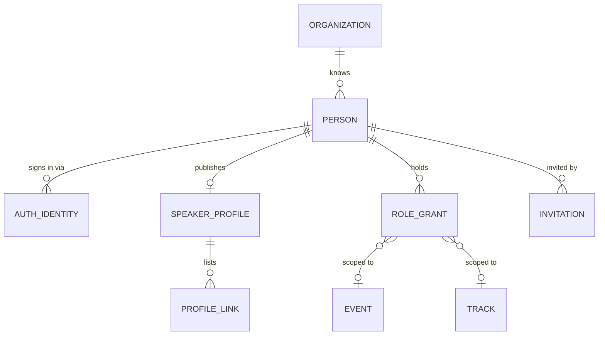
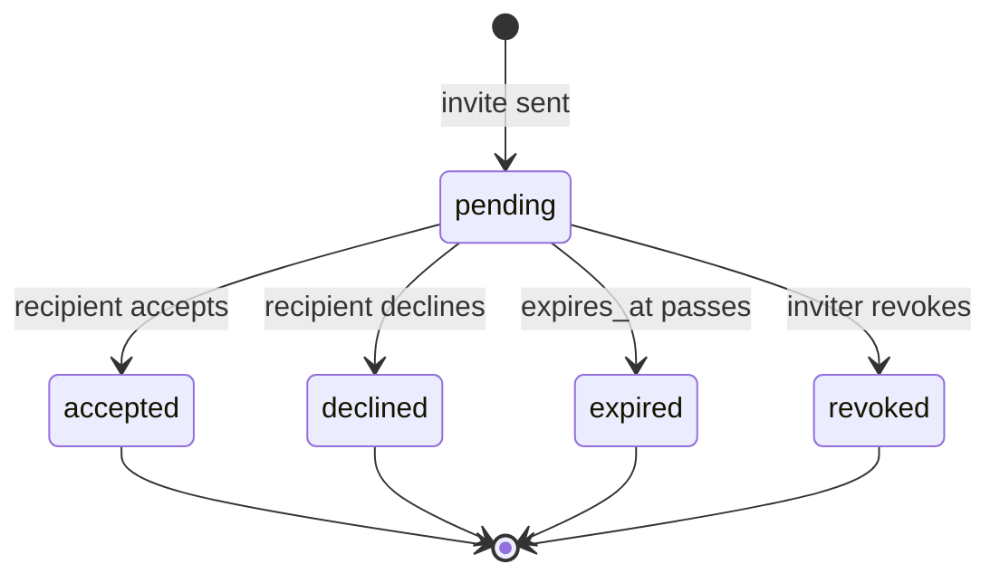

# 01 — Identity & Access

**Aggregate roots:** `Organization`, `Person`, `Invitation`.

This context is a shared kernel: everything else references `Person` and asks it about
permissions. It is kept deliberately small so it can stay stable.

## Tenancy

One **Organization** per deployment (the conference-running body — e.g. the group behind
AI Engineer World's Fair). **Events** are first class and plural: an org runs World's Fair
2026, Summit 2027, and a regional edition from the same instance, sharing a person
directory, sponsor records and reviewer pool.

The model still carries `org_id` on top-level entities. That is not multi-tenancy theatre —
it is what makes a future hosted mode a configuration change rather than a rewrite, and it
makes "every query is scoped" a rule you can enforce in one place. See
[`13-open-questions.md#Q1`](13-open-questions.md).

## Person vs. account

A **`Person`** is a human the system knows about. A person can exist with no ability to log
in — a co-speaker added by name and email during submission is a real `Person` from the
moment they are named, which is what makes "invite your co-speaker" and "the co-speaker
also has onboarding tasks" work without a second shadow model.

An **`AuthIdentity`** is a way of proving you are that person. Zero identities means the
person cannot sign in yet; more than one means they linked Google and email.

## Organization

| Field | Type | Req | Notes |
|---|---|---|---|
| `id` | `ulid` | Y | prefix `org_` |
| `name` | `string` | Y | "AI Engineer" |
| `slug` | `slug` | Y | unique globally |
| `primary_domain` | `string` | N | used for email sender identity and embed origin defaults |
| `logo_asset_id` | `ref(Asset)` | N | |
| `default_timezone` | `string` | Y | IANA tz, default for new events |
| `contact_email` | `string` | Y | reply-to for platform mail |
| `settings` | `json` | Y | see below |
| `created_at` / `updated_at` | `timestamptz` | Y | |

`settings` keys (all optional, defaults in code):
`review.default_visibility`, `submissions.allow_public_gallery`,
`onboarding.reminder_default_offsets`, `branding.*`, `privacy.retention_days`.

## Person

| Field | Type | Req | Notes |
|---|---|---|---|
| `id` | `ulid` | Y | prefix `per_` |
| `org_id` | `ref(Organization)` | Y | |
| `email` | `string` | Y | canonical, lowercased; unique per org (INV-01-1) |
| `email_verified_at` | `timestamptz` | N | null until proven |
| `full_name` | `string` | Y | as the person writes it; never split into first/last |
| `display_name` | `string` | N | short form for the schedule; falls back to `full_name` |
| `pronouns` | `string` | N | free text, never inferred |
| `timezone` | `string` | N | IANA tz; used for reminder send times |
| `locale` | `string` | N | BCP-47 |
| `status` | `enum(invited, active, deactivated)` | Y | `invited` = created by someone else, never signed in |
| `is_placeholder` | `bool` | Y | true when created from just a name+email on a proposal |
| `merged_into_person_id` | `ref(Person)` | N | set when deduplicated; reads follow the pointer |
| `created_at` / `updated_at` / `deleted_at` | `timestamptz` | Y/Y/N | |

**Person merge.** Duplicate people are inevitable (submitted with a work email, signed in
with a personal one). Merge is a first-class operation: the loser gets
`merged_into_person_id`, all references are repointed, and a `person.merged` event is
emitted. Merging is never automatic — it is an organizer action with a confirmation step,
because a wrong merge exposes one person's proposals to another.

## AuthIdentity

| Field | Type | Req | Notes |
|---|---|---|---|
| `id` | `ulid` | Y | prefix `aid_` |
| `person_id` | `ref(Person)` | Y | |
| `provider` | `enum(email_otp, google, github, oidc)` | Y | |
| `subject` | `string` | Y | provider's stable user id; unique with `provider` (INV-01-2) |
| `email_at_provider` | `string` | N | may differ from `Person.email` |
| `last_used_at` | `timestamptz` | N | |
| `created_at` | `timestamptz` | Y | |

Passwords are not modelled. Email OTP / magic link plus OAuth covers the population, and
not storing password hashes removes an entire class of incident.

## SpeakerProfile

One per person, org-scoped, owned and edited by the person. This is J4: the thing that
shows up next to their talk. Field-level visibility matters — a speaker will happily give
you a phone number for logistics and be furious if it appears on the website.

| Field | Type | Req | Notes |
|---|---|---|---|
| `id` | `ulid` | Y | prefix `spk_` |
| `person_id` | `ref(Person)` | Y | unique (INV-01-3) |
| `headline` | `string` | N | "Staff Engineer, Acme" — one line under the name |
| `job_title` | `string` | N | |
| `company` | `string` | N | |
| `bio` | `text` | N | markdown subset; length limit configured per event's form |
| `short_bio` | `text` | N | for the schedule card |
| `headshot_asset_id` | `ref(Asset)` | N | |
| `location` | `string` | N | city / country, free text |
| `phone` | `string` | N | logistics only, never public (INV-01-4) |
| `dietary_notes` | `text` | N | logistics only, never public |
| `accessibility_notes` | `text` | N | logistics only, never public |
| `visibility` | `json` | Y | per-field: `{bio: public, company: public, location: private, ...}` |
| `is_listed` | `bool` | Y | opt out of the public speaker directory while still speaking |
| `completeness` | `int` | D | 0–100, drives the portal's "finish your profile" nudge |
| `updated_at` | `timestamptz` | Y | |

### ProfileLink

| Field | Type | Req | Notes |
|---|---|---|---|
| `id` | `ulid` | Y | prefix `lnk_` |
| `speaker_profile_id` | `ref(SpeakerProfile)` | Y | |
| `kind` | `enum(website, x, bluesky, linkedin, github, mastodon, youtube, scholar, other)` | Y | |
| `url` | `string` | Y | must be absolute https (INV-01-5) |
| `label` | `string` | N | |
| `sort_order` | `int` | Y | |
| `is_public` | `bool` | Y | |

**Profile snapshots.** The public schedule does not read the live profile. When a schedule
is published, the speaker's public fields are copied into the publication snapshot (see
[`08`](08-scheduling-and-publication.md)). A speaker changing jobs in March does not
silently rewrite the archived 2026 program, and the marketing site's cache has something
stable to point at.

## Roles and grants

Roles are grants, and grants are scoped. A person can be a reviewer for the Agents track
at World's Fair and a chair at Summit, with no relationship between the two.

### RoleGrant

| Field | Type | Req | Notes |
|---|---|---|---|
| `id` | `ulid` | Y | prefix `grt_` |
| `person_id` | `ref(Person)` | Y | |
| `role` | `enum(owner, admin, program_chair, track_lead, reviewer, organizer, sponsor_manager, viewer)` | Y | |
| `scope_type` | `enum(org, event, track)` | Y | |
| `scope_id` | `ulid` | Y | `org_id`, `event_id` or `track_id` matching `scope_type` (INV-01-6) |
| `granted_by_person_id` | `ref(Person)` | Y | |
| `granted_at` | `timestamptz` | Y | |
| `expires_at` | `timestamptz` | N | reviewer grants often expire with the round |
| `revoked_at` | `timestamptz` | N | |

| Role | Scope | Can |
|---|---|---|
| `owner` | org | everything, including billing/integrations and deleting the org |
| `admin` | org | everything except destroying the org |
| `program_chair` | event | configure the event, run rounds, make decisions, publish |
| `track_lead` | track | assign reviewers and recommend decisions within a track |
| `reviewer` | event or track | see assigned proposals, submit reviews |
| `organizer` | event | onboarding and scheduling; read-only on review scores |
| `sponsor_manager` | org or event | sponsors, tiers, entitlements, sponsor sessions |
| `viewer` | event | read-only across the event, no scores |

The full permission matrix is in [`11-cross-cutting.md`](11-cross-cutting.md).

**Effective permissions** = union of role grants that are unexpired and unrevoked and whose
scope contains the target, **plus** relationship-derived permissions:

- you may read and edit a `Proposal` in `draft`/`changes_requested` if you are its
  submitter;
- you may read a `Proposal` if you are credited on it;
- you may read and act on a `Session`, and complete `TaskInstance`s assigned to you, if you
  are a `SessionSpeaker` on it;
- you may act for a `Sponsor` if you are an active `SponsorContact`.

Relationship-derived permissions end when the relationship ends. Removing a co-speaker from
a session removes their access to it — including their onboarding tasks, which are
cancelled, not orphaned.

## Invitation

Covers all "come join this" flows: staff invites, reviewer invites, co-speaker invites,
sponsor contact invites. One entity, one expiry policy, one audit trail.

| Field | Type | Req | Notes |
|---|---|---|---|
| `id` | `ulid` | Y | prefix `inv_` |
| `org_id` | `ref(Organization)` | Y | |
| `email` | `string` | Y | |
| `person_id` | `ref(Person)` | N | set if the person already exists |
| `kind` | `enum(staff, reviewer, co_speaker, sponsor_contact)` | Y | |
| `intended_role` | `enum(...)` | N | role to grant on acceptance, for `staff`/`reviewer` |
| `scope_type` / `scope_id` | as `RoleGrant` | N | |
| `context_type` | `enum(proposal, session, sponsor)` | N | what they are being invited *to*, for non-staff kinds |
| `context_id` | `ulid` | N | |
| `token_hash` | `string` | Y | the raw token is never stored (INV-01-7) |
| `status` | `enum(pending, accepted, declined, expired, revoked)` | Y | |
| `expires_at` | `timestamptz` | Y | default 14 days |
| `invited_by_person_id` | `ref(Person)` | Y | |
| `accepted_at` | `timestamptz` | N | |

## Invariants

- **INV-01-1** `Person.email` is unique per org among non-deleted, non-merged people.
- **INV-01-2** `(AuthIdentity.provider, subject)` is globally unique.
- **INV-01-3** At most one `SpeakerProfile` per person.
- **INV-01-4** `phone`, `dietary_notes` and `accessibility_notes` are never included in any
  public read model or publication snapshot, regardless of `visibility`.
- **INV-01-5** `ProfileLink.url` must parse as an absolute `https` URL.
- **INV-01-6** `RoleGrant.scope_id` must reference an entity of `scope_type`, within the
  same org. `owner` and `admin` may only be granted at `org` scope; `track_lead` only at
  `track` scope.
- **INV-01-7** Invitation tokens are stored hashed; a token is single-use and invalid once
  `status != pending`.
- **INV-01-8** An org must always have at least one active `owner`. The last owner grant
  cannot be revoked.
- **INV-01-9** A person with `merged_into_person_id` set may not be referenced by new
  records; writes must resolve to the surviving person.
- **INV-01-10** Deactivating a person revokes their role grants and reassigns or cancels
  their open `ReviewAssignment`s; it does **not** remove them from sessions they spoke at.

## Emitted events

`person.created`, `person.merged`, `person.deactivated`, `speaker_profile.updated`,
`role_grant.created`, `role_grant.revoked`, `invitation.sent`, `invitation.accepted`,
`invitation.expired`. Payloads in [`10-domain-events.md`](10-domain-events.md).
