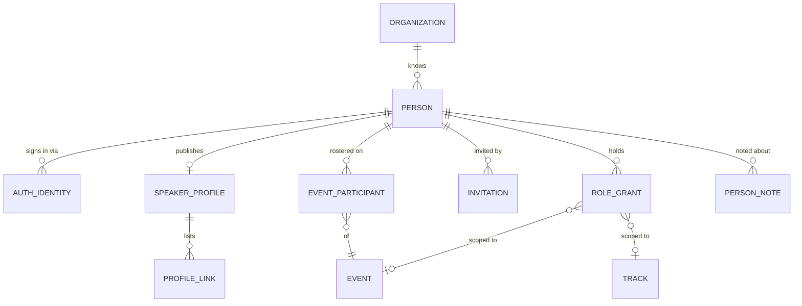
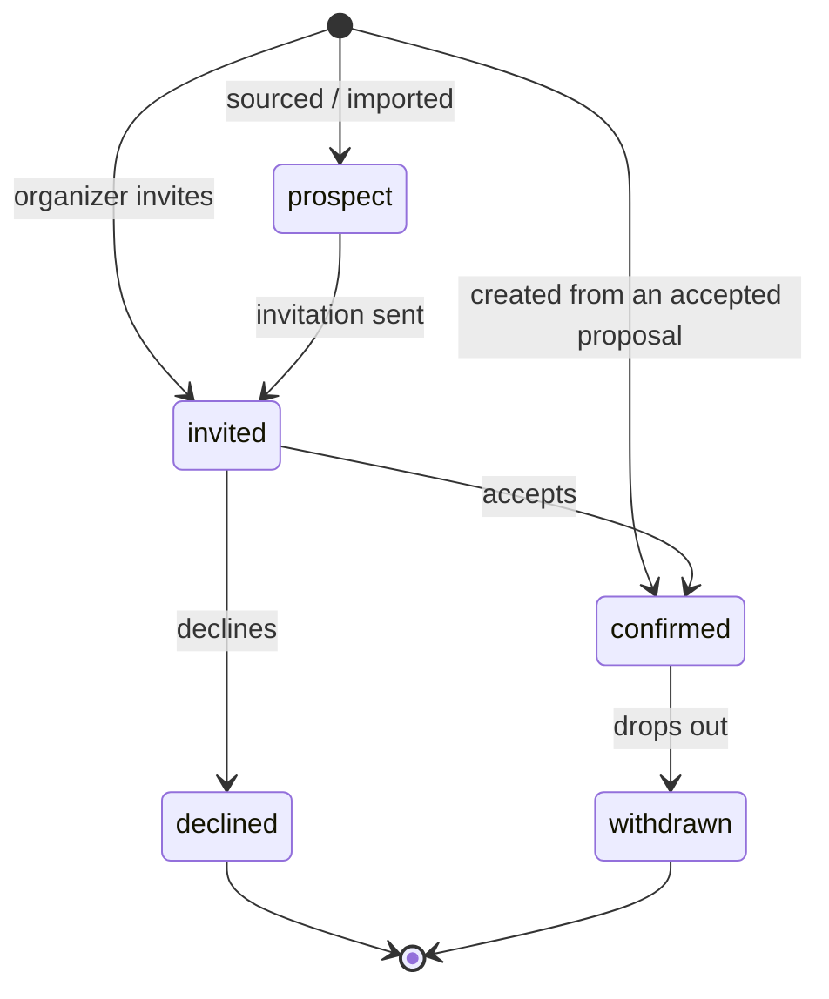
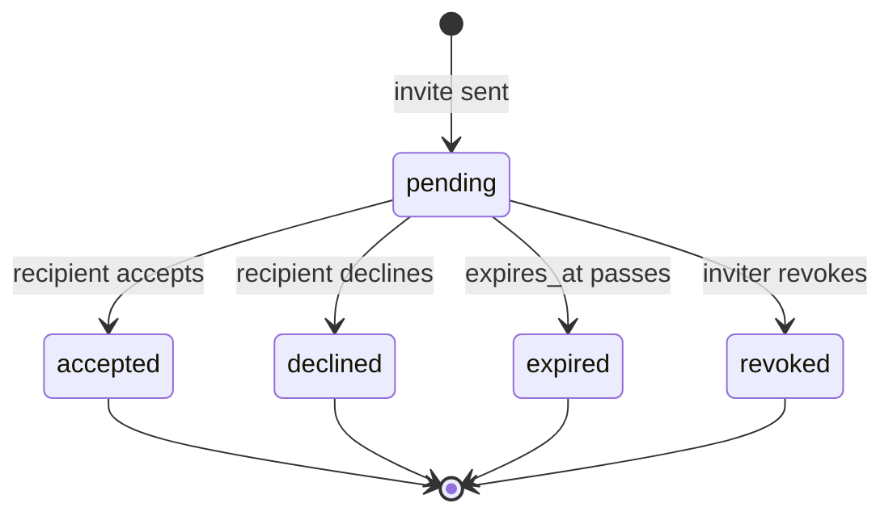

# 01 — Identity & Access

**Aggregate roots:** `Organization`, `Person`, `Invitation`.

This context is a shared kernel: everything else references `Person` and asks it about
permissions. It is kept deliberately small so it can stay stable.

## Tenancy

One **Organization** per deployment (the conference-running body — e.g. the group behind
AI Engineer World's Fair). **Events** are first class and plural: an org runs World's Fair
2026, Summit 2027, and a regional edition from the same instance, sharing a person
directory, sponsor records and reviewer pool.

The model still carries `org_id` on top-level entities. That is not multi-tenancy theatre —
it is what makes a future hosted mode a configuration change rather than a rewrite, and it
makes "every query is scoped" a rule you can enforce in one place. See
[`13-open-questions.md`](13-open-questions.md), R9 — settled by the org-scoped speaker
directory in [`14`](14-speaker-crm.md), which makes the column load-bearing today rather
than speculatively.

## Person vs. account

A **`Person`** is a human the system knows about. A person can exist with no ability to log
in — a co-speaker added by name and email during submission is a real `Person` from the
moment they are named, which is what makes "invite your co-speaker" and "the co-speaker
also has onboarding tasks" work without a second shadow model.

An **`AuthIdentity`** is a way of proving you are that person. Zero identities means the
person cannot sign in yet; more than one means they linked Google and email.

## Organization

<!-- entity: Organization -->
| Field | Type | Req | Notes |
|---|---|---|---|
| `id` | `ulid` | Y | prefix `org_` |
| `name` | `string` | Y | "AI Engineer" |
| `slug` | `slug` | Y | unique globally |
| `primary_domain` | `string` | N | used for email sender identity and embed origin defaults |
| `logo_asset_id` | `ref(Asset)` | N | |
| `default_timezone` | `string` | Y | IANA tz, default for new events |
| `contact_email` | `string` | Y | reply-to for platform mail |
| `settings` | `json` | Y | see below |
| `created_at` / `updated_at` | `timestamptz` | Y | |

`settings` keys (all optional, defaults in code):
`review.default_visibility`, `submissions.allow_public_gallery`,
`onboarding.reminder_default_offsets`, `branding.*`, `privacy.retention_days`.

**First-run setup.** Nothing seeds the one Organization a deployment needs — it does not
exist until someone creates it. A freshly migrated deployment directs an anonymous visitor to
a setup screen that creates, as one unit of work, the Organization, the first Person, their
`password` AuthIdentity and an `owner` RoleGrant, then signs them in exactly as `/signup`
does. That screen is reachable only while no Organization row exists (INV-01-16) — once one
does, it is refused on every method, checked against the database on every request, because
it runs with no principal and creates an administrator.

## Person

<!-- entity: Person -->
| Field | Type | Req | Notes |
|---|---|---|---|
| `id` | `ulid` | Y | prefix `per_` |
| `org_id` | `ref(Organization)` | Y | |
| `email` | `string` | Y | canonical, lowercased; unique per org (INV-01-1) |
| `email_verified_at` | `timestamptz` | N | null until proven |
| `full_name` | `string` | Y | as the person writes it; never split into first/last |
| `display_name` | `string` | N | short form for the schedule; falls back to `full_name` |
| `pronouns` | `string` | N | free text, never inferred |
| `timezone` | `string` | N | IANA tz; used for reminder send times |
| `locale` | `string` | N | BCP-47 |
| `status` | `enum(invited, active, deactivated)` | Y | `invited` = created by someone else, never signed in |
| `is_placeholder` | `bool` | Y | true when created from just a name+email on a proposal |
| `merged_into_person_id` | `ref(Person)` | N | set when deduplicated; reads follow the pointer |
| `tags` | `string[]` | N | free-form org-level labels ("returning", "keynote material", "ai-infra") |
| `custom_field_values` | `json` | N | keyed by `CustomFieldDefinition.key`, see [`11`](11-cross-cutting.md) |
| `created_at` / `updated_at` / `deleted_at` | `timestamptz` | Y/Y/N | |

`tags` and `custom_field_values` are org-scoped and persist across events — they are how a
programming team accumulates knowledge about the people it works with, and the reason the
person directory is worth more in year three than in year one. Anything event-specific
belongs on `EventParticipant` instead.

**Person merge.** Duplicate people are inevitable (submitted with a work email, signed in
with a personal one). Merge is a first-class operation: the loser gets
`merged_into_person_id`, all references are repointed, and a `person.merged` event is
emitted. Merging is never automatic — it is an organizer action with a confirmation step,
because a wrong merge exposes one person's proposals to another.

Duplicates are **surfaced, never auto-merged**. `PersonMergeCandidate` is a derived read
model — pairs matching on normalised name, on a shared `AuthIdentity.email_at_provider`, or
on identical name plus employer — scored and listed for an organizer to confirm or dismiss.
A dismissal is remembered so the same pair is not offered forever.

| PersonMergeCandidate field | Type | Notes |
|---|---|---|
| `person_id` / `candidate_person_id` | `ref(Person)` | ordered pair, lower ULID first |
| `signals` | `enum(same_normalised_name, same_provider_email, same_name_and_company, manual)[]` | why they were paired |
| `confidence` | `decimal` | 0–1, advisory only |
| `dismissed_by_person_id` / `dismissed_at` | | a dismissal suppresses the pair |

## AuthIdentity

<!-- entity: AuthIdentity -->
| Field | Type | Req | Notes |
|---|---|---|---|
| `id` | `ulid` | Y | prefix `aid_` |
| `person_id` | `ref(Person)` | Y | |
| `provider` | `enum(email_otp, google, github, oidc, password)` | Y | |
| `subject` | `string` | Y | provider's stable user id; unique with `provider` (INV-01-2). For `password`, the lowercased email |
| `credential_hash` | `string` | N | required for `password`, forbidden otherwise (INV-01-12); Argon2id |
| `credential_updated_at` | `timestamptz` | N | drives "password changed" notices and forced rotation |
| `email_at_provider` | `string` | N | may differ from `Person.email` |
| `last_used_at` | `timestamptz` | N | |
| `created_at` | `timestamptz` | Y | |

**Why `password` exists despite the cost.** Email OTP plus OAuth is the better default for
humans and stays the recommended configuration. But an authentication method that requires
an inbox makes the platform unusable to anything that is not a human with that inbox: an
evaluation harness, an end-to-end test suite, a self-hoster with no deliverable mail, a
support engineer reproducing a speaker's problem. Every one of those is a real user, and
"log in as the reviewer" must not be gated on mail delivery. So the provider set includes
password login, off by default per org (`settings.auth.password_login_enabled`), with the
usual obligations: Argon2id, no storage of the plaintext, and rate limiting per identity.

**What "off by default" means, precisely** (R23 in
[`13-open-questions.md`](13-open-questions.md)). Off in production configuration; **on** in
the shipped default seed, and **on** in any deployment with no active `email` integration.
A deployment that can neither send mail nor accept a password is a deployment nobody can
sign into, and that failure mode is worse than the marginal risk of password auth on a
conference tool.

Whatever the org enables, **at least one non-inbox path to every role must exist**. Where
password login is disabled, an invitation or magic link must be retrievable *in the product*
— a copyable link on the invite screen, or an organizer-visible outbox of sent messages —
so that provisioning a reviewer never dead-ends at "check your email". See
[`09`](09-api-and-integrations.md) for the outbox.

## SpeakerProfile

One per person, org-scoped, primarily owned and edited by the person. This is J4: the thing
that shows up next to their talk. Field-level visibility matters — a speaker will happily
give you a phone number for logistics and be furious if it appears on the website.

<!-- entity: SpeakerProfile -->
| Field | Type | Req | Notes |
|---|---|---|---|
| `id` | `ulid` | Y | prefix `spk_` |
| `person_id` | `ref(Person)` | Y | unique (INV-01-3) |
| `headline` | `string` | N | "Staff Engineer, Acme" — one line under the name |
| `job_title` | `string` | N | |
| `company` | `string` | N | |
| `bio` | `text` | N | markdown subset; length limit configured per event's form |
| `short_bio` | `text` | N | for the schedule card |
| `headshot_asset_id` | `ref(Asset)` | N | |
| `location` | `string` | N | city / country, free text |
| `phone` | `string` | N | logistics only, never public (INV-01-4) |
| `dietary_notes` | `text` | N | logistics only, never public |
| `accessibility_notes` | `text` | N | logistics only, never public |
| `visibility` | `json` | Y | per-field: `{bio: public, company: public, location: private, ...}` |
| `is_listed` | `bool` | Y | opt out of the public speaker directory while still speaking |
| `completeness` | `int` | D | 0–100, drives the portal's "finish your profile" nudge |
| `last_edited_by_person_id` | `ref(Person)` | N | may be an organizer, not the profile's owner |
| `updated_at` | `timestamptz` | Y | |

**Organizers may edit a speaker profile, and must be able to.** A bio arrives as a
paragraph of marketing copy three days before the programme goes to print; a headshot is
1200×1600 of somebody's ceiling; a speaker has vanished and the website still needs a
sentence under their name. Refusing organizer edits does not protect the speaker, it just
moves the edit into a copy-paste on the marketing site where the speaker never sees it.

The protections that make this safe are recorded rather than prevented: every organizer
edit sets `last_edited_by_person_id`, writes an audit row (INV-11-5), and emits
`speaker_profile.updated` with `edited_by_role`. The speaker sees who last changed their
profile and can change it back. What an organizer may **not** do is change `visibility` or
`is_listed` — those are the speaker's consent, not the organizer's preference (INV-01-13).

<!-- entity: ProfileLink -->
| Field | Type | Req | Notes |
|---|---|---|---|
| `id` | `ulid` | Y | prefix `lnk_` |
| `speaker_profile_id` | `ref(SpeakerProfile)` | Y | |
| `kind` | `enum(website, x, bluesky, linkedin, github, mastodon, youtube, scholar, other)` | Y | |
| `url` | `string` | Y | must be absolute https (INV-01-5) |
| `label` | `string` | N | |
| `sort_order` | `int` | Y | |
| `is_public` | `bool` | Y | |

**Profile snapshots.** The public schedule does not read the live profile. When a schedule
is published, the speaker's public fields are copied into the publication snapshot (see
[`08`](08-scheduling-and-publication.md)). A speaker changing jobs in March does not
silently rewrite the archived 2026 program, and the marketing site's cache has something
stable to point at.

## EventParticipant

`Person` is org-scoped and permanent. `SessionSpeaker` is session-scoped and only exists
once there is a session. Between them sits the question an organizer asks every day: **who
is on this event's roster, and where are they up to?**

A keynote speaker is invited in October, months before any session record exists. A CSV of
last year's speakers is imported to be chased. A contact is pushed from the org directory
into next year's event. None of those people are speakers yet — they have no session — and
none of them should have to be faked as a proposal to appear on a list.

`EventParticipant` is that roster row. It is a person's membership of one event, with its
own status and its own portal access, and it deliberately grants **no content access at
all**: being on the roster lets you sign in to the portal and see your own tasks and
profile, nothing more. Reading a session, completing its tasks and appearing on the
schedule still flow from `SessionSpeaker`, exactly as before. Roster membership is
administrative; speaking is still a relationship.

<!-- entity: EventParticipant -->
| Field | Type | Req | Notes |
|---|---|---|---|
| `id` | `ulid` | Y | prefix `epa_` |
| `event_id` | `ref(Event)` | Y | |
| `person_id` | `ref(Person)` | Y | unique with `event_id` (INV-01-11) |
| `kind` | `enum(speaker, sponsor_contact, staff, reviewer, prospect, other)` | Y | why they are on this roster |
| `status` | `enum(prospect, invited, confirmed, declined, withdrawn)` | Y | roster workflow, independent of any session |
| `source` | `enum(proposal, decision, manual, import, crm_push, invitation)` | Y | provenance — "how did this person get here" is asked constantly |
| `portal_access` | `enum(none, invited, active, revoked)` | Y | whether they can reach the speaker portal |
| `portal_invited_at` / `portal_first_seen_at` | `timestamptz` | N | the invite-sent / invite-used pair |
| `custom_field_values` | `json` | N | event-specific fields; org-level ones live on `Person` |
| `session_count` | `int` | D | non-cancelled sessions they are credited on |
| `task_completion` | `json` | D | `{completed, waived, outstanding, overdue}` across their instances |
| `added_by_person_id` | `ref(Person)` | Y | |
| `created_at` / `updated_at` | `timestamptz` | Y | |

Rows are created automatically as a side effect of the pipelines — a submitted proposal
adds its speakers as `confirmed`-on-acceptance participants — so an organizer who never
touches the roster still has a correct one. The `status` here answers "is this human coming
to our conference"; `SessionSpeaker.confirmation_status` answers "is this human giving that
talk". They are different questions and a speaker with two talks can be confirmed on one
and pending on the other.

**Roster read model.** `EventRoster` joins `EventParticipant` with `SpeakerProfile`, session
titles, and task completion, filterable by `status`, `kind`, track, and outstanding-task
count, and searchable by name, email and company. It is the organizer's people screen, and
it must render completion state at list level — the whole point is not opening 200 records
to find the four that are stuck.

## PersonNote

Internal, organizer-authored notes about a person: "strong on CI topics, shortlist for a
keynote", "asked not to be scheduled before 11am", "declined 2026, worth asking again".
Append-only and attributed, because an unattributed note about a human being is a liability
and a note that can be silently edited is worthless as a record.

<!-- entity: PersonNote -->
| Field | Type | Req | Notes |
|---|---|---|---|
| `id` | `ulid` | Y | prefix `pnt_` |
| `org_id` | `ref(Organization)` | Y | notes follow the person across events |
| `person_id` | `ref(Person)` | Y | |
| `event_id` | `ref(Event)` | N | set when the note is about one event |
| `body` | `text` | Y | markdown |
| `author_person_id` | `ref(Person)` | Y | |
| `created_at` | `timestamptz` | Y | |
| `deleted_at` | `timestamptz` | N | soft delete; the row survives for the record |

Notes are **never visible to their subject** and never leave the organization: they are
excluded from `/v1/me/...`, from every public read model, from `GET /v1/me/export`, and from
webhook payloads regardless of `include_pii` (INV-01-14). A speaker reading a candid note
about themselves is the kind of incident that ends a tool's use at an organization, and the
only reliable way to prevent it is to make the surface impossible rather than careful.

## Roles and grants

Roles are grants, and grants are scoped. A person can be a reviewer for the Agents track
at World's Fair and a chair at Summit, with no relationship between the two.

### RoleGrant

<!-- entity: RoleGrant -->
| Field | Type | Req | Notes |
|---|---|---|---|
| `id` | `ulid` | Y | prefix `grt_` |
| `person_id` | `ref(Person)` | Y | |
| `role` | `enum(owner, admin, program_chair, track_lead, reviewer, organizer, sponsor_manager, viewer)` | Y | |
| `scope_type` | `enum(org, event, track)` | Y | |
| `scope_id` | `ulid` | Y | `org_id`, `event_id` or `track_id` matching `scope_type` (INV-01-6) |
| `granted_by_person_id` | `ref(Person)` | Y | |
| `granted_at` | `timestamptz` | Y | |
| `expires_at` | `timestamptz` | N | reviewer grants often expire with the round |
| `revoked_at` | `timestamptz` | N | |

| Role | Scope | Can |
|---|---|---|
| `owner` | org | everything, including billing/integrations and deleting the org |
| `admin` | org | everything except destroying the org |
| `program_chair` | event | configure the event, run rounds, make decisions, publish |
| `track_lead` | track | assign reviewers and recommend decisions within a track |
| `reviewer` | event or track | see assigned proposals, submit reviews |
| `organizer` | event | onboarding and scheduling; read-only on review scores |
| `sponsor_manager` | org or event | sponsors, tiers, entitlements, sponsor sessions |
| `viewer` | event | read-only across the event, no scores |

The full permission matrix is in [`11-cross-cutting.md`](11-cross-cutting.md).

**Effective permissions** = union of role grants that are unexpired and unrevoked and whose
scope contains the target, **plus** relationship-derived permissions:

- you may read and edit a `Proposal` in `draft`/`changes_requested` if you are its
  submitter;
- you may read a `Proposal` if you are credited on it;
- you may read and act on a `Session`, and complete `TaskInstance`s assigned to you, if you
  are a `SessionSpeaker` on it;
- you may act for a `Sponsor` if you are an active `SponsorContact`.

Relationship-derived permissions end when the relationship ends. Removing a co-speaker from
a session removes their access to it — including their onboarding tasks, which are
cancelled, not orphaned.

## Invitation

Covers all "come join this" flows: staff invites, reviewer invites, co-speaker invites,
sponsor contact invites. One entity, one expiry policy, one audit trail.

<!-- entity: Invitation -->
| Field | Type | Req | Notes |
|---|---|---|---|
| `id` | `ulid` | Y | prefix `inv_` |
| `org_id` | `ref(Organization)` | Y | |
| `email` | `string` | Y | |
| `person_id` | `ref(Person)` | N | set if the person already exists |
| `kind` | `enum(staff, reviewer, co_speaker, sponsor_contact, speaker_portal)` | Y | |
| `intended_role` | `enum(owner, admin, program_chair, track_lead, reviewer, organizer, sponsor_manager, viewer)` | N | role to grant on acceptance, for `staff`/`reviewer`; same members as `RoleGrant.role` |
| `scope_type` / `scope_id` | as `RoleGrant` | N | |
| `context_type` | `enum(proposal, session, sponsor, event)` | N | what they are being invited *to*, for non-staff kinds |
| `context_id` | `ulid` | N | |
| `token_hash` | `string` | Y | the raw token is never stored (INV-01-7) |
| `accept_url` | `string` | D | the full link, returned in the creation response **only**, for on-screen copying (INV-01-15) |
| `status` | `enum(pending, accepted, declined, expired, revoked)` | Y | |
| `expires_at` | `timestamptz` | Y | default 14 days |
| `invited_by_person_id` | `ref(Person)` | Y | |
| `accepted_at` | `timestamptz` | N | |

## Invariants

- **INV-01-1** `Person.email` is unique per org among non-deleted, non-merged people.
- **INV-01-2** `(AuthIdentity.provider, subject)` is globally unique.
- **INV-01-3** At most one `SpeakerProfile` per person.
- **INV-01-4** `phone`, `dietary_notes` and `accessibility_notes` are never included in any
  public read model or publication snapshot, regardless of `visibility`.
- **INV-01-5** `ProfileLink.url` must parse as an absolute `https` URL.
- **INV-01-6** `RoleGrant.scope_id` must reference an entity of `scope_type`, within the
  same org. `owner` and `admin` may only be granted at `org` scope; `track_lead` only at
  `track` scope.
- **INV-01-7** Invitation tokens are stored hashed; a token is single-use and invalid once
  `status != pending`.
- **INV-01-8** An org must always have at least one active `owner`. The last owner grant
  cannot be revoked.
- **INV-01-9** A person with `merged_into_person_id` set may not be referenced by new
  records; writes must resolve to the surviving person.
- **INV-01-10** Deactivating a person revokes their role grants and reassigns or cancels
  their open `ReviewAssignment`s; it does **not** remove them from sessions they spoke at.
- **INV-01-11** One `EventParticipant` per `(event, person)`. Membership grants portal
  sign-in only; it never confers read or write access to any proposal, session, task or
  review, all of which remain relationship- or grant-derived.
- **INV-01-12** `AuthIdentity.credential_hash` is required when `provider = password` and
  must be null for every other provider. The plaintext is never stored, never logged, and
  never returned by any surface.
- **INV-01-13** Only the profile's own person may change `SpeakerProfile.visibility` or
  `is_listed`. Any other field may be edited by staff with the event's `organizer`,
  `program_chair`, `admin` or `owner` role, always recording `last_edited_by_person_id` and
  an audit row.
- **INV-01-14** `PersonNote` bodies are never exposed to the person they are about, in any
  role, through any surface — including the portal, the PII export, public read models and
  webhook payloads with `include_pii`.
- **INV-01-15** An invitation's `accept_url` is returned exactly once, in the response to
  the command that created it, and is never re-readable. Every invitation kind must offer
  it, so that provisioning an account never depends on mail delivery.
- **INV-01-16** At most one `Organization` row may ever exist per deployment. It is created,
  atomically with its first `Person`, `AuthIdentity` and `owner` `RoleGrant`, by the first-run
  setup screen and by nothing else; that screen is refused, on every method and checked
  against the database rather than a cached or in-memory flag, once an `Organization` row
  exists.

## Emitted events

`organization.created`, `person.created`, `person.merged`, `person.merge_candidate_detected`,
`person.deactivated`, `speaker_profile.updated`, `person_note.added`,
`event_participant.added`, `event_participant.status_changed`,
`event_participant.portal_invited`, `role_grant.created`, `role_grant.revoked`,
`invitation.sent`, `invitation.accepted`, `invitation.expired`. Payloads in
[`10-domain-events.md`](10-domain-events.md).
