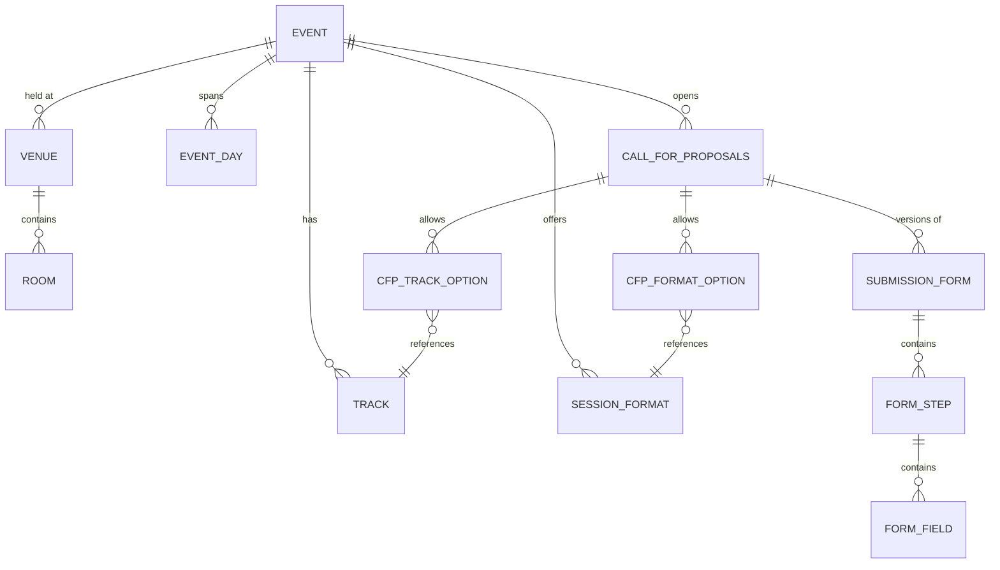
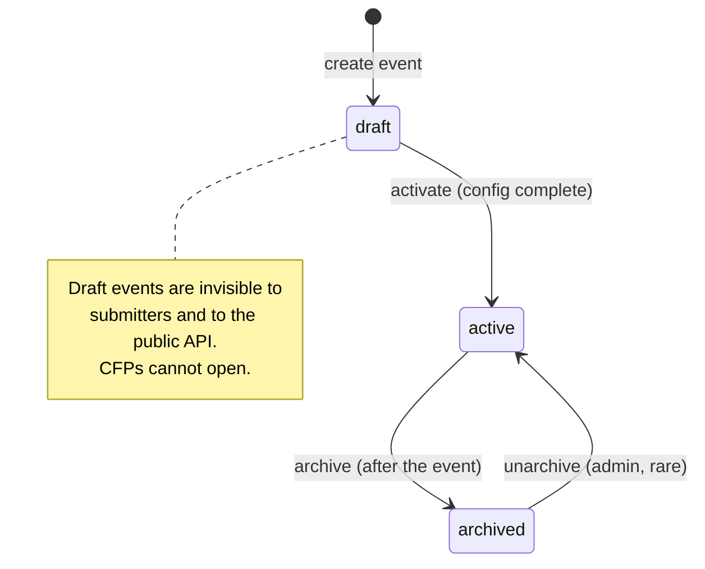
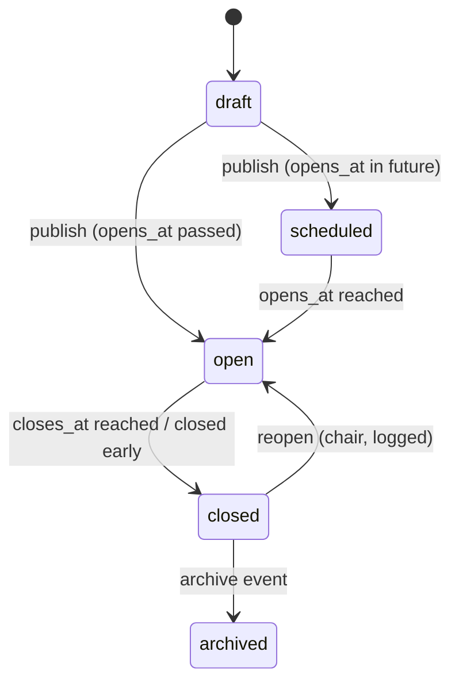

# 02 — Event Configuration

**Aggregate roots:** `Event`, `CallForProposals`, `SubmissionForm`, `Venue`.

Everything an organizer sets up *before* intake opens. The rule that shapes this context:
**configuration that a submitter has already started interacting with is versioned, not
edited in place.** Renaming a track is fine; deleting a required field out from under
fourteen half-finished drafts is not.



## Event

<!-- entity: Event -->
| Field | Type | Req | Notes |
|---|---|---|---|
| `id` | `ulid` | Y | prefix `evt_` |
| `org_id` | `ref(Organization)` | Y | |
| `name` | `string` | Y | "AI Engineer World's Fair 2026" |
| `slug` | `slug` | Y | unique per org; appears in public URLs |
| `edition` | `string` | N | "2026", "Summit '27" — for grouping recurring events |
| `tagline` | `string` | N | |
| `description` | `text` | N | markdown |
| `timezone` | `string` | Y | IANA tz; **the** timezone for all displayed schedule times (INV-02-1) |
| `starts_on` / `ends_on` | `date` | Y | inclusive, in event timezone |
| `venue_id` | `ref(Venue)` | N | null for fully online events |
| `mode` | `enum(in_person, online, hybrid)` | Y | |
| `website_url` | `string` | N | the marketing site the schedule embeds into |
| `logo_asset_id` | `ref(Asset)` | N | |
| `status` | `enum(draft, active, archived)` | Y | see state machine |
| `visibility` | `enum(private, public)` | Y | `public` exposes the event to unauthenticated read endpoints |
| `settings` | `json` | Y | overrides of org settings, same keys |
| `created_at` / `updated_at` / `archived_at` | `timestamptz` | Y/Y/N | |



`EventDay` exists so the schedule grid, day tabs and per-day publication are not derived by
date arithmetic across timezone boundaries:

<!-- entity: EventDay -->
| Field | Type | Req | Notes |
|---|---|---|---|
| `id` | `ulid` | Y | prefix `day_` |
| `event_id` | `ref(Event)` | Y | |
| `date` | `date` | Y | unique per event |
| `label` | `string` | N | "Day 1 — Workshops" |
| `sort_order` | `int` | Y | |
| `is_public` | `bool` | Y | a staff-only build day is not on the public schedule |

## Track

A thematic lane. At AI Engineer events these are the recognisable ones: Agents, Evals,
RAG, Infra, Leadership. Tracks matter here beyond labelling — reviewer pools, track leads,
quotas and schedule columns are all per-track.

<!-- entity: Track -->
| Field | Type | Req | Notes |
|---|---|---|---|
| `id` | `ulid` | Y | prefix `trk_` |
| `event_id` | `ref(Event)` | Y | |
| `name` | `string` | Y | |
| `slug` | `slug` | Y | unique per event |
| `description` | `text` | N | shown on the CFP form to guide submitters |
| `color` | `string` | N | hex, for schedule rendering |
| `sort_order` | `int` | Y | |
| `target_session_count` | `int` | N | soft target used by the program-balance read model |
| `lead_person_ids` | `ref(Person)[]` | D | derived from `RoleGrant` at track scope |
| `is_public` | `bool` | Y | a track can be hidden while the program is being built |

## SessionFormat

<!-- entity: SessionFormat -->
| Field | Type | Req | Notes |
|---|---|---|---|
| `id` | `ulid` | Y | prefix `fmt_` |
| `event_id` | `ref(Event)` | Y | |
| `name` | `string` | Y | "Conference talk", "Workshop", "Lightning talk", "Sponsor demo", "Keynote", "Panel" |
| `slug` | `slug` | Y | unique per event |
| `description` | `text` | N | |
| `default_duration_minutes` | `int` | Y | |
| `min_duration_minutes` / `max_duration_minutes` | `int` | N | when the slot length is negotiable |
| `max_speakers` | `int` | Y | default 1; panels raise it |
| `eligible_origins` | `enum(cfp, sponsor, invited)[]` | Y | who may submit this format (INV-02-2) |
| `requires_review` | `bool` | Y | false for `invited` keynotes and, typically, contracted sponsor sessions |
| `requires_recording_consent` | `bool` | Y | |
| `capacity_policy` | `enum(open, ticketed, capped)` | Y | workshops are usually `ticketed` |
| `sort_order` | `int` | Y | |
| `is_public` | `bool` | Y | |

## Venue and Room

<!-- entity: Venue -->
| Venue field | Type | Req | Notes |
|---|---|---|---|
| `id` | `ulid` | Y | prefix `ven_` |
| `event_id` | `ref(Event)` | Y | scoped to the event; venues are not shared across years |
| `name` | `string` | Y | |
| `address` | `text` | N | |
| `map_url` | `string` | N | |
| `timezone` | `string` | N | defaults to the event timezone |

<!-- entity: Room -->
| Room field | Type | Req | Notes |
|---|---|---|---|
| `id` | `ulid` | Y | prefix `rom_` |
| `venue_id` | `ref(Venue)` | Y | |
| `name` | `string` | Y | "Golden Gate Ballroom" |
| `slug` | `slug` | Y | unique per venue |
| `capacity` | `int` | N | used by the over-capacity warning, not enforced |
| `floor` | `string` | N | |
| `av_capabilities` | `enum(projector, confidence_monitor, stage_mics, handheld_mics, recording, livestream, hybrid_av, hands_on_power, wifi_dedicated)[]` | Y | matched against a session's `av_requirements` |
| `default_track_id` | `ref(Track)` | N | when a room is a track's home for the day |
| `sort_order` | `int` | Y | |
| `is_public` | `bool` | Y | green rooms and staff rooms are schedulable but not published |

## CallForProposals

An event may run several concurrently — a main CFP, a separate workshops CFP with its own
deadline, and a sponsor session intake that opens later and is only visible to sponsors.
Modelling this as plural avoids the usual mess of one form with a "are you a sponsor?"
branch at the top.

<!-- entity: CallForProposals -->
| Field | Type | Req | Notes |
|---|---|---|---|
| `id` | `ulid` | Y | prefix `cfp_` |
| `event_id` | `ref(Event)` | Y | |
| `name` | `string` | Y | "Main CFP 2026" |
| `slug` | `slug` | Y | unique per event; public URL segment |
| `audience` | `enum(public, sponsors_only, invite_only)` | Y | drives who can see and submit (INV-02-3) |
| `intro_markdown` | `text` | N | shown on step 0 |
| `guidelines_url` | `string` | N | |
| `opens_at` | `timestamptz` | Y | |
| `closes_at` | `timestamptz` | Y | must be after `opens_at` (INV-02-4) |
| `grace_period_minutes` | `int` | Y | default 0; lets in-flight submits land after the bell |
| `late_submission_policy` | `enum(reject, allow_with_flag)` | Y | `allow_with_flag` marks the proposal `is_late` for the committee |
| `max_proposals_per_person` | `int` | N | null = unlimited |
| `allow_edit_after_submit` | `bool` | Y | if true, submitters may edit until `closes_at` |
| `withdraw_allowed_until` | `enum(decision, always, never)` | Y | default `always` |
| `active_form_id` | `ref(SubmissionForm)` | Y | the version new drafts bind to |
| `notify_on_submit` | `bool` | Y | send the submitter a confirmation |
| `status` | `enum(draft, scheduled, open, closed, archived)` | D | derived from `opens_at`/`closes_at` and a manual `closed_early_at` |
| `closed_early_at` | `timestamptz` | N | manual close |



### CfpFormatOption

Which formats this CFP accepts, with per-CFP overrides.

<!-- entity: CfpFormatOption -->
| Field | Type | Req | Notes |
|---|---|---|---|
| `id` | `ulid` | Y | |
| `cfp_id` | `ref(CallForProposals)` | Y | |
| `session_format_id` | `ref(SessionFormat)` | Y | |
| `is_available` | `bool` | Y | |
| `max_proposals_per_person` | `int` | N | narrower than the CFP-wide cap |
| `closes_at_override` | `timestamptz` | N | e.g. workshops close two weeks earlier |
| `sort_order` | `int` | Y | |

### CfpTrackOption

Which tracks this CFP accepts. Same shape, so a CFP can narrow formats and tracks
independently.

<!-- entity: CfpTrackOption -->
| Field | Type | Req | Notes |
|---|---|---|---|
| `id` | `ulid` | Y | |
| `cfp_id` | `ref(CallForProposals)` | Y | |
| `track_id` | `ref(Track)` | Y | |
| `is_available` | `bool` | Y | |
| `max_proposals_per_person` | `int` | N | narrower than the CFP-wide cap |
| `closes_at_override` | `timestamptz` | N | |
| `sort_order` | `int` | Y | |

## The multi-step submission form

This is J1, and it is where most CFP tools are weakest. Requirements the model must
support: steps with progress and resume; conditional fields; per-field validation; fields
that are private to the committee vs. shown publicly; and — critically — **versioning**, so
that changing the form mid-CFP does not corrupt drafts.

### SubmissionForm

<!-- entity: SubmissionForm -->
| Field | Type | Req | Notes |
|---|---|---|---|
| `id` | `ulid` | Y | prefix `frm_` |
| `cfp_id` | `ref(CallForProposals)` | Y | |
| `version` | `int` | Y | monotonic per CFP |
| `status` | `enum(draft, published, retired)` | Y | only one `published` per CFP (INV-02-5) |
| `published_at` | `timestamptz` | N | |
| `notes` | `text` | N | why this version exists |

Editing a `published` form clones it to a new `draft` version. Publishing the new version
retires the old one. Existing proposal drafts keep their bound version until the submitter
opts into the new one; the portal tells them what changed. Submitted proposals are always
read against the version they were submitted under.

### FormStep

<!-- entity: FormStep -->
| Field | Type | Req | Notes |
|---|---|---|---|
| `id` | `ulid` | Y | prefix `stp_` |
| `form_id` | `ref(SubmissionForm)` | Y | |
| `key` | `slug` | Y | stable across versions; unique per form |
| `title` | `string` | Y | "About your talk" |
| `description` | `text` | N | |
| `sort_order` | `int` | Y | |
| `visible_when` | `json` | N | condition rule, see below |
| `is_optional` | `bool` | Y | a skippable step still counts as visited |

A conventional four-step shape, which the seed data should ship:
`your-details` → `the-talk` → `logistics` → `review-and-submit`.

### FormField

<!-- entity: FormField -->
| Field | Type | Req | Notes |
|---|---|---|---|
| `id` | `ulid` | Y | prefix `fld_` |
| `step_id` | `ref(FormStep)` | Y | |
| `key` | `slug` | Y | stable identifier; unique per form (INV-02-6) |
| `label` | `string` | Y | |
| `help_text` | `text` | N | |
| `placeholder` | `string` | N | |
| `type` | `enum(short_text, long_text, markdown, email, url, number, single_select, multi_select, checkbox, date, file, speaker_list, track_picker, format_picker, duration_picker, consent)` | Y | |
| `options` | `json` | N | for select types: `[{value,label,description}]` |
| `is_required` | `bool` | Y | |
| `validation` | `json` | N | `{min_length,max_length,min,max,pattern,accept,max_file_mb,max_files}` |
| `visible_when` | `json` | N | condition rule |
| `maps_to` | `enum(none, title, abstract, description, track, format, duration, level, keywords, av_requirements, recording_consent, coi_disclosure, speakers)` | Y | promotes an answer into a first-class `Proposal` column (INV-02-7) |
| `audience` | `enum(public, committee_only, organizer_only)` | Y | `public` may appear on the published schedule; the rest never do |
| `pii` | `bool` | Y | flags the answer for retention and export handling |
| `sort_order` | `int` | Y | |

**`maps_to` is the bridge between a configurable form and a typed domain.** The committee
needs `title`, `abstract`, `track` and `format` to exist as real columns for sorting,
scoring and scheduling; everything else can stay as free-form answers. A field with
`maps_to != none` writes both the answer row and the `Proposal` column, and its type is
constrained to match.

**Condition rules** (`visible_when`) are deliberately tiny — a flat all-of list, no nesting:

```json
{ "all": [ { "field": "needs_travel_support", "op": "eq", "value": true } ] }
```

Supported ops: `eq`, `neq`, `in`, `not_in`, `is_set`, `is_empty`, `gt`, `lt`. A rule may
only reference fields in an *earlier* step or earlier in the same step (INV-02-8) — this
keeps evaluation a single forward pass and makes "why is this field showing" answerable.

## Invariants

- **INV-02-1** All stored instants are UTC. Any time rendered to a human for an event is
  rendered in `Event.timezone` unless the viewer has explicitly chosen otherwise.
- **INV-02-2** A proposal's `origin` must be in its format's `eligible_origins`.
- **INV-02-3** A `sponsors_only` CFP is visible only to people who are an active
  `SponsorContact` for a sponsor of that event, plus staff. `invite_only` requires a
  matching `Invitation`.
- **INV-02-4** `closes_at > opens_at`; `CfpFormatOption.closes_at_override`, if set, must be
  `<= closes_at`.
- **INV-02-5** Exactly one `published` `SubmissionForm` per CFP at a time. A CFP cannot move
  to `open` without one.
- **INV-02-6** `FormField.key` is unique within a form and immutable once the form is
  published. Reusing a key across versions means "the same question".
- **INV-02-7** At most one field per form may claim a given non-`none` `maps_to` value.
  Fields mapping to `title`, `abstract`, `track`, `format` and `speakers` must exist and be
  required in any published form.
- **INV-02-8** `visible_when` may only reference fields that precede it in step/field order.
  Cycles are impossible by construction.
- **INV-02-9** A published `SubmissionForm`, `FormStep` or `FormField` is immutable except
  for `sort_order` within a step and cosmetic text (`label`, `help_text`, `description`).
  Anything else clones a new version.
- **INV-02-10** Tracks, formats and rooms may not be hard-deleted once referenced by a
  proposal or session; they are archived (`is_public=false` plus `deleted_at`) instead.
- **INV-02-11** An `Event` cannot become `active` without at least one `EventDay`, one
  `SessionFormat`, and — if `mode != online` — one `Room`.

## Emitted events

`event.created`, `event.activated`, `event.archived`, `cfp.opened`, `cfp.closed`,
`submission_form.published`, `track.created`, `session_format.created`.
