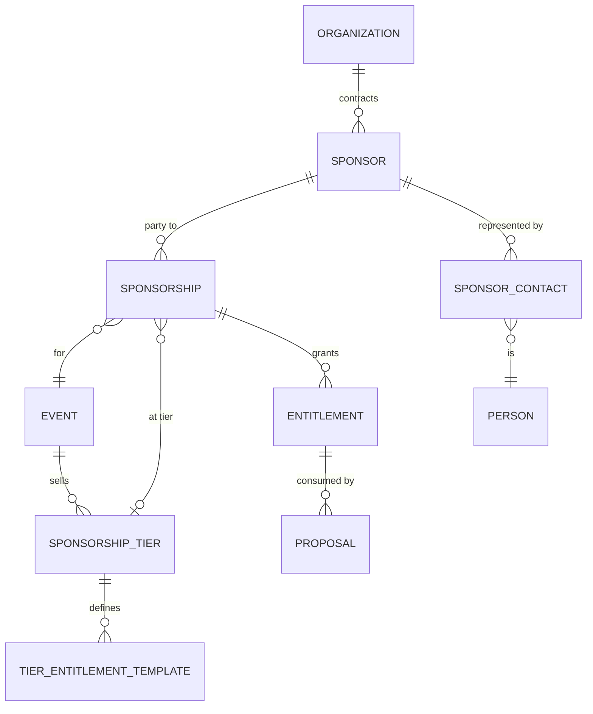
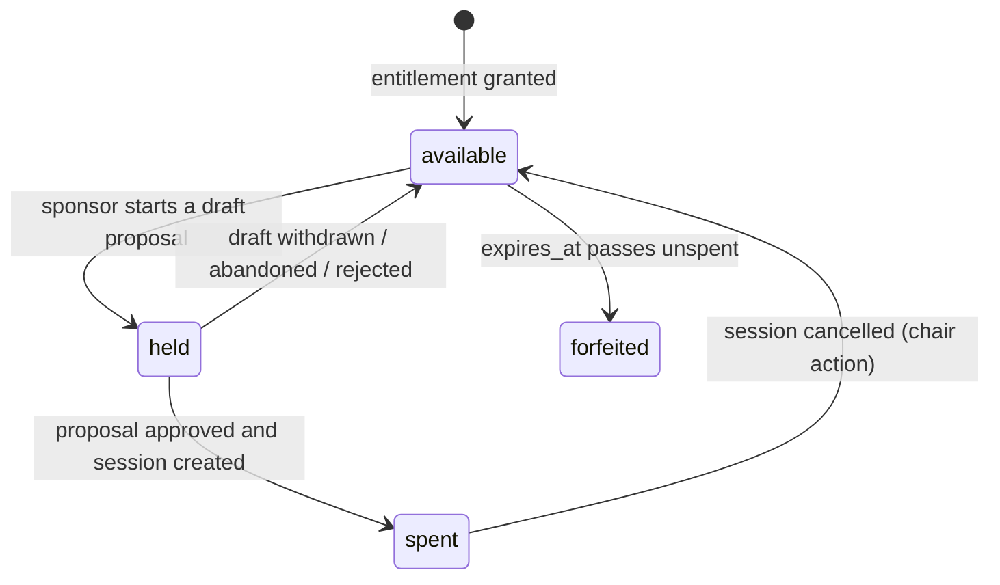

# 03 — Sponsorship

**Aggregate roots:** `Sponsor`, `SponsorshipTier`.

Why this context exists at all: at an AI Engineer conference a large share of the program
is sponsor-contributed, and those sessions arrive with entirely different constraints from
CFP talks. They are **already sold**, so they cannot be rejected on merit — but they can be
sent back for content that is a product pitch when the contract promised a technical talk.
They come from a *company*, not a person, and the speaker is frequently "TBD" for weeks.
And the number of them is contractually bounded, which is the single fact that generic CFP
tools have no way to express.

That bound is modelled as an **`Entitlement`**: a countable right to something, granted by
a contract, consumed by a submission.

## Sponsor

The company. Org-scoped and long-lived — the same sponsor comes back next year, and
carrying their record forward is half the value of having events be plural.

<!-- entity: Sponsor -->
| Field | Type | Req | Notes |
|---|---|---|---|
| `id` | `ulid` | Y | prefix `spo_` |
| `name` | `string` | Y | legal or trading name |
| `display_name` | `string` | N | what goes on the website |
| `slug` | `slug` | Y | unique per org |
| `website_url` | `string` | N | |
| `logo_asset_id` | `ref(Asset)` | N | light-background logo |
| `logo_dark_asset_id` | `ref(Asset)` | N | |
| `description` | `text` | N | markdown, public blurb |
| `industry_tags` | `string[]` | N | |
| `internal_notes` | `text` | N | organizer-only, never public |
| `status` | `enum(prospect, active, lapsed, blocked)` | Y | `blocked` = do not accept, with a reason |
| `created_at` / `updated_at` / `deleted_at` | `timestamptz` | Y/Y/N | |

## SponsorshipTier

Per event, because the packages change every year.

<!-- entity: SponsorshipTier -->
| Field | Type | Req | Notes |
|---|---|---|---|
| `id` | `ulid` | Y | prefix `tir_` |
| `event_id` | `ref(Event)` | Y | |
| `name` | `string` | Y | "Diamond", "Gold", "Community" |
| `slug` | `slug` | Y | unique per event |
| `level` | `int` | Y | sort weight; higher = more prominent |
| `description` | `text` | N | |
| `is_public` | `bool` | Y | whether the tier is shown on the sponsor wall |
| `sort_order` | `int` | Y | |

### TierEntitlementTemplate

What a tier grants by default. Applying a tier to a sponsorship copies these into concrete
`Entitlement` rows — a copy, not a reference, because deals get negotiated and the copy is
then edited without rewriting the tier for everyone else.

<!-- entity: TierEntitlementTemplate -->
| Field | Type | Req | Notes |
|---|---|---|---|
| `id` | `ulid` | Y | |
| `tier_id` | `ref(SponsorshipTier)` | Y | |
| `entitlement_type` | `enum(session_slot, workshop_slot, lightning_slot, keynote_slot, booth, logo_placement, attendee_passes, newsletter_mention, other)` | Y | |
| `quantity` | `int` | Y | |
| `allowed_format_ids` | `ref(SessionFormat)[]` | N | which formats a slot may be spent on |
| `constraints` | `json` | N | `{max_duration_minutes, track_ids, requires_review}` |
| `notes` | `text` | N | |

## Sponsorship

The link between a sponsor and one event — the deal for that year.

<!-- entity: Sponsorship -->
| Field | Type | Req | Notes |
|---|---|---|---|
| `id` | `ulid` | Y | prefix `snp_` |
| `sponsor_id` | `ref(Sponsor)` | Y | |
| `event_id` | `ref(Event)` | Y | unique with `sponsor_id` (INV-03-1) |
| `tier_id` | `ref(SponsorshipTier)` | N | null for bespoke deals |
| `status` | `enum(pending, confirmed, cancelled)` | Y | only `confirmed` sponsorships may spend entitlements (INV-03-2) |
| `confirmed_at` | `timestamptz` | N | |
| `contract_reference` | `string` | N | external CRM/contract id — money lives in that system, not this one |
| `public_from` | `timestamptz` | N | when the logo may appear publicly |
| `internal_notes` | `text` | N | |
| `sort_order_override` | `int` | N | manual placement on the sponsor wall |

Deliberately absent: amounts, invoices, payment status. Sponsorship *fulfilment* is in
scope; sponsorship *billing* is not, and coupling them would drag the platform into finance
territory it should not occupy. `contract_reference` is the seam.

## Entitlement

A countable right. This is the entity that makes sponsor sessions tractable.

<!-- entity: Entitlement -->
| Field | Type | Req | Notes |
|---|---|---|---|
| `id` | `ulid` | Y | prefix `ent_` |
| `sponsorship_id` | `ref(Sponsorship)` | Y | |
| `entitlement_type` | `enum(session_slot, workshop_slot, lightning_slot, keynote_slot, booth, logo_placement, attendee_passes, newsletter_mention, other)` | Y | same members as `TierEntitlementTemplate.entitlement_type` |
| `quantity` | `int` | Y | total granted; may be edited by a sponsor manager with an audit entry |
| `consumed_count` | `int` | D | count of proposals holding or having spent this entitlement |
| `remaining` | `int` | D | `quantity - consumed_count` |
| `allowed_format_ids` | `ref(SessionFormat)[]` | N | |
| `constraints` | `json` | N | |
| `submission_deadline` | `timestamptz` | N | sponsor-specific deadline, usually later than the CFP |
| `expires_at` | `timestamptz` | N | unspent after this = forfeited, surfaced as a nudge not a hard delete |
| `source` | `enum(tier_template, manual, negotiated)` | Y | provenance, so "why does Acme have three slots?" is answerable |
| `notes` | `text` | N | |

**Consumption is a hold, not a decrement.** A sponsor session proposal in `draft` already
holds a slot (otherwise three contacts at the same company race for two slots and two of
them waste an afternoon writing). The hold is released when the proposal is withdrawn,
rejected, or abandoned past a timeout. `consumed_count` is therefore derived from the
proposals pointing at the entitlement, never a hand-maintained counter — the standard way
this class of bug appears.

**Abandoned means 14 days without activity on the draft, with a warning email at 7**
(`Event.settings.sponsorship.draft_abandonment_days`, R22 in
[`13-open-questions.md`](13-open-questions.md)). The number is configurable per event and
belongs in settings rather than in a condition somewhere, because a hold that expires on a
rule nobody can find is indistinguishable from a hold that expired by accident.

## SponsorContact

<!-- entity: SponsorContact -->
| Field | Type | Req | Notes |
|---|---|---|---|
| `id` | `ulid` | Y | prefix `sct_` |
| `sponsor_id` | `ref(Sponsor)` | Y | |
| `person_id` | `ref(Person)` | Y | |
| `contact_role` | `enum(primary, marketing, logistics, speaker_wrangler, billing)` | Y | |
| `event_id` | `ref(Event)` | N | null = contact for all of this sponsor's events |
| `can_submit_sessions` | `bool` | Y | |
| `can_manage_contacts` | `bool` | Y | |
| `status` | `enum(active, revoked)` | Y | |
| `invited_at` / `accepted_at` / `revoked_at` | `timestamptz` | N | |

A sponsor contact is a **relationship**, not a role grant (see
[`01`](01-identity-and-access.md)). Their access to the portal is exactly: their sponsor's
entitlements, the proposals and sessions spent from them, and the onboarding tasks attached
to those. They never see other sponsors, and they never see CFP proposals.

**Contacts churn constantly.** The marketing manager who signed the deal leaves in March.
`status=revoked` plus a fresh invitation is the whole story; nothing is orphaned because
proposals belong to the *sponsor*, not to the contact who typed them.

## Public sponsor read model

`PublicSponsor` — derived, published alongside the schedule (see
[`08`](08-scheduling-and-publication.md)): `name`/`display_name`, `slug`, logo URLs,
`description`, `website_url`, tier name and level, and the list of published sessions.
Never: `internal_notes`, `contract_reference`, entitlement counts, contacts, or `status`.

## Invariants

- **INV-03-1** One `Sponsorship` per `(sponsor, event)`.
- **INV-03-2** An entitlement may only be held or spent while its `Sponsorship.status` is
  `confirmed` and the entitlement is unexpired.
- **INV-03-3** `consumed_count <= quantity` at all times. A submission that would exceed the
  quantity is rejected with a domain error naming the entitlement, not a generic 400.
- **INV-03-4** Lowering `quantity` below `consumed_count` is refused; the sponsor manager
  must first release specific proposals.
- **INV-03-5** A `sponsor_session` proposal must reference an entitlement whose
  `allowed_format_ids` is empty or contains the proposal's format, and whose
  `submission_deadline` (if set) has not passed.
- **INV-03-6** Only an active `SponsorContact` with `can_submit_sessions`, or staff with
  `sponsor_manager`, may create or edit a proposal against that sponsor's entitlements.
- **INV-03-7** A sponsor with `status=blocked` may not hold new entitlements or submit.
- **INV-03-8** A sponsor's logo and name appear publicly only when `Sponsorship.status =
  confirmed` and `public_from` has passed (or is null).
- **INV-03-9** Deleting a sponsor is a soft delete and is refused while any spent
  entitlement is attached to a non-cancelled session.

## Emitted events

`sponsor.created`, `sponsorship.confirmed`, `sponsorship.cancelled`,
`entitlement.granted`, `entitlement.held`, `entitlement.released`, `entitlement.spent`,
`entitlement.exhausted`, `entitlement.expiring_soon`, `sponsor_contact.invited`,
`sponsor_contact.revoked`.

`entitlement.exhausted` and `entitlement.expiring_soon` are the hooks the nudge emails hang
off — the sponsor-chasing job (J2's unhappy path) is mostly "who has unspent slots and a
deadline next week", and that should be a subscription, not a spreadsheet.
