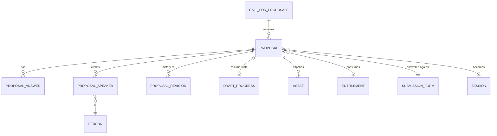
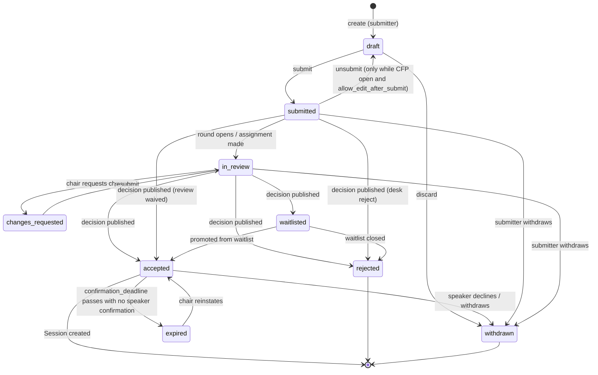

# 04 — Submissions

**Aggregate root:** `Proposal`. `ProposalAnswer`, `ProposalSpeaker`, `ProposalRevision`
and `DraftProgress` are inside the aggregate and only change through it.

Covers J1 (speaker submits an abstract), J2 (sponsor submits a contracted session) and J3
(submitter tracks everything in one portal).

## Proposal

<!-- entity: Proposal -->
| Field | Type | Req | Notes |
|---|---|---|---|
| `id` | `ulid` | Y | prefix `prp_` |
| `org_id` / `event_id` | `ref(...)` | Y | denormalised for scoping and indexing |
| `cfp_id` | `ref(CallForProposals)` | Y | |
| `form_id` | `ref(SubmissionForm)` | Y | the version this proposal is answered against (INV-04-1) |
| `reference` | `string` | Y | human-facing short code, e.g. `WF26-0142`; unique per event (INV-04-2) |
| `origin` | `enum(cfp, sponsor, invited)` | Y | which pipeline this came from |
| `submitter_person_id` | `ref(Person)` | Y | who typed it; not necessarily a speaker |
| `sponsor_id` | `ref(Sponsor)` | N | required when `origin = sponsor` |
| `entitlement_id` | `ref(Entitlement)` | N | required when `origin = sponsor` (INV-04-3) |
| **Promoted content** | | | populated from answers via `FormField.maps_to` |
| `title` | `string` | Y | |
| `abstract` | `text` | Y | public-facing summary |
| `description` | `text` | N | detail for the committee; not published |
| `session_format_id` | `ref(SessionFormat)` | Y | |
| `requested_duration_minutes` | `int` | N | defaults to the format's default |
| `track_id` | `ref(Track)` | N | submitter's preference |
| `assigned_track_id` | `ref(Track)` | N | chair's decision; may differ |
| `audience_level` | `enum(beginner, intermediate, advanced, all)` | N | |
| `keywords` | `string[]` | N | |
| `language` | `string` | N | BCP-47, default `en` |
| `av_requirements` | `enum(projector, confidence_monitor, stage_mics, handheld_mics, recording, livestream, hybrid_av, hands_on_power, wifi_dedicated)[]` | N | matched against `Room.av_capabilities`; same members |
| `recording_consent` | `enum(granted, denied, conditional, unanswered)` | Y | default `unanswered` |
| `recording_conditions` | `text` | N | |
| `coi_disclosure` | `text` | N | vendor affiliation the committee should know about |
| **Lifecycle** | | | |
| `status` | `enum(draft, submitted, in_review, changes_requested, accepted, waitlisted, rejected, withdrawn, expired)` | Y | see state machine |
| `is_late` | `bool` | Y | submitted after `closes_at` under `allow_with_flag` |
| `submitted_at` | `timestamptz` | N | |
| `last_activity_at` | `timestamptz` | Y | drives abandoned-draft nudges |
| `decision_id` | `ref(Decision)` | N | the authoritative decision, once made |
| `confirmation_deadline` | `timestamptz` | N | set on acceptance; drives `expired` |
| `session_id` | `ref(Session)` | N | set once the program item exists |
| `withdrawn_reason` | `text` | N | |
| `content_hash` | `string` | D | hash of reviewable content; changes invalidate a stale review flag |
| `created_at` / `updated_at` / `deleted_at` | `timestamptz` | Y/Y/N | |

### Why content is both promoted columns and answers

Every answer is stored as a `ProposalAnswer` row keyed by `FormField.key` — that is what
makes the form configurable. But the fields the rest of the system reasons about (`title`,
`abstract`, `session_format_id`, `track_id`, `speakers`) are *also* real columns, written
transactionally from the mapped answers.

The alternative — everything in a JSON blob — means the review queue cannot sort by title,
the scheduler cannot check format duration, and every consumer reimplements a lookup by
magic string. The alternative in the other direction — a fixed schema and no custom
questions — fails the first time an organizer wants to ask "have you given this talk
before?". [INV-02-7](02-event-configuration.md) keeps the two in step.

## ProposalAnswer

<!-- entity: ProposalAnswer -->
| Field | Type | Req | Notes |
|---|---|---|---|
| `id` | `ulid` | Y | |
| `proposal_id` | `ref(Proposal)` | Y | |
| `field_key` | `slug` | Y | unique with `proposal_id` (INV-04-4) |
| `form_field_id` | `ref(FormField)` | Y | the exact field version answered |
| `value` | `json` | Y | shape determined by field type; scalar, array, or `{asset_ids:[]}` |
| `answered_at` | `timestamptz` | Y | |
| `display` | `string?` | D | `value` resolved to what a reader sees; `null` when unanswered |

Answers for fields that later become invisible (condition flipped) are **retained, not
deleted**, and excluded from validation and from committee views. A submitter who toggles
"I need travel support" off and on again should not have to retype the details.

### An answer's value is not what a reader sees

`value` is what `FormField.type` stores, and for four types that is an id rather than
anything a person typed: `track_picker` and `format_picker` hold a `Track` / `SessionFormat`
id, `speaker_list` holds `Person` ids, and `file` holds `{asset_ids:[…]}`. `single_select`
and `multi_select` store an option's `value`, not its `label`, and `consent` stores a bool.
Any surface that renders `value` to a person — the reviewer scorecard, the committee detail
view, the submitter's own read view — shows a raw id, an option key, or `true`/`false`
instead of a name.

`display` is that answer resolved for a reader: a track's name, a format's name, the
credited speakers' names joined by comma, an attached file's name (or a bare count where the
name itself is withheld — see below), an option's label, "Yes"/"No" for a boolean. It is
derived, not stored, because the labels it resolves against — a track's name, a person's
display name — belong to those entities and move independently of the answer that references
them. A reference that no longer resolves (a hard-deleted track, a person a reader may not
see) renders as "(no longer available)", never as the id — an id is not a fallback a reader
can act on, and showing one is the leak this rule exists to close.

Under `double_blind` (05, "Fairness rules made explicit"), the `speaker_list` answer is
dropped from what a reviewer's projection returns — it names the people the round exists to
hide, and the roster is what `Proposal.speakers` already represents to a blind reviewer as
"absent", so it would just be naming them a second way. A `file` answer's `display` falls
back to a count with no filenames under `double_blind`, for the same reason a redacted
answer isn't shown with a placeholder: `jane-doe-cv.pdf` identifies as surely as the name
would. Every other reference-valued answer (track, format, option labels) resolves normally
under any anonymity, because a track or a format names the *proposal*, not a person.
`reviewableContentHash` still hashes `value`, never `display` — a track being renamed is not
a change to the proposal, and (per INV-05-8, below) a co-speaker joining the roster under a
blind round is not a change to what that round's reviewer scored either, since the roster was
never part of what they saw.

## ProposalSpeaker

<!-- entity: ProposalSpeaker -->
| Field | Type | Req | Notes |
|---|---|---|---|
| `id` | `ulid` | Y | prefix `psp_` |
| `proposal_id` | `ref(Proposal)` | Y | |
| `person_id` | `ref(Person)` | Y | created as a placeholder person if new |
| `speaker_role` | `enum(primary, co_speaker, moderator, panelist)` | Y | exactly one `primary` (INV-04-5) |
| `sort_order` | `int` | Y | billing order on the schedule |
| `is_submitter` | `bool` | D | `person_id == Proposal.submitter_person_id` |
| `invitation_id` | `ref(Invitation)` | N | for co-speakers who have not accepted |
| `participation_status` | `enum(pending, accepted, declined, removed)` | Y | |
| `added_by_person_id` | `ref(Person)` | Y | |
| `added_at` | `timestamptz` | Y | |

A sponsor session frequently has **no speaker at submission time**. That is legal: an
`origin = sponsor` proposal may be submitted with zero speakers, and "name your speaker"
becomes an onboarding task with its own deadline (see [`07`](07-onboarding.md)). Forcing a
placeholder speaker here is what produces the "TBD TBD, Acme Corp" rows that end up on
printed programs.

## DraftProgress

Multi-step forms need resume. Keeping it in its own row means autosave writes do not churn
the proposal record or its `updated_at`.

<!-- entity: DraftProgress -->
| Field | Type | Req | Notes |
|---|---|---|---|
| `proposal_id` | `ref(Proposal)` | Y | primary key |
| `current_step_key` | `slug` | Y | |
| `completed_step_keys` | `slug[]` | Y | |
| `furthest_step_key` | `slug` | Y | lets the user jump back and forward freely |
| `percent_complete` | `int` | D | required visible fields answered / total |
| `last_saved_at` | `timestamptz` | Y | |
| `client_revision` | `int` | Y | optimistic-concurrency counter for autosave (INV-04-6) |

## ProposalRevision

An append-only record of content changes, needed for three concrete things: showing
reviewers "this changed since you scored it", letting a chair see what was edited during a
`changes_requested` round, and disputes.

<!-- entity: ProposalRevision -->
| Field | Type | Req | Notes |
|---|---|---|---|
| `id` | `ulid` | Y | |
| `proposal_id` | `ref(Proposal)` | Y | |
| `revision_number` | `int` | Y | monotonic |
| `changed_by_person_id` | `ref(Person)` | Y | |
| `change_kind` | `enum(draft_edit, resubmission, organizer_edit, speaker_change)` | Y | |
| `diff` | `json` | Y | `{field: {from, to}}`, PII-redacted at rest per field flags |
| `snapshot` | `json` | N | full content snapshot; written at submit and at each decision |
| `created_at` | `timestamptz` | Y | |

Only `submit` and `decision` revisions carry a full `snapshot`. **The submit snapshot is
what reviewers see** — reviewing a moving target is the fastest way to lose a committee's
trust.

## Lifecycle

Notes on the edges that matter:

- **`accepted` does not create the session.** Acceptance is the organizer's decision;
  the session exists once speakers confirm. That gap is where `confirmation_deadline` and
  `expired` live, and it is the difference between a program you can trust and one where
  three "accepted" talks quietly have no speaker in June.
- **`changes_requested`** is a real state, not a comment. Sponsor sessions land here
  constantly ("this reads as a product pitch; please make it technical"), and so do CFP
  talks with an unworkable scope. It is the only state where a submitter can edit content
  after the CFP has closed.
- **`withdrawn` releases the entitlement hold** for sponsor proposals, and frees a
  `max_proposals_per_person` slot for CFP ones.
- **`submitted --> draft --> submitted` is one move, not two.** Content is immutable in
  `submitted` ([INV-04-7](#invariants)), so an edit has to route through `draft` — but
  `allow_edit_after_submit` promises the submitter that they "may edit until `closes_at`"
  ([02](02-event-configuration.md)), not that fixing a typo silently pulls their proposal
  out of the committee's queue. Saving an edit therefore unsubmits, writes the revision,
  and resubmits within the same request. If the edited proposal now fails a submission
  rule it stays a `draft` and the submitter is told which rule; that is the only way this
  round trip ends anywhere but `submitted`.

## Submission-time validation

Submit runs the full ruleset; autosave runs none of it beyond type coercion. Failing rules
are returned as a list keyed by `field_key` so the UI can route each error back to its step.

1. The CFP is `open` (or within `grace_period_minutes`, or `allow_with_flag` applies).
2. Every visible required field on every visible step has an answer.
3. `maps_to` fields satisfy their domain constraints (format eligible for this CFP, track
   available, duration within the format's min/max).
4. Speaker count is within `SessionFormat.max_speakers`; a `primary` exists — unless
   `origin = sponsor`, which may submit speaker-less.
5. `max_proposals_per_person` not exceeded, counting only non-withdrawn, non-rejected
   proposals by the same submitter under this CFP.
6. For `origin = sponsor`: [INV-03-5](03-sponsorship.md) and [INV-03-3](03-sponsorship.md)
   hold.
7. `recording_consent != unanswered` when the format requires it.
8. All referenced assets have `scan_status = clean`.

## Submitter portal read model (J3)

`SubmitterDashboard`, per person, spanning every event — one page that answers "what have I
got outstanding":

- **Proposals**: reference, title, event, status, a plain-language next action
  ("Awaiting decision", "Confirm by 14 April", "3 changes requested"), deadline, and
  whether they can still edit.
- **Speaking invitations**: proposals where they are a `co_speaker` with
  `participation_status = pending`.
- **Sessions**: confirmed program items with time and room once published.
- **Tasks**: open `TaskInstance`s across all sessions, sorted by due date, with the overdue
  ones first.
- **Profile**: completeness, and what is publicly visible.

This read model is the portal. It must be assemblable in one round trip per person, which
is why `TaskInstance` carries a denormalised `assignee_person_id` and `due_at`.

## Invariants

- **INV-04-1** `form_id` is set at draft creation and never changes implicitly. Migrating a
  draft to a newer form version is an explicit submitter action that re-validates and
  reports dropped answers.
- **INV-04-2** `reference` is unique per event, assigned at draft creation, and never reused
  even if the proposal is deleted.
- **INV-04-3** `origin = sponsor` requires both `sponsor_id` and `entitlement_id`, and the
  entitlement must belong to a `Sponsorship` for this event.
  `origin = cfp` requires both to be null.
- **INV-04-4** One answer per `(proposal, field_key)`.
- **INV-04-5** A non-`sponsor` proposal has exactly one `primary` speaker with
  `participation_status != removed`. Speaker count never exceeds
  `SessionFormat.max_speakers`.
- **INV-04-6** Autosave uses `client_revision` for optimistic concurrency; a stale write is
  rejected with the current server state so two tabs cannot silently clobber each other.
- **INV-04-7** Content fields are immutable in `submitted`, `in_review`, `accepted`,
  `waitlisted` and `rejected` except via an organizer edit, which always writes a
  `ProposalRevision` with `change_kind = organizer_edit`.
- **INV-04-8** `status = accepted` requires a `decision_id` whose `outcome` is `accept`.
- **INV-04-9** A proposal may reference at most one `Session`, and a session at most one
  proposal.
- **INV-04-10** Withdrawing or rejecting releases any entitlement hold in the same
  transaction.
- **INV-04-11** A submitter may not see reviews, scores, reviewer identities, or committee
  comments for their own proposal at any status. Only `comments_for_speaker` from a
  published decision is visible.
- **INV-04-12** `content_hash` covers exactly the fields reviewers score against; any change
  bumps it and flags affected submitted reviews as `stale`.

## Emitted events

`proposal.created`, `proposal.submitted`, `proposal.resubmitted`, `proposal.withdrawn`,
`proposal.updated`, `proposal.changes_requested`, `proposal.expired`,
`proposal_speaker.added`, `proposal_speaker.accepted`, `proposal_speaker.declined`,
`proposal_speaker.removed`, `draft.abandoned` (no activity for N days, drives the nudge).
