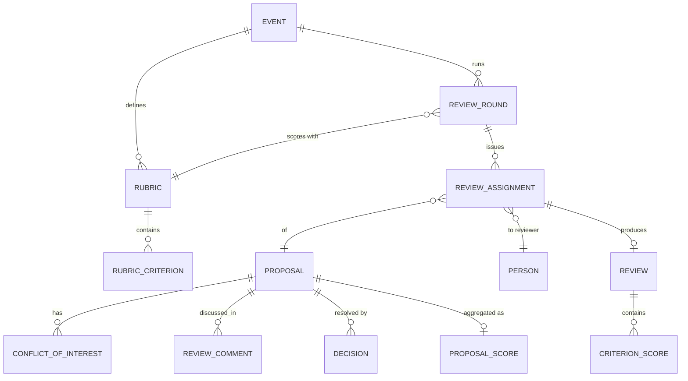
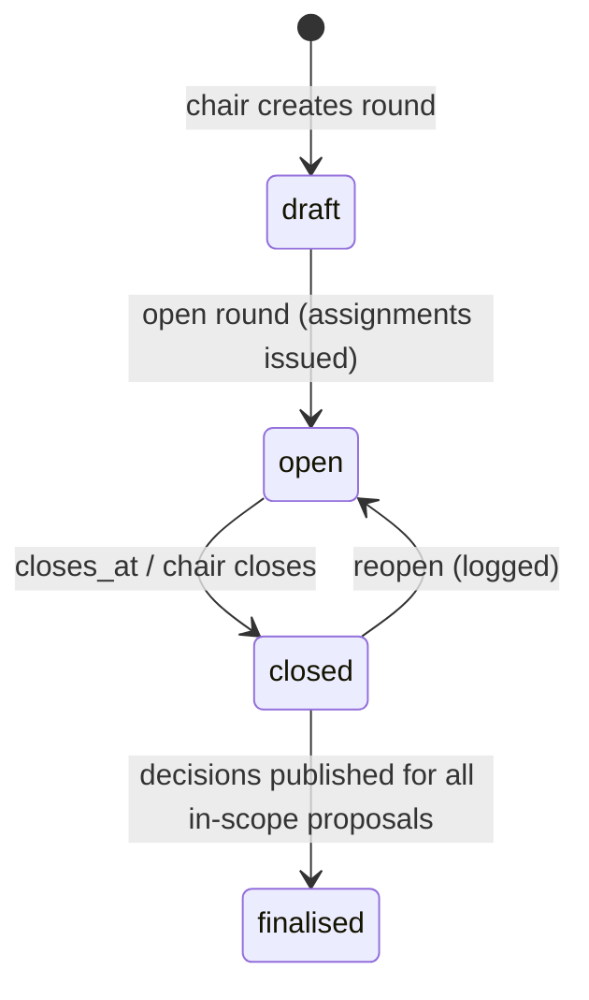
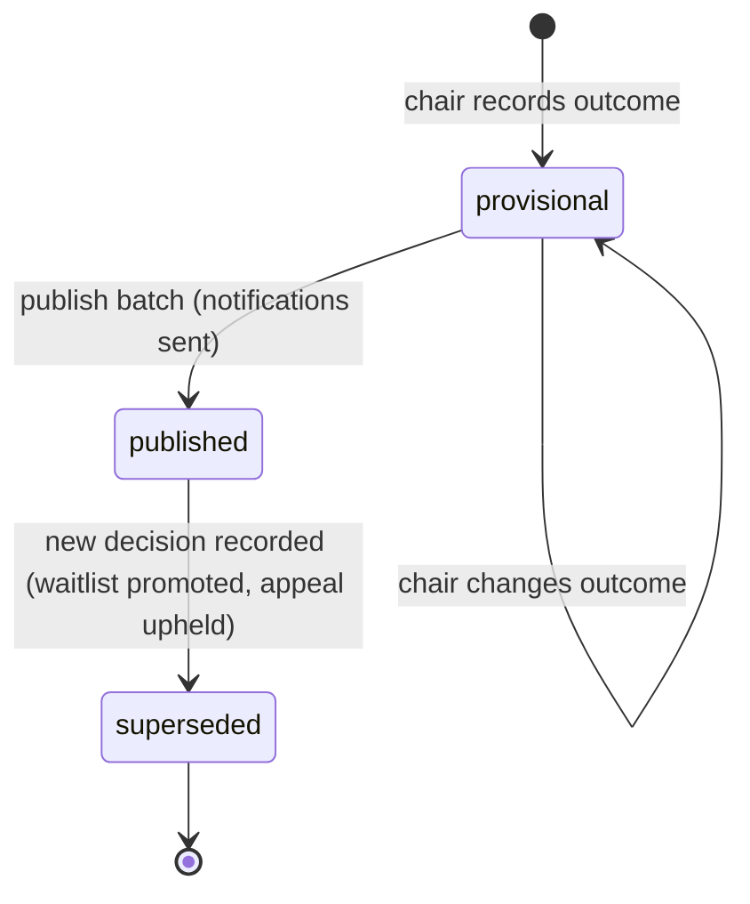

# 05 — Review & Selection

**Aggregate roots:** `ReviewRound`, `Rubric`, `Review`, `Decision`.

Covers J5 (review fairly, without conflicts) and J6 (decide the program and tell people).

The governing constraint is **evidence integrity**: a review must be attributable, tied to
the exact content it was written against, and impossible to quietly rewrite after the fact.
Everything else here follows from that.

## ReviewRound

Rounds are plural on purpose: a screening pass over 900 submissions with two light
reviewers each, then a deep round on the surviving 200, then a chairs' shortlist meeting.
Modelling one round forces organizers to fake the others in spreadsheets.

| Field | Type | Req | Notes |
|---|---|---|---|
| `id` | `ulid` | Y | prefix `rnd_` |
| `event_id` | `ref(Event)` | Y | |
| `name` | `string` | Y | "Screening", "Deep review" |
| `sequence` | `int` | Y | order within the event |
| `rubric_id` | `ref(Rubric)` | Y | |
| `scope` | `json` | N | which proposals are in play: `{track_ids, format_ids, cfp_ids, min_prior_score}` |
| `anonymity` | `enum(open, single_blind, double_blind)` | Y | `single_blind` hides reviewers from submitters; `double_blind` also hides speakers from reviewers |
| `opens_at` / `closes_at` | `timestamptz` | Y | |
| `target_reviews_per_proposal` | `int` | Y | the quorum for a complete proposal |
| `max_assignments_per_reviewer` | `int` | N | load cap used by the assignment algorithm |
| `allow_self_assignment` | `bool` | Y | bidding mode: reviewers claim from a pool |
| `show_other_reviews_before_submit` | `bool` | Y | default **false** — anchoring is real (INV-05-6) |
| `discussion_enabled` | `bool` | Y | |
| `status` | `enum(draft, open, closed, finalised)` | Y | |

## Rubric and RubricCriterion

| Rubric field | Type | Req | Notes |
|---|---|---|---|
| `id` | `ulid` | Y | prefix `rub_` |
| `event_id` | `ref(Event)` | Y | |
| `name` | `string` | Y | |
| `description` | `text` | N | |
| `version` | `int` | Y | immutable once used by an open round (INV-05-1) |
| `overall_scale` | `enum(none, recommendation, numeric)` | Y | whether reviewers give a holistic verdict on top of criteria |
| `requires_comment` | `bool` | Y | force at least one written comment |

| Criterion field | Type | Req | Notes |
|---|---|---|---|
| `id` | `ulid` | Y | prefix `crt_` |
| `rubric_id` | `ref(Rubric)` | Y | |
| `key` | `slug` | Y | unique per rubric; stable across versions |
| `label` | `string` | Y | "Technical depth", "Speaker credibility", "Novelty", "Fit for track" |
| `description` | `text` | N | anchor text for what a 1 and a 5 mean — the single highest-leverage field for score consistency |
| `scale_min` / `scale_max` | `int` | Y | typically 1–5 |
| `weight` | `decimal` | Y | default 1.0 |
| `is_required` | `bool` | Y | |
| `allows_na` | `bool` | Y | "can't judge this" is more honest than a 3 |
| `sort_order` | `int` | Y | |

## ReviewAssignment

| Field | Type | Req | Notes |
|---|---|---|---|
| `id` | `ulid` | Y | prefix `asg_` |
| `round_id` | `ref(ReviewRound)` | Y | |
| `proposal_id` | `ref(Proposal)` | Y | |
| `reviewer_person_id` | `ref(Person)` | Y | unique with round+proposal (INV-05-2) |
| `assigned_by` | `enum(chair, algorithm, self)` | Y | |
| `status` | `enum(assigned, accepted, declined, in_progress, submitted, revoked, expired)` | Y | |
| `decline_reason` | `enum(conflict_of_interest, no_expertise, no_capacity, other)` | N | |
| `due_at` | `timestamptz` | N | defaults to the round's `closes_at` |
| `assigned_at` / `submitted_at` | `timestamptz` | Y/N | |

`decline_reason = conflict_of_interest` **automatically creates a `ConflictOfInterest`
record** so the same reviewer is not reassigned in the next round. Making a reviewer declare
the same conflict three times is how conflicts stop being declared.

## Review

| Field | Type | Req | Notes |
|---|---|---|---|
| `id` | `ulid` | Y | prefix `rvw_` |
| `assignment_id` | `ref(ReviewAssignment)` | Y | unique (INV-05-3) |
| `proposal_id` / `round_id` / `reviewer_person_id` | `ref(...)` | Y | denormalised for querying |
| `recommendation` | `enum(strong_accept, accept, weak_accept, neutral, weak_reject, reject, strong_reject)` | N | required when `Rubric.overall_scale = recommendation` |
| `overall_score` | `decimal` | D | weighted mean of criterion scores |
| `confidence` | `enum(low, medium, high, expert)` | N | weights the aggregate and flags thin coverage |
| `comments_for_committee` | `text` | N | never visible to the submitter (INV-05-7) |
| `comments_for_speaker` | `text` | N | released only with a published decision |
| `flags` | `enum(off_topic, product_pitch, duplicate, needs_coi_check, exceptional, code_of_conduct_concern)[]` | N | |
| `status` | `enum(draft, submitted, stale)` | Y | |
| `reviewed_content_hash` | `string` | Y | `Proposal.content_hash` at submit time (INV-05-8) |
| `submitted_at` / `updated_at` | `timestamptz` | N/Y | |

| CriterionScore field | Type | Req | Notes |
|---|---|---|---|
| `review_id` | `ref(Review)` | Y | |
| `criterion_id` | `ref(RubricCriterion)` | Y | unique with `review_id` |
| `value` | `int` | N | null only when `allows_na` |
| `note` | `text` | N | |

A `submitted` review is **append-only**. Editing one creates a new version and marks the
prior `superseded`; the aggregate always reads the latest. `stale` means the proposal
changed underneath it — the reviewer is prompted to re-confirm, and the chair sees the
staleness in the queue rather than discovering it during the decision meeting.

## ConflictOfInterest

| Field | Type | Req | Notes |
|---|---|---|---|
| `id` | `ulid` | Y | prefix `coi_` |
| `event_id` | `ref(Event)` | Y | |
| `reviewer_person_id` | `ref(Person)` | Y | |
| `subject_type` | `enum(proposal, person, sponsor, company_domain)` | Y | |
| `subject_id` | `ulid` | N | null for `company_domain` |
| `subject_value` | `string` | N | the domain, for `company_domain` |
| `reason` | `enum(same_employer, co_author, personal, financial, advisor, undisclosed_other)` | Y | |
| `source` | `enum(declared_by_reviewer, declared_by_chair, auto_detected)` | Y | |
| `note` | `text` | N | |
| `created_at` | `timestamptz` | Y | |

Auto-detection is intentionally shallow and advisory: matching email domains between a
reviewer and a speaker, a reviewer being a contact for the sponsoring company, and a
reviewer credited on the proposal. Anything cleverer produces false confidence. A
`company_domain` conflict is the one that scales — reviewers from big labs declare their
employer's domain once and are excluded from every proposal by their colleagues.

## Discussion

| ReviewComment field | Type | Req | Notes |
|---|---|---|---|
| `id` | `ulid` | Y | prefix `rcm_` |
| `proposal_id` | `ref(Proposal)` | Y | |
| `round_id` | `ref(ReviewRound)` | N | |
| `author_person_id` | `ref(Person)` | Y | |
| `parent_id` | `ref(ReviewComment)` | N | one level of threading |
| `body` | `text` | Y | markdown |
| `visibility` | `enum(committee_only, chairs_only)` | Y | never speaker-visible (INV-05-7) |
| `created_at` / `edited_at` / `deleted_at` | `timestamptz` | Y/N/N | |

Speaker-facing feedback goes through `Decision.feedback_for_speaker`, assembled by the
chair. There is exactly one channel to the speaker, and a human writes it. Piping raw
committee discussion to submitters is a reliable way to end up on social media.

## Aggregation — ProposalScore

A derived read model, recomputed when a review is submitted, superseded, or goes stale.

| Field | Type | Notes |
|---|---|---|
| `proposal_id` / `round_id` | `ref(...)` | key |
| `review_count` / `submitted_count` / `stale_count` | `int` | |
| `mean` / `median` / `stddev` | `decimal` | on `Review.overall_score` |
| `weighted_mean` | `decimal` | weighted by `confidence` |
| `per_criterion_mean` | `json` | `{criterion_key: mean}` |
| `recommendation_histogram` | `json` | |
| `disagreement` | `decimal` | normalised stddev; the chair's triage signal |
| `has_quorum` | `bool` | `submitted_count >= target_reviews_per_proposal` |
| `flag_counts` | `json` | |

Ranking is never automatic. The model provides the numbers and the disagreement signal; a
human decides. High-`disagreement` proposals are the ones worth a discussion slot, and
surfacing them is more useful than any auto-ranking.

## Decision

The authoritative selection record. `Proposal.status` is downstream of this, not parallel
to it.

| Field | Type | Req | Notes |
|---|---|---|---|
| `id` | `ulid` | Y | prefix `dec_` |
| `proposal_id` | `ref(Proposal)` | Y | |
| `round_id` | `ref(ReviewRound)` | N | null for desk decisions |
| `outcome` | `enum(accept, waitlist, reject, request_changes)` | Y | |
| `assigned_track_id` | `ref(Track)` | N | may move the talk to a different track |
| `assigned_format_id` | `ref(SessionFormat)` | N | "accept, but as a lightning talk" |
| `assigned_duration_minutes` | `int` | N | "accept, but 20 minutes not 40" |
| `conditions` | `text` | N | conditions of acceptance, shown to the speaker |
| `feedback_for_speaker` | `text` | N | the one speaker-facing channel |
| `rationale` | `text` | N | committee-only |
| `decided_by_person_id` | `ref(Person)` | Y | |
| `decided_at` | `timestamptz` | Y | |
| `status` | `enum(provisional, published, superseded)` | Y | |
| `published_at` | `timestamptz` | N | when the speaker was told (INV-05-9) |
| `notification_id` | `ref(NotificationDelivery)` | N | |
| `confirmation_deadline` | `timestamptz` | N | copied onto the proposal on accept |
| `supersedes_decision_id` | `ref(Decision)` | N | waitlist → accept keeps both records |

**Provisional vs published** is the most important distinction in this file. Chairs decide
over days, in meetings, changing their minds. Nothing reaches a speaker until the chair
publishes — as a deliberate batch, with a preview of exactly who gets which email. The
alternative is the classic disaster where saving a dropdown emails 400 rejections at 2am.

Publishing a batch, in one transaction per proposal: set `Decision.status = published`,
move `Proposal.status`, stamp `confirmation_deadline` on accepts, and enqueue exactly one
notification per proposal. Re-running a publish is idempotent on `decision.id` — nobody gets
told twice.

## Fairness rules made explicit

Rules stated here because "we all knew that" is not enforceable:

- A reviewer never reviews a proposal they are credited on, submitted, or have a `COI`
  against (INV-05-4).
- Under `double_blind`, reviewers do not see speaker names, bios, affiliations, links, or
  any answer whose field is flagged `pii`, and the proposal's `content_hash` covers only the
  fields they can see.
- Under `double_blind`, sponsor sessions are still identifiable (the sponsor is the point) —
  so sponsor sessions are excluded from blind rounds by scope rather than pretending.
- A chair may override any aggregate, but an override on a proposal where the chair has a
  COI is refused outright, not merely logged.
- Reviewer identities are never exposed to submitters, in any state, through any API
  response or event payload.

## Invariants

- **INV-05-1** A `Rubric` version referenced by a non-`draft` round is immutable. Changes
  create a new version.
- **INV-05-2** One assignment per `(round, proposal, reviewer)`.
- **INV-05-3** One current `Review` per assignment; edits supersede rather than mutate.
- **INV-05-4** An assignment may not be created, and a review may not be submitted, where a
  `ConflictOfInterest` matches the reviewer and the proposal (directly, via a credited
  person, via the sponsor, or via `company_domain` against a speaker's email domain).
- **INV-05-5** Every required criterion has a `CriterionScore` before a review may be
  submitted; `null` only where `allows_na`.
- **INV-05-6** When `show_other_reviews_before_submit` is false, a reviewer cannot read
  other reviews, aggregate scores, or discussion for a proposal until their own review is
  submitted or their assignment is declined.
- **INV-05-7** `comments_for_committee`, `rationale`, `ReviewComment` bodies, reviewer
  identities and raw scores are never exposed to submitters or in public/API read models
  available to them.
- **INV-05-8** `Review.reviewed_content_hash` must equal `Proposal.content_hash` at submit
  time; divergence sets `status = stale`.
- **INV-05-9** A `Decision` may only be `published` when `Proposal.status` allows it and,
  for `outcome = accept`, `confirmation_deadline` is set and in the future.
- **INV-05-10** Publishing a decision batch sends at most one speaker notification per
  proposal, and is idempotent on decision id.
- **INV-05-11** `outcome = accept` requires `has_quorum`, unless the round is configured to
  waive it or the chair records an explicit `quorum_waived` reason on the decision.
- **INV-05-12** A round cannot be `finalised` while any in-scope proposal lacks a published
  decision.

## Emitted events

`review_round.opened`, `review_round.closed`, `review_assignment.created`,
`review_assignment.declined`, `review.submitted`, `review.stale`,
`conflict_of_interest.declared`, `decision.recorded`, `decision.published`,
`proposal.accepted`, `proposal.rejected`, `proposal.waitlisted`.

`decision.published` is the seam the whole downstream program hangs off — onboarding,
scheduling and every integration react to it, not to a database status column.
