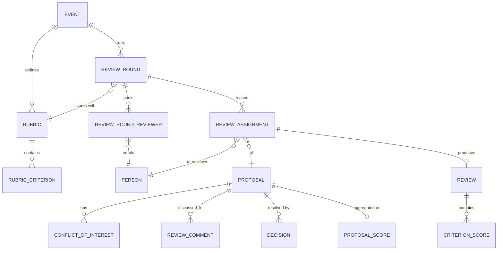
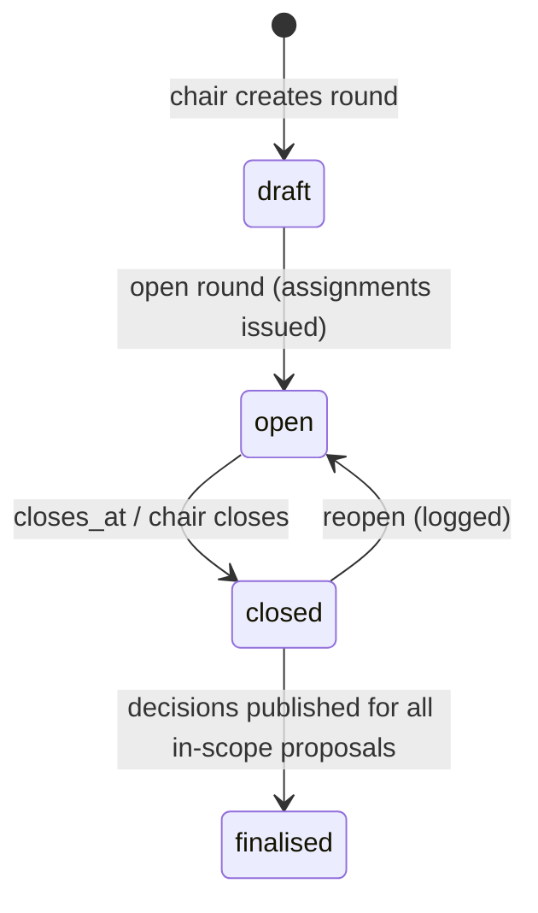
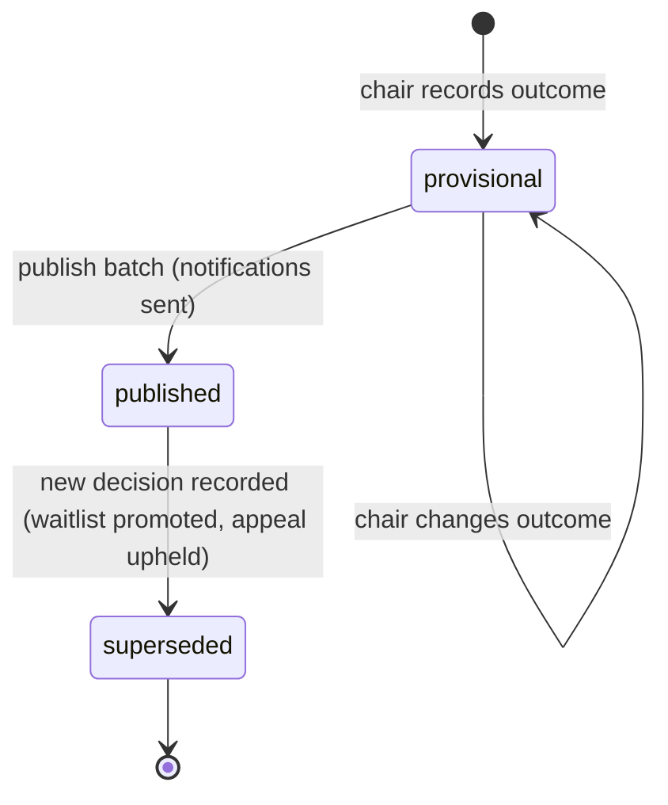

# 05 — Review & Selection

**Aggregate roots:** `ReviewRound`, `Rubric`, `Review`, `Decision`.

Covers J5 (review fairly, without conflicts) and J6 (decide the program and tell people).

The governing constraint is **evidence integrity**: a review must be attributable, tied to
the exact content it was written against, and impossible to quietly rewrite after the fact.
Everything else here follows from that.

## ReviewRound

Rounds are plural on purpose: a screening pass over 900 submissions with two light
reviewers each, then a deep round on the surviving 200, then a chairs' shortlist meeting.
Modelling one round forces organizers to fake the others in spreadsheets.

<!-- entity: ReviewRound -->
| Field | Type | Req | Notes |
|---|---|---|---|
| `id` | `ulid` | Y | prefix `rnd_` |
| `event_id` | `ref(Event)` | Y | |
| `name` | `string` | Y | "Screening", "Deep review" |
| `sequence` | `int` | Y | order within the event |
| `rubric_id` | `ref(Rubric)` | Y | |
| `scope` | `json` | N | which proposals are in play: `{track_ids, format_ids, cfp_ids, min_prior_score}` |
| `anonymity` | `enum(open, single_blind, double_blind)` | Y | `single_blind` hides reviewers from submitters; `double_blind` also hides speakers from reviewers |
| `opens_at` / `closes_at` | `timestamptz` | Y | |
| `target_reviews_per_proposal` | `int` | Y | the quorum for a complete proposal |
| `max_assignments_per_reviewer` | `int` | N | load cap used by the assignment algorithm |
| `allow_self_assignment` | `bool` | Y | bidding mode: reviewers claim from a pool |
| `show_other_reviews_before_submit` | `bool` | Y | default **false** — anchoring is real (INV-05-6) |
| `discussion_enabled` | `bool` | Y | |
| `status` | `enum(draft, open, closed, finalised)` | Y | |

### ReviewRoundReviewer — the per-round pool

A `RoleGrant` of `reviewer` says *this person reviews for this event*. It does not say
*which rounds*, and rounds have genuinely different casts: a screening round run by twenty
volunteers, a deep round by six domain experts, a chairs' shortlist by three. Expressing
that with grant expiry — the previous approach — means revoking and re-granting people
between rounds, which is both laborious and lossy.

| Field | Type | Req | Notes |
|---|---|---|---|
| `id` | `ulid` | Y | prefix `rrv_` |
| `round_id` | `ref(ReviewRound)` | Y | |
| `person_id` | `ref(Person)` | Y | unique with `round_id` (INV-05-15) |
| `pool_role` | `enum(reviewer, meta_reviewer, observer)` | Y | `meta_reviewer` sees the round's aggregates; `observer` reads without scoring |
| `track_ids` | `ref(Track)[]` | N | narrows what may be assigned to them within the round |
| `max_assignments` | `int` | N | per-person cap, overriding the round's `max_assignments_per_reviewer` |
| `added_by_person_id` | `ref(Person)` | Y | |
| `status` | `enum(active, removed)` | Y | |

Membership of a round's pool is a prerequisite for holding an assignment in it (INV-05-15),
which makes "who is reviewing round 2" a query rather than an inference from who happens to
have assignments. Adding somebody to a pool does not assign them anything; the two actions
are separate because bulk-adding a committee and then distributing work are separate days.

### Assignment at scale

Three mechanisms, because a round of 900 proposals is not assigned by clicking:

- **Caps.** `ReviewRound.max_assignments_per_reviewer`, narrowed per person by
  `ReviewRoundReviewer.max_assignments`. Assignment stops at the cap and says so.
- **Filtered bulk assignment.** Select by track, format, CFP or keyword; assign the whole
  filtered set to one reviewer or spread it across a chosen group in one command.
- **Auto-distribution.** `assigned_by = algorithm` over the round's pool, honouring caps,
  track affinity and every `ConflictOfInterest`, aiming at
  `target_reviews_per_proposal` per proposal. It produces a *proposed* set the chair
  reviews and confirms — see [R12](13-open-questions.md).

All three are ordinary commands over `ReviewAssignment`, and all three refuse silently-bad
outcomes loudly: a proposal that cannot reach quorum without a COI violation is reported as
unassignable rather than being quietly under-reviewed.

## Rubric and RubricCriterion

<!-- entity: Rubric -->
| Rubric field | Type | Req | Notes |
|---|---|---|---|
| `id` | `ulid` | Y | prefix `rub_` |
| `event_id` | `ref(Event)` | Y | |
| `name` | `string` | Y | |
| `description` | `text` | N | |
| `version` | `int` | Y | immutable once used by an open round (INV-05-1) |
| `overall_scale` | `enum(none, recommendation, numeric)` | Y | whether reviewers give a holistic verdict on top of criteria |
| `requires_comment` | `bool` | Y | force at least one written comment |

<!-- entity: RubricCriterion -->
| Criterion field | Type | Req | Notes |
|---|---|---|---|
| `id` | `ulid` | Y | prefix `crt_` |
| `rubric_id` | `ref(Rubric)` | Y | |
| `key` | `slug` | Y | unique per rubric; stable across versions |
| `label` | `string` | Y | "Technical depth", "Speaker credibility", "Novelty", "Fit for track" |
| `description` | `text` | N | anchor text for what a 1 and a 5 mean — the single highest-leverage field for score consistency |
| `type` | `enum(numeric, select, text, boolean)` | Y | what the reviewer is asked for (INV-05-13) |
| `scale_min` / `scale_max` | `int` | N | required for `numeric`; typically 1–5 or 1–10 |
| `options` | `json` | N | required for `select`: `[{value, label, description, score}]` |
| `max_length` | `int` | N | for `text` |
| `weight` | `decimal` | Y | default 1.0; ignored for `text` (INV-05-14) |
| `is_required` | `bool` | Y | |
| `allows_na` | `bool` | Y | "can't judge this" is more honest than a 3 |
| `sort_order` | `int` | Y | |

**Why criteria are typed rather than uniformly numeric.** A committee's scorecard is not
five sliders. It is two or three numbers, one categorical verdict ("Accept / Maybe /
Reject"), and a box where the actual reasoning goes — and the categorical one is usually
the field the chair sorts on. Forcing the verdict into a 1–5 scale loses the vocabulary the
committee argues in; leaving free text out of the rubric pushes the reasoning into an email
thread. Both are how a review process stops being auditable.

A `select` option may carry an optional `score`, which is what lets a categorical criterion
participate in the weighted aggregate ("Accept" = 5, "Maybe" = 3, "Reject" = 1). Where
`score` is omitted the criterion is reported as a histogram and excluded from the mean —
some verdicts genuinely are not numbers and averaging them invents precision.

### The starter scorecard

The shape above is not a matter of taste, so a new event gets it built
([`02`](02-event-configuration.md), "the starter blueprint"): two weighted numbers — *fit
for the track* and *technical depth* — one optional number for *speaker credibility*, a
`select` verdict carrying scores, and a required comment. Every criterion ships with anchor
text, because `description` is the single highest-leverage field for score consistency and a
committee that has to invent its own anchors mid-round will not.

It is an ordinary `Rubric` once created: renamed, reweighted, or deleted before the first
round opens.

### The sponsor compliance rubric

Sponsor sessions are not selected — they hold a slot the sponsor already bought, and
`requires_review = false` on the format stays true ([`02`](02-event-configuration.md)).
They are still *checked*, and that check gets a rubric of exactly one criterion: **is this a
technical talk or a product pitch?** A `select` with anchored option descriptions, run by
one organizer, with `changes_requested` as its outcome (R17 in
[`13-open-questions.md`](13-open-questions.md)).

One criterion is the whole design. "Please rework this" is a conversation an organizer has
to have with somebody who has paid, and having it from a recorded judgement against a
written anchor is a different conversation from having it from an opinion. Scaling it up to
a real scorecard would imply the session is competing for a slot it already owns.

## ReviewAssignment

<!-- entity: ReviewAssignment -->
| Field | Type | Req | Notes |
|---|---|---|---|
| `id` | `ulid` | Y | prefix `asg_` |
| `round_id` | `ref(ReviewRound)` | Y | |
| `proposal_id` | `ref(Proposal)` | Y | |
| `reviewer_person_id` | `ref(Person)` | Y | unique with round+proposal (INV-05-2) |
| `assigned_by` | `enum(chair, algorithm, self)` | Y | |
| `status` | `enum(assigned, accepted, declined, in_progress, submitted, revoked, expired)` | Y | |
| `decline_reason` | `enum(conflict_of_interest, no_expertise, no_capacity, other)` | N | |
| `due_at` | `timestamptz` | N | defaults to the round's `closes_at` |
| `reminder_count` / `last_reminded_at` | `int` / `timestamptz` | Y/N | so "have we chased them?" has an answer |
| `assigned_at` / `submitted_at` | `timestamptz` | Y/N | |

`decline_reason = conflict_of_interest` **automatically creates a `ConflictOfInterest`
record** so the same reviewer is not reassigned in the next round. Making a reviewer declare
the same conflict three times is how conflicts stop being declared.

## Review

<!-- entity: Review -->
| Field | Type | Req | Notes |
|---|---|---|---|
| `id` | `ulid` | Y | prefix `rvw_` |
| `assignment_id` | `ref(ReviewAssignment)` | N | null only for `author_kind = ai` (INV-05-16) |
| `proposal_id` / `round_id` / `reviewer_person_id` | `ref(...)` | Y/Y/N | denormalised for querying; reviewer is null for AI reviews |
| `author_kind` | `enum(human, ai)` | Y | default `human` (INV-05-16) |
| `ai_evaluator_key` | `string` | N | which configured evaluator produced it |
| `ai_model` | `string` | N | the model identifier, recorded for reproducibility |
| `ai_rationale` | `text` | N | the written reasoning; required when `author_kind = ai` |
| `overridden_by_person_id` | `ref(Person)` | N | a human who replaced the AI's scores |
| `overridden_at` | `timestamptz` | N | |
| `recommendation` | `enum(strong_accept, accept, weak_accept, neutral, weak_reject, reject, strong_reject)` | N | required when `Rubric.overall_scale = recommendation` |
| `overall_score` | `decimal` | D | weighted mean of criterion scores |
| `confidence` | `enum(low, medium, high, expert)` | N | weights the aggregate and flags thin coverage |
| `comments_for_committee` | `text` | N | never visible to the submitter (INV-05-7) |
| `comments_for_speaker` | `text` | N | released only with a published decision |
| `flags` | `enum(off_topic, product_pitch, duplicate, needs_coi_check, exceptional, code_of_conduct_concern)[]` | N | |
| `status` | `enum(draft, submitted, stale, superseded)` | Y | `superseded` is set when an edit creates a newer version (INV-05-3) |
| `reviewed_content_hash` | `string` | Y | `Proposal.content_hash` at submit time (INV-05-8) |
| `submitted_at` / `updated_at` | `timestamptz` | N/Y | |

<!-- entity: CriterionScore -->
| CriterionScore field | Type | Req | Notes |
|---|---|---|---|
| `review_id` | `ref(Review)` | Y | |
| `criterion_id` | `ref(RubricCriterion)` | Y | unique with `review_id` |
| `value_number` | `int` | N | for `numeric`; null only when `allows_na` |
| `value_option` | `string` | N | for `select`; must be one of the criterion's option values |
| `value_text` | `text` | N | for `text` |
| `value_bool` | `bool` | N | for `boolean` |
| `effective_score` | `decimal` | D | the number this contributes to the aggregate, or null (INV-05-14) |
| `note` | `text` | N | |

A `submitted` review is **append-only**. Editing one creates a new version and marks the
prior `superseded`; the aggregate always reads the latest. `stale` means the proposal
changed underneath it — the reviewer is prompted to re-confirm, and the chair sees the
staleness in the queue rather than discovering it during the decision meeting.

### AI first-pass evaluation

An AI review is a `Review` like any other, distinguished by `author_kind = ai`. Modelling
it as a separate "AI score" column was the alternative and it is worse: the chair's table,
the aggregate, the export and the audit trail would each need a second code path, and the
one thing that must be true — that a machine's opinion is visibly a machine's opinion — is
easier to guarantee in one place than four.

The rules that make it safe to have at all:

- **It never counts toward quorum.** `has_quorum` counts human reviews only (INV-05-17).
  A proposal with three AI reviews and no human one is unreviewed.
- **It is always labelled**, in the results table, the export, the API and every event
  payload. `author_kind` is not optional and not themeable.
- **It must show its reasoning.** `ai_rationale` is required, and a rationale generic enough
  to apply to any proposal is a defect in the evaluator, not an acceptable output.
- **A human can override it.** Overriding writes the human's scores onto a new review with
  `author_kind = human`, marks the AI review superseded, and records
  `overridden_by_person_id` — so the disagreement is preserved rather than erased.
- **It is a triage aid, never a decision.** `outcome = accept` from an AI review alone is
  refused by INV-05-11's quorum rule, which is exactly the point.

`AiEvaluator` configuration (which model, which rubric, what prompt persona, which scope of
proposals) is an `Integration` with `capability = analytics`; the core calls the contract
and stores the result. See [`09`](09-api-and-integrations.md).

**Shipped behind `Organization.settings.review.ai_evaluation_enabled`, default off**
(R24 in [`13-open-questions.md`](13-open-questions.md)). The guardrails above are worth
having in the model before anyone adds the feature in a hurry, but a bad first-pass score
anchors a committee even when everyone in the room knows it came from a machine. The
committees that turn it on will mostly use it to triage a first cut of 900 submissions,
not to decide anything.

## Progress and chasing

Reviews are late. Every round, for every committee, without exception — and the difference
between a round that closes on time and one that slips two weeks is entirely whether the
chair could see who was behind while there was still time to do something about it.

**`ReviewerProgress`** (derived, per round per reviewer) is that view:

| Field | Notes |
|---|---|
| `round_id` / `reviewer_person_id` | key |
| `assigned` / `accepted` / `declined` / `submitted` / `outstanding` | counts over `ReviewAssignment` |
| `overdue` | outstanding assignments past `due_at` |
| `completion_pct` | `submitted / assigned` |
| `last_activity_at` | last review submitted or assignment opened |
| `reminder_count` / `last_reminded_at` | summed from their assignments |

It is recomputed on assignment and review change and must be **live**, not nightly: a
dashboard that says 0 of 2 complete ten minutes after the reviewer finished is a dashboard
nobody trusts twice.

**Reminders** come in both flavours, and both are needed:

- **Scheduled**, from `ReviewRoundReminderRule` — deliberately the same shape as
  `TaskReminderRule` in [`07`](07-onboarding.md), because chasing a reviewer and chasing a
  speaker are the same problem and should not have two mechanisms that drift apart.
- **Manual**, from the progress view — the chair selects the lagging reviewers and sends
  now, because the useful nudge is usually the one prompted by looking at the list rather
  than by a cron expression.

| ReviewRoundReminderRule field | Type | Req | Notes |
|---|---|---|---|
| `id` | `ulid` | Y | prefix `rrr_` |
| `round_id` | `ref(ReviewRound)` | Y | |
| `offset_days` | `int` | Y | relative to the assignment's `due_at`; negative = before, positive = escalation |
| `channel` | `enum(email, chat)` | Y | |
| `template_key` | `string` | Y | resolved by the notification layer |
| `escalate_to` | `enum(none, program_chair, track_lead)` | N | who is cc'd on late reminders |
| `only_if_status` | `enum(assigned, accepted, declined, in_progress, submitted, revoked, expired)[]` | N | `ReviewAssignment.status` members; default: any non-terminal one |

Digesting applies exactly as it does for tasks: a reviewer with nine outstanding proposals
gets one email listing nine, batched per person per day in their timezone.

Both flavours write a `NotificationDelivery`, both increment `ReviewAssignment.reminder_count`,
and both are recorded in the communications history
([`09`](09-api-and-integrations.md)). "Did we chase them" and "how many times" are questions
with answers.

## ConflictOfInterest

<!-- entity: ConflictOfInterest -->
| Field | Type | Req | Notes |
|---|---|---|---|
| `id` | `ulid` | Y | prefix `coi_` |
| `event_id` | `ref(Event)` | Y | |
| `reviewer_person_id` | `ref(Person)` | Y | |
| `subject_type` | `enum(proposal, person, sponsor, company_domain)` | Y | |
| `subject_id` | `ulid` | N | null for `company_domain` |
| `subject_value` | `string` | N | the domain, for `company_domain` |
| `reason` | `enum(same_employer, co_author, personal, financial, advisor, undisclosed_other)` | Y | |
| `source` | `enum(declared_by_reviewer, declared_by_chair, auto_detected)` | Y | |
| `note` | `text` | N | |
| `created_at` | `timestamptz` | Y | |

Auto-detection is intentionally shallow and advisory: matching email domains between a
reviewer and a speaker, a reviewer being a contact for the sponsoring company, and a
reviewer credited on the proposal. Anything cleverer produces false confidence. A
`company_domain` conflict is the one that scales — reviewers from big labs declare their
employer's domain once and are excluded from every proposal by their colleagues.

## Discussion

<!-- entity: ReviewComment -->
| ReviewComment field | Type | Req | Notes |
|---|---|---|---|
| `id` | `ulid` | Y | prefix `rcm_` |
| `proposal_id` | `ref(Proposal)` | Y | |
| `round_id` | `ref(ReviewRound)` | N | |
| `author_person_id` | `ref(Person)` | Y | |
| `parent_id` | `ref(ReviewComment)` | N | one level of threading |
| `body` | `text` | Y | markdown |
| `visibility` | `enum(committee_only, chairs_only)` | Y | never speaker-visible (INV-05-7) |
| `created_at` / `edited_at` / `deleted_at` | `timestamptz` | Y/N/N | |

Speaker-facing feedback goes through `Decision.feedback_for_speaker`, assembled by the
chair. There is exactly one channel to the speaker, and a human writes it. Piping raw
committee discussion to submitters is a reliable way to end up on social media.

## Aggregation — ProposalScore

A derived read model, recomputed when a review is submitted, superseded, or goes stale.

<!-- entity: ProposalScore -->
| Field | Type | Notes |
|---|---|---|
| `proposal_id` / `round_id` | `ref(...)` | key |
| `review_count` / `submitted_count` / `stale_count` | `int` | |
| `human_review_count` / `ai_review_count` | `int` | AI reviews are counted and reported separately, never pooled |
| `mean` / `median` / `stddev` | `decimal` | on `Review.overall_score`, human reviews only |
| `weighted_mean` | `decimal` | weighted by `confidence` |
| `per_criterion_mean` | `json` | `{criterion_key: mean}` over criteria with an `effective_score` |
| `per_criterion_histogram` | `json` | `{criterion_key: {option_value: count}}` for `select` criteria |
| `recommendation_histogram` | `json` | |
| `disagreement` | `decimal` | normalised stddev; the chair's triage signal |
| `has_quorum` | `bool` | `human_review_count >= target_reviews_per_proposal` (INV-05-17) |
| `flag_counts` | `json` | |

Ranking is never automatic. The model provides the numbers and the disagreement signal; a
human decides. High-`disagreement` proposals are the ones worth a discussion slot, and
surfacing them is more useful than any auto-ranking.

**The results table** is the chair's working surface over `ProposalScore`: one row per
proposal with its aggregate, per-criterion means, recommendation histogram, review count,
quorum and staleness, sortable on any column and filterable by track, format, flag and
decision state. Sorting is the whole reason the aggregate is a real number rather than a
rendering: "show me everything above 4.0 with quorum and no outstanding flags" is how a
programme actually gets built.

It is also the most-exported object in the product. Committees work in spreadsheets no
matter what the tool offers, and a chair who cannot get the scores out will retype them.
Export runs through the generic `Export` job in [`11`](11-cross-cutting.md) with
`subject = review_results`: one row per proposal, per-criterion columns, aggregate,
recommendation, reviewer count and status, honouring the requester's `pii:read` and the
round's `anonymity` — an export is a read, and reads do not become less protected because
they end in a file.

## Decision

The authoritative selection record. `Proposal.status` is downstream of this, not parallel
to it.

<!-- entity: Decision -->
| Field | Type | Req | Notes |
|---|---|---|---|
| `id` | `ulid` | Y | prefix `dec_` |
| `proposal_id` | `ref(Proposal)` | Y | |
| `round_id` | `ref(ReviewRound)` | N | null for desk decisions |
| `outcome` | `enum(accept, waitlist, reject, request_changes)` | Y | |
| `assigned_track_id` | `ref(Track)` | N | may move the talk to a different track |
| `assigned_format_id` | `ref(SessionFormat)` | N | "accept, but as a lightning talk" |
| `assigned_duration_minutes` | `int` | N | "accept, but 20 minutes not 40" |
| `conditions` | `text` | N | conditions of acceptance, shown to the speaker |
| `feedback_for_speaker` | `text` | N | the one speaker-facing channel |
| `rationale` | `text` | N | committee-only |
| `decided_by_person_id` | `ref(Person)` | Y | |
| `decided_at` | `timestamptz` | Y | |
| `status` | `enum(provisional, published, superseded)` | Y | |
| `published_at` | `timestamptz` | N | when the speaker was told (INV-05-9) |
| `notification_id` | `ref(NotificationDelivery)` | N | |
| `confirmation_deadline` | `timestamptz` | N | copied onto the proposal on accept |
| `supersedes_decision_id` | `ref(Decision)` | N | waitlist → accept keeps both records |
| `quorum_waived_reason` | `text` | N | required when accepting without quorum (INV-05-11) |

**Provisional vs published** is the most important distinction in this file. Chairs decide
over days, in meetings, changing their minds. Nothing reaches a speaker until the chair
publishes — as a deliberate batch, with a preview of exactly who gets which email. The
alternative is the classic disaster where saving a dropdown emails 400 rejections at 2am.

**The waitlist is the outcome and the superseding decision, and nothing more** (R18 in
[`13-open-questions.md`](13-open-questions.md)). Ranked position, automatic promotion on a
withdrawal, and expiry of waitlist status are all deliberately unmodelled. Auto-promotion is
the one worth naming: the highest-scoring waitlisted proposal is rarely the one that fills
the specific hole a withdrawal leaves — wrong track, wrong length, wrong room. The chair
chooses the replacement. Add `Decision.waitlist_rank` when an event actually runs a ranked
waitlist.

Publishing a batch, in one transaction per proposal: set `Decision.status = published`,
move `Proposal.status`, stamp `confirmation_deadline` on accepts, and enqueue exactly one
notification per proposal. Re-running a publish is idempotent on `decision.id` — nobody gets
told twice.

## Fairness rules made explicit

Rules stated here because "we all knew that" is not enforceable:

- A reviewer never reviews a proposal they are credited on, submitted, or have a `COI`
  against (INV-05-4).
- Under `double_blind`, reviewers do not see speaker names, bios, affiliations, links, or
  any answer whose field is flagged `pii`, and the proposal's `content_hash` covers only the
  fields they can see. "Bios" is not automatic: a bio reaches a reviewer as an ordinary
  answer on the submission form, `public` rather than `pii` because it is published beside
  the talk. The form says which answers name their speaker —
  [`FormField.identifies_speaker`](02-event-configuration.md) — and the blind projection
  drops those alongside the roster.
- Under `double_blind`, sponsor sessions are still identifiable (the sponsor is the point) —
  so sponsor sessions are excluded from blind rounds by scope rather than pretending.
- A chair may override any aggregate, but an override on a proposal where the chair has a
  COI is refused outright, not merely logged.
- Reviewer identities are never exposed to submitters, in any state, through any API
  response or event payload.

**`code_of_conduct_concern` is a routing signal and nothing more** (R21 in
[`13-open-questions.md`](13-open-questions.md)). It tells a chair that something needs to
reach the event's incident process; it does not open a case, hold evidence, or record an
outcome, and the platform deliberately models none of those. An incomplete incident record
sitting in a general-purpose tool with broad staff read access is a liability, and the
people who handle these need a process this tool cannot see.

## Invariants

- **INV-05-1** A `Rubric` version referenced by a non-`draft` round is immutable. Changes
  create a new version.
- **INV-05-2** One assignment per `(round, proposal, reviewer)`.
- **INV-05-3** One current `Review` per assignment; edits supersede rather than mutate.
- **INV-05-4** An assignment may not be created, and a review may not be submitted, where a
  `ConflictOfInterest` matches the reviewer and the proposal (directly, via a credited
  person, via the sponsor, or via `company_domain` against a speaker's email domain).
- **INV-05-5** Every required criterion has a `CriterionScore` before a review may be
  submitted; `null` only where `allows_na`.
- **INV-05-6** When `show_other_reviews_before_submit` is false, a reviewer cannot read
  other reviews, aggregate scores, or discussion for a proposal until their own review is
  submitted or their assignment is declined.
- **INV-05-7** `comments_for_committee`, `rationale`, `ReviewComment` bodies, reviewer
  identities and raw scores are never exposed to submitters or in public/API read models
  available to them.
- **INV-05-8** `Review.reviewed_content_hash` must equal `Proposal.content_hash` at submit
  time; divergence sets `status = stale`.
- **INV-05-9** A `Decision` may only be `published` when `Proposal.status` allows it and,
  for `outcome = accept`, `confirmation_deadline` is set and in the future.
- **INV-05-10** Publishing a decision batch sends at most one speaker notification per
  proposal, and is idempotent on decision id.
- **INV-05-11** `outcome = accept` requires `has_quorum`, unless the round is configured to
  waive it or the chair records an explicit `quorum_waived` reason on the decision.
- **INV-05-12** A round cannot be `finalised` while any in-scope proposal lacks a published
  decision.
- **INV-05-13** A `RubricCriterion` must carry the configuration its `type` requires:
  `scale_min`/`scale_max` for `numeric`, at least two `options` for `select`. A
  `CriterionScore` may populate only the `value_*` column matching its criterion's type.
- **INV-05-14** `effective_score` is `value_number` for `numeric`, the selected option's
  `score` for `select`, 0 or `scale_max` for `boolean`, and null for `text` and for any
  option without a `score`. Criteria contributing null are excluded from means, never
  counted as zero.
- **INV-05-15** A `ReviewAssignment` may only name a reviewer who is an `active`
  `ReviewRoundReviewer` of that round with `pool_role = reviewer`, and whose `track_ids`, if
  set, include the proposal's track. Membership of one round's pool implies nothing about
  any other round.
- **INV-05-16** `author_kind = ai` requires `ai_evaluator_key`, `ai_model` and
  `ai_rationale`, and has no `assignment_id` or `reviewer_person_id`. `author_kind = human`
  requires both. AI reviews are labelled as such in every read model, export, API response
  and event payload, without exception.
- **INV-05-17** `has_quorum` counts submitted, non-stale, non-superseded reviews with
  `author_kind = human` only. An AI review never satisfies quorum and never gates a
  decision.
- **INV-05-18** A reviewer may read only the proposals assigned to them in a round whose
  pool they belong to. Enumerating, searching or fetching any other proposal — including by
  guessing an identifier — is denied, not merely unlinked.

## Emitted events

`review_round.opened`, `review_round.closed`, `review_round_reviewer.added`,
`review_round_reviewer.removed`, `review_assignment.created`,
`review_assignment.declined`, `review_assignment.reminded`, `review.submitted`,
`review.stale`, `review.ai_generated`, `review.overridden`,
`conflict_of_interest.declared`, `decision.recorded`, `decision.published`,
`proposal.accepted`, `proposal.rejected`, `proposal.waitlisted`.

`decision.published` is the seam the whole downstream program hangs off — onboarding,
scheduling and every integration react to it, not to a database status column.
