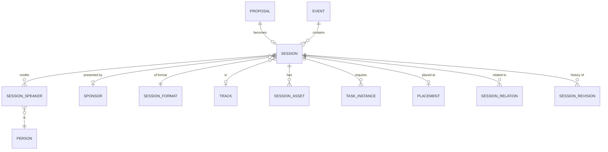
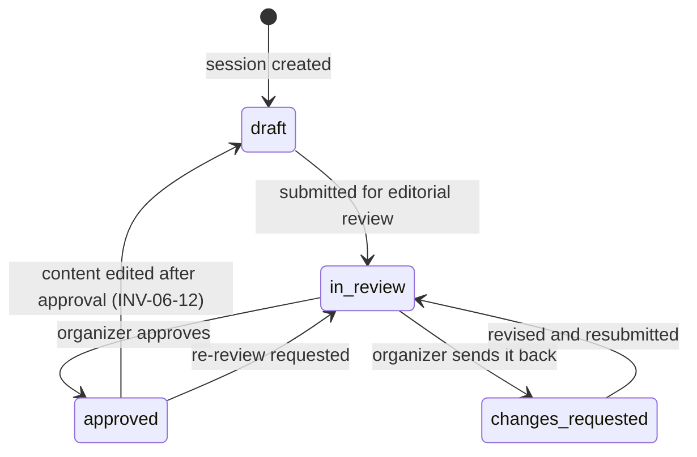
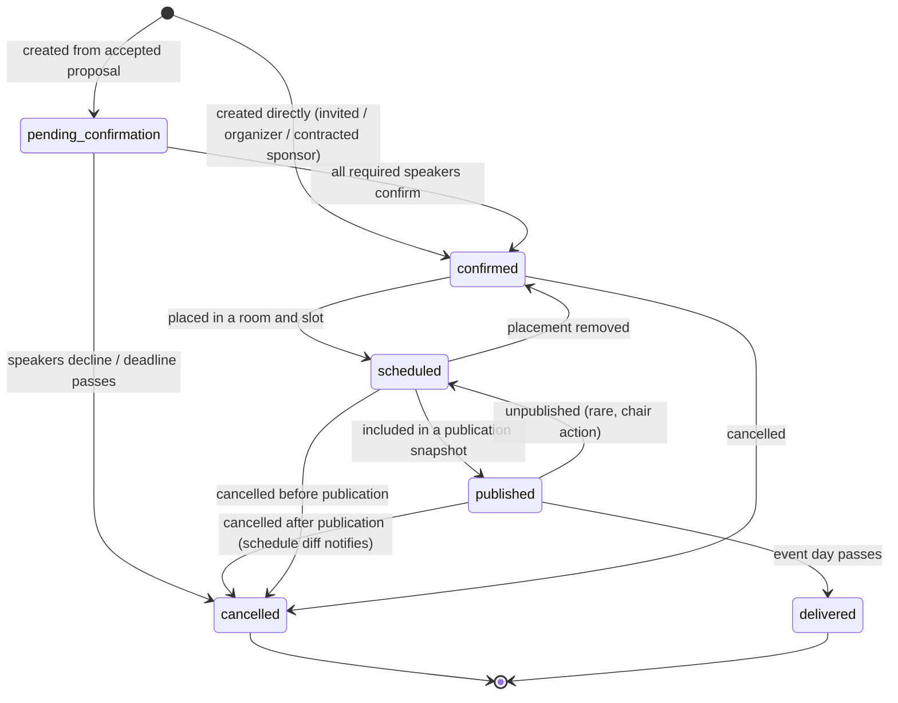

# 06 — Program

**Aggregate root:** `Session`. `SessionSpeaker` and `SessionAsset` live inside it.

A `Session` is a confirmed item in the program. It is the thing that gets onboarded,
scheduled, published, and pointed at by every integration. Everything upstream
(proposals, reviews, entitlements) is how it came to exist; everything downstream treats
`Session` as the noun.

## Why this is separate from `Proposal`

Three reasons, each of which is a real failure mode in tools that merge them:

1. **Review integrity.** The reviewed text must stay frozen. The program text must be
   editable — retitled for the website, trimmed to fit a card, copy-edited. One record
   cannot be both.
2. **Different owners.** A proposal belongs to its submitter. A session is co-owned:
   speakers edit their bios and upload slides, organizers set the title that ships.
3. **Different cardinality over time.** Two accepted lightning talks get merged into one
   session. A workshop is split across two days. A keynote exists with no proposal behind
   it. `Proposal ↔ Session` is 0..1 ↔ 0..1, not identity.

## Session

<!-- entity: Session -->
| Field | Type | Req | Notes |
|---|---|---|---|
| `id` | `ulid` | Y | prefix `ses_` |
| `org_id` / `event_id` | `ref(...)` | Y | |
| `proposal_id` | `ref(Proposal)` | N | null for invited/organizer-created sessions |
| `reference` | `string` | Y | human-facing code, unique per event; reuses the proposal's when there is one |
| `origin` | `enum(cfp, sponsor, invited, organizer)` | Y | `organizer` covers breaks, registration, and other non-talk items |
| **Program content** | | | editable post-acceptance; independent of the proposal |
| `title` | `string` | Y | |
| `subtitle` | `string` | N | |
| `abstract` | `text` | Y | public |
| `description` | `text` | N | long form for the session page |
| `session_format_id` | `ref(SessionFormat)` | Y | may differ from the proposal's if the decision reassigned it |
| `track_id` | `ref(Track)` | N | |
| `duration_minutes` | `int` | Y | authoritative planned length |
| `audience_level` | `enum(beginner, intermediate, advanced, all)` | N | |
| `keywords` | `string[]` | N | |
| `language` | `string` | N | |
| `sponsor_id` | `ref(Sponsor)` | N | set for `origin = sponsor`; drives the "Presented by" label (INV-06-2) |
| `is_sponsored_content` | `bool` | D | `sponsor_id is not null` — the disclosure flag the published schedule must render |
| **Delivery** | | | |
| `av_requirements` | `enum(...)[]` | N | |
| `recording_consent` | `enum(granted, denied, conditional, unanswered)` | Y | carried from the proposal, re-confirmable in onboarding |
| `recording_url` | `string` | N | populated after the event |
| `slides_asset_id` | `ref(Asset)` | N | |
| `capacity_override` | `int` | N | for ticketed workshops |
| `registration_url` | `string` | N | external workshop signup |
| **Lifecycle** | | | |
| `status` | `enum(pending_confirmation, confirmed, scheduled, published, cancelled, delivered)` | Y | see state machine |
| `content_status` | `enum(draft, in_review, approved, changes_requested)` | Y | editorial sign-off, orthogonal to `status` (INV-06-11) |
| `content_approved_by_person_id` / `content_approved_at` | `ref(Person)` / `timestamptz` | N | who signed it off, and when |
| `content_diverged` | `bool` | D | session content differs from its proposal's decision snapshot (INV-06-9) |
| `visibility` | `enum(internal, public)` | Y | `internal` = never published, e.g. speaker briefings |
| `cancellation_reason` | `text` | N | |
| `onboarding_progress` | `int` | D | 0–100 across this session's task instances |
| `blocking_tasks_outstanding` | `int` | D | count of incomplete `is_blocking` tasks (INV-06-5) |
| `publication_override_reason` | `text` | N | set when a chair knowingly publishes past a blocking task (INV-06-5) |
| `content_diverged` | `bool` | D | session content differs from the linked proposal; surfaced on the program board, never notified (INV-06-9) |
| `published_at` | `timestamptz` | N | first time it appeared in a publication snapshot |
| `created_at` / `updated_at` | `timestamptz` | Y | |

## SessionSpeaker

<!-- entity: SessionSpeaker -->
| Field | Type | Req | Notes |
|---|---|---|---|
| `id` | `ulid` | Y | prefix `ssp_` |
| `session_id` | `ref(Session)` | Y | |
| `person_id` | `ref(Person)` | Y | unique with `session_id` (INV-06-3) |
| `speaker_role` | `enum(primary, co_speaker, moderator, panelist, host)` | Y | |
| `sort_order` | `int` | Y | billing order |
| `confirmation_status` | `enum(pending, confirmed, declined, withdrawn, replaced)` | Y | |
| `confirmed_at` / `declined_at` | `timestamptz` | N | |
| `replaced_by_person_id` | `ref(Person)` | N | the substitution trail |
| `is_public` | `bool` | Y | a speaker may be on the run sheet but not the website |
| `travel_status` | `enum(not_required, pending, booked, self_arranged, declined)` | N | organizer-only |
| `attendance_mode` | `enum(in_person, remote)` | N | |
| `added_at` | `timestamptz` | Y | |

**Speaker substitution is a first-class flow**, not a delete-and-add. Sponsor sessions swap
speakers routinely, and so do CFP talks when someone's visa falls through. Replacement
preserves the trail (`replaced_by_person_id`), transfers the outgoing speaker's incomplete
task instances to the incoming one, and revokes the outgoing person's access to the
session — all as one command, because doing it in three steps means step three gets
forgotten and a former speaker keeps portal access.

## SessionRelation

<!-- entity: SessionRelation -->
| Field | Type | Req | Notes |
|---|---|---|---|
| `id` | `ulid` | Y | |
| `session_id` | `ref(Session)` | Y | |
| `related_session_id` | `ref(Session)` | Y | |
| `relation` | `enum(part_of_series, continues_in, prerequisite_for, merged_from, alternative_to)` | Y | |
| `sort_order` | `int` | Y | |

Covers multi-part workshops (`continues_in`), talk series (`part_of_series`), and merged
lightning talks (`merged_from`). The scheduler uses `continues_in` to keep parts in the same
room and in order.

## SessionAsset

<!-- entity: SessionAsset -->
| Field | Type | Req | Notes |
|---|---|---|---|
| `id` | `ulid` | Y | |
| `session_id` | `ref(Session)` | Y | |
| `asset_id` | `ref(Asset)` | Y | |
| `kind` | `enum(slides, cover_image, handout, code_repo_link, recording, transcript, other)` | Y | |
| `uploaded_by_person_id` | `ref(Person)` | Y | |
| `is_public` | `bool` | Y | slides usually go public *after* the talk |
| `public_from` | `timestamptz` | N | |

## Content approval

`status` tracks whether a session is *happening*. `content_status` tracks whether its words
are *fit to publish*. Conflating them is a mistake with a predictable ending: a confirmed,
scheduled talk whose abstract is still the speaker's first draft goes live on the marketing
site because "confirmed" was the only gate anyone could see.

Two rules carry the weight:

- **Approval gates publication.** A session with `content_status != approved` is not
  included in a publication snapshot (INV-06-11). This is a second gate alongside blocking
  onboarding tasks (INV-06-5): tasks answer "has the speaker done their part", approval
  answers "have we done ours".
- **Editing approved content revokes approval** (INV-06-12). Anything else means an approval
  granted on Monday silently endorses Thursday's rewrite. The revocation is automatic and
  the diff is visible, so re-approving is a glance rather than a re-read.

`content_diverged` realises [R14](13-open-questions.md): it is set when the session's
`title`, `abstract`, `description`, format, duration or track differ from the snapshot the
decision was made against. It is a **filter on the programme board, not a notification** —
divergence is normal and expected, and alerting on the normal case teaches people to
dismiss alerts.

## SessionRevision

Programme content is edited by several people over months: the speaker tightens the
abstract, an organizer cuts it to fit a card, marketing rewrites the title, somebody
restores last week's version because the new one was worse. Without a history that is an
argument nobody can win; with one it is a two-click revert.

Append-only, mirroring `ProposalRevision` in [`04`](04-submissions.md) so the two read the
same way.

<!-- entity: SessionRevision -->
| Field | Type | Req | Notes |
|---|---|---|---|
| `id` | `ulid` | Y | prefix `srv_` |
| `session_id` | `ref(Session)` | Y | |
| `revision_number` | `int` | Y | monotonic per session |
| `changed_by_person_id` | `ref(Person)` | Y | |
| `change_kind` | `enum(organizer_edit, speaker_edit, decision_import, restore, approval_change)` | Y | |
| `diff` | `json` | Y | `{field: {from, to}}` |
| `snapshot` | `json` | Y | full content snapshot, so restore never has to replay diffs |
| `restored_from_revision_id` | `ref(SessionRevision)` | N | set when `change_kind = restore` |
| `created_at` | `timestamptz` | Y | |

**Restore is a forward operation.** Restoring revision 4 writes revision 9 whose content
equals revision 4's snapshot, with `restored_from_revision_id` pointing back. History is
never rewound, only extended — the record of the bad edit and of somebody undoing it are
both facts worth keeping, and a restore that erased its own cause would be the one edit
nobody could audit.

Restore covers content fields only. It never changes `status`, `content_status`,
placement, speakers or assets: those have their own lifecycles, and a text revert that
silently unscheduled a talk would be a far worse surprise than the typo it fixed.

## Lifecycle

**Creation.** A session is created by one of three commands, all of which are explicit and
audited:

- `CreateSessionFromProposal` — fires on `decision.published` with `outcome = accept`, or
  manually. Copies content, format, duration and track from the decision (which may have
  overridden the proposal), copies speakers as `pending`, links `proposal_id`, and
  materialises onboarding tasks.
- `CreateSponsorSession` — same, plus spends the entitlement and sets `sponsor_id`. May
  start with zero speakers; "name your speaker" becomes a blocking task.
- `CreateProgramItem` — organizer creates a break, keynote or registration block directly.
  No proposal, `origin = organizer`, review not applicable.

**`pending_confirmation → confirmed`** requires every `SessionSpeaker` with
`speaker_role = primary` to be `confirmed`, and co-speakers to be `confirmed` or `declined`
(a declining co-speaker does not block the talk; a declining primary does). For a sponsor
session with no speakers yet, the session is `confirmed` on creation — the contract is
confirmed even though the human is not.

**`delivered`** is set by a scheduled job after the placement's end time passes. It exists
so post-event flows (upload your recording, share your slides, feedback requests) have a
state to hang off.

## Program health read model

The chair's dashboard, derived, recomputed on session and placement change:

| Signal | Definition |
|---|---|
| `sessions_by_status` | count per status |
| `track_balance` | per track: confirmed count vs `Track.target_session_count` |
| `format_mix` | count per format |
| `sponsor_session_share` | sponsored sessions / total published, per day and overall |
| `unconfirmed_speakers` | sessions with a pending primary past their confirmation deadline |
| `onboarding_at_risk` | sessions with blocking tasks overdue or due within 7 days |
| `unplaced_confirmed` | confirmed sessions with no placement |
| `unpublishable` | scheduled sessions blocked from publication, with the reason |

`sponsor_session_share` deserves its place: the ratio of paid to earned content is the
number a program chair is judged on, and it is invisible until someone counts. Making it a
first-class signal is a small amount of code that changes how the program gets built.

## Invariants

- **INV-06-1** A session has at most one proposal and a proposal at most one non-cancelled
  session.
- **INV-06-2** `origin = sponsor` requires `sponsor_id`, and that sponsor must have a
  `confirmed` sponsorship for this event. `origin = cfp` requires `sponsor_id` to be null.
- **INV-06-3** One `SessionSpeaker` per `(session, person)`. Speaker count must not exceed
  `SessionFormat.max_speakers` unless an organizer records an override reason.
- **INV-06-4** A session may not reach `confirmed` while any `primary` speaker is `pending`
  or `declined` — except `origin = sponsor` sessions with zero speakers.
- **INV-06-5** A session may not be included in a publication snapshot while
  `blocking_tasks_outstanding > 0`, unless a chair records an explicit publication override
  with a reason.
- **INV-06-6** `duration_minutes` must be within the format's `min`/`max` when those are
  set; a placement's length must equal `duration_minutes` (see
  [`08`](08-scheduling-and-publication.md)).
- **INV-06-7** Cancelling a session releases its placement, cancels its open task instances,
  releases any spent entitlement back to `available`, and — if it was published — records a
  `schedule.session_cancelled` diff entry on the next publication.
- **INV-06-8** `visibility = internal` sessions never appear in publication snapshots,
  public read models, ICS feeds or unauthenticated API responses.
- **INV-06-9** Editing session content never mutates the linked proposal. Editing a
  proposal after a session exists never mutates the session; divergence is surfaced to
  organizers, not auto-merged.
- **INV-06-10** A `replaced` speaker loses relationship-derived access to the session in the
  same transaction that records the replacement.
- **INV-06-11** A session may not be included in a publication snapshot unless
  `content_status = approved`. This gate is independent of INV-06-5; both must pass, and
  either may be overridden only by a chair recording an explicit reason.
- **INV-06-12** Editing any published content field (`title`, `subtitle`, `abstract`,
  `description`, `track_id`, `session_format_id`, `duration_minutes`) of a session whose
  `content_status = approved` returns it to `draft` and clears
  `content_approved_by_person_id` / `content_approved_at`, in the same transaction.
- **INV-06-13** Every change to a session's content fields writes exactly one
  `SessionRevision` with a full `snapshot`. Restoring writes a new revision; no revision is
  ever mutated or deleted.

## Emitted events

`session.created`, `session.confirmed`, `session.updated`, `session.cancelled`,
`session.delivered`, `session.content_approved`, `session.content_approval_revoked`,
`session.content_restored`, `session_speaker.confirmed`, `session_speaker.declined`,
`session_speaker.replaced`, `session_asset.uploaded`.
