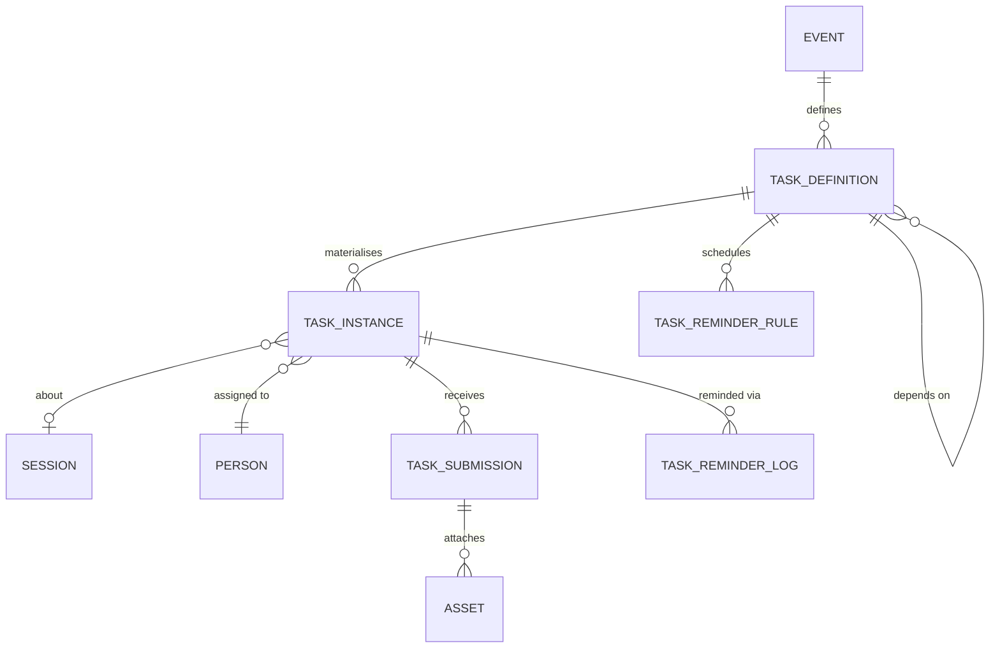
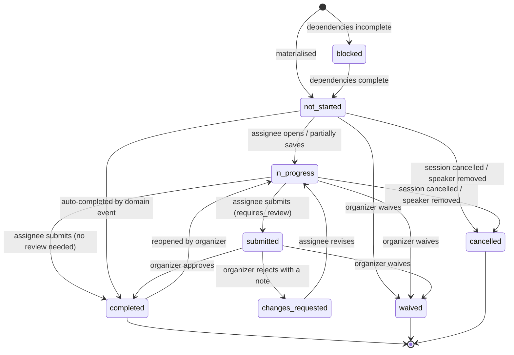

# 07 — Onboarding

**Aggregate roots:** `TaskDefinition` (the template), `TaskInstance` (the obligation).

Covers J7 (define what accepted speakers must do and chase it) and J8 (a speaker completing
their tasks). This is the part organizers actually spend their spring on, and the part
generic CFP tools leave to a spreadsheet and four rounds of "gentle reminder" emails.

The model is a small, boring workflow engine with a deliberate constraint: **definitions
are templates, instances are obligations, and the two are versioned apart.** Editing "upload
your headshot" next year must not rewrite what 200 people already did this year.

## TaskDefinition

| Field | Type | Req | Notes |
|---|---|---|---|
| `id` | `ulid` | Y | prefix `tdf_` |
| `event_id` | `ref(Event)` | Y | |
| `key` | `slug` | Y | unique per event; stable across years for reporting |
| `title` | `string` | Y | "Upload your headshot" |
| `instructions` | `text` | N | markdown; the place to explain *why*, which measurably lifts completion |
| `category` | `enum(legal, profile, content, logistics, travel, technical, marketing, other)` | Y | groups the checklist |
| **What kind of thing it is** | | | |
| `requirement_type` | `enum(acknowledgement, form, file_upload, external_link, external_action, scheduling, text_response, speaker_nomination)` | Y | |
| `config` | `json` | Y | shape depends on `requirement_type`, below |
| **Who it lands on** | | | |
| `subject_type` | `enum(session, speaker, sponsor)` | Y | what the task is *about* |
| `assignee_rule` | `enum(each_speaker, primary_speaker_only, submitter, sponsor_primary_contact, sponsor_speaker_wrangler, named_organizer)` | Y | who must do it |
| `assignee_person_id` | `ref(Person)` | N | for `named_organizer` |
| **When it applies** | | | |
| `applies_to` | `json` | N | filter: `{origins, format_ids, track_ids, attendance_modes, speaker_roles}` — empty = everything |
| `trigger` | `enum(on_session_created, on_session_confirmed, on_speaker_confirmed, on_task_completed, manual)` | Y | |
| `trigger_task_key` | `slug` | N | for `on_task_completed` |
| **When it is due** | | | |
| `due_rule` | `enum(fixed_date, relative_to_event_start, relative_to_session_start, relative_to_assignment, none)` | Y | |
| `due_value` | `json` | N | `{date}` or `{offset_days, at_time}` (negative = before) |
| **How much it matters** | | | |
| `is_blocking` | `bool` | Y | incomplete blocks schedule publication (INV-06-5) |
| `is_required` | `bool` | Y | non-required tasks are nudges, not obligations |
| `requires_review` | `bool` | Y | organizer must approve the submission |
| `auto_complete_on_event` | `string` | N | a domain event type that completes it automatically |
| `depends_on_task_keys` | `slug[]` | N | stays `blocked` until these complete (INV-07-4) |
| `sort_order` | `int` | Y | |
| `status` | `enum(draft, active, retired)` | Y | |
| `version` | `int` | Y | bumped on any semantic change (INV-07-1) |

### `config` by `requirement_type`

| Type | `config` | Completed when |
|---|---|---|
| `acknowledgement` | `{document_url, document_asset_id, checkbox_label, require_typed_name}` | The assignee accepts, with name and timestamp recorded |
| `form` | `{form_id}` — a `SubmissionForm` reused as a task form | All required fields answered |
| `file_upload` | `{accept[], max_files, max_file_mb, min_width, min_height, naming_hint}` | Files uploaded, scanned clean, dimensions pass |
| `external_link` | `{url, label, confirm_label}` | The assignee confirms they did it elsewhere |
| `external_action` | `{integration_key, action}` | An integration reports completion via `auto_complete_on_event` |
| `scheduling` | `{booking_url, window_start, window_end}` | A slot is booked (self-reported or via integration) |
| `text_response` | `{prompt, min_length, max_length}` | Text submitted |
| `speaker_nomination` | `{min_speakers, max_speakers, deadline}` | Speakers named and invited on the session |

`speaker_nomination` is the sponsor-shaped task that makes the whole sponsor pipeline work:
the contract is signed, the session exists, and the one thing missing is a human. Modelling
it as a task with a deadline and reminders — instead of an organizer's mental note — is the
difference between chasing it in February and discovering it in June.

### A realistic default set

Seed data should ship roughly this, because a blank onboarding config is where organizers
give up and reopen the spreadsheet:

| Key | Type | Assignee | Due | Blocking |
|---|---|---|---|---|
| `speaker-agreement` | acknowledgement | each_speaker | +7d from assignment | yes |
| `code-of-conduct` | acknowledgement | each_speaker | +7d | yes |
| `profile-bio-headshot` | form | each_speaker | −60d from event | yes |
| `confirm-title-abstract` | form | primary_speaker | −60d | yes |
| `recording-consent` | acknowledgement | each_speaker | −45d | yes |
| `av-requirements` | form | primary_speaker | −30d | no |
| `travel-details` | form | each_speaker (in_person) | −45d | no |
| `visa-letter-request` | form | each_speaker (in_person) | −90d | no |
| `slides-upload` | file_upload | primary_speaker | −7d | no |
| `tech-check` | scheduling | primary_speaker | −3d | no |
| `nominate-speaker` | speaker_nomination | sponsor_speaker_wrangler | −60d | yes |
| `sponsor-logo` | file_upload | sponsor_primary_contact | −60d | no |

## TaskInstance

| Field | Type | Req | Notes |
|---|---|---|---|
| `id` | `ulid` | Y | prefix `tsk_` |
| `org_id` / `event_id` | `ref(...)` | Y | denormalised for the portal query |
| `definition_id` | `ref(TaskDefinition)` | Y | |
| `definition_version` | `int` | Y | frozen at materialisation (INV-07-1) |
| `definition_key` | `slug` | Y | denormalised, so reporting survives definition retirement |
| `title` / `instructions` / `requirement_type` / `config` | *snapshot* | Y | copied at materialisation |
| `subject_type` | `enum(session, speaker, sponsor)` | Y | |
| `subject_id` | `ulid` | Y | |
| `session_id` | `ref(Session)` | N | denormalised when the subject is or belongs to a session |
| `assignee_person_id` | `ref(Person)` | Y | the one throat to choke |
| `sponsor_id` | `ref(Sponsor)` | N | for sponsor-subject tasks |
| `status` | `enum(blocked, not_started, in_progress, submitted, changes_requested, completed, waived, cancelled)` | Y | |
| `is_blocking` / `is_required` / `requires_review` | `bool` | Y | snapshot |
| `due_at` | `timestamptz` | N | resolved from `due_rule` at materialisation; recomputed if the session moves |
| `is_overdue` | `bool` | D | `due_at < now` and not terminal — a computed view, never a stored state (INV-07-3) |
| `started_at` / `submitted_at` / `completed_at` | `timestamptz` | N | |
| `completed_by_person_id` | `ref(Person)` | N | may be an organizer completing on someone's behalf |
| `waived_by_person_id` / `waiver_reason` | `ref(Person)` / `text` | N | |
| `reviewed_by_person_id` / `review_note` | `ref(Person)` / `text` | N | |
| `reminder_count` / `last_reminded_at` | `int` / `timestamptz` | Y/N | |
| `created_at` / `updated_at` | `timestamptz` | Y | |

**`waived` is not `completed`.** A waived task is a decision someone made and should be
able to justify; folding it into completion destroys the only record that a rule was bent.
Completion metrics report the two separately.

**`is_overdue` is derived, never stored.** Overdue-as-a-state means a nightly job, and a
nightly job means a task is "not overdue" for up to 24 hours after its deadline, and then
somebody's dashboard disagrees with somebody else's email. Compare `due_at` to now at read
time; the reminder scheduler is what runs on a timer, not the state.

## TaskSubmission

Append-only: a resubmission after `changes_requested` is a new version, so the back-and-forth
is visible.

| Field | Type | Req | Notes |
|---|---|---|---|
| `id` | `ulid` | Y | prefix `tsb_` |
| `task_instance_id` | `ref(TaskInstance)` | Y | |
| `version` | `int` | Y | monotonic |
| `payload` | `json` | Y | answers, acknowledgement record, or asset references |
| `asset_ids` | `ref(Asset)[]` | N | |
| `submitted_by_person_id` | `ref(Person)` | Y | |
| `submitted_at` | `timestamptz` | Y | |
| `review_outcome` | `enum(pending, approved, changes_requested)` | N | |
| `reviewed_by_person_id` / `reviewed_at` / `review_note` | | N | |

For `acknowledgement` the payload is the legal record: `{accepted: true, typed_name,
document_version, ip, user_agent, accepted_at}`. That is what a speaker agreement is worth
in a dispute, and it is why the document version is captured rather than just a URL.

## Reminders

| TaskReminderRule field | Type | Req | Notes |
|---|---|---|---|
| `id` | `ulid` | Y | |
| `definition_id` | `ref(TaskDefinition)` | Y | |
| `offset_days` | `int` | Y | relative to `due_at`; negative = before, positive = after (escalation) |
| `channel` | `enum(email, webhook)` | Y | |
| `template_key` | `string` | Y | resolved by the notification layer |
| `escalate_to` | `enum(none, primary_speaker, sponsor_primary_contact, organizer)` | N | who gets cc'd on late reminders |
| `only_if_status` | `enum(...)[]` | N | default: any non-terminal status |

| TaskReminderLog field | Type | Req | Notes |
|---|---|---|---|
| `task_instance_id` | `ref(TaskInstance)` | Y | |
| `rule_id` | `ref(TaskReminderRule)` | Y | |
| `scheduled_for` / `sent_at` | `timestamptz` | Y/N | |
| `notification_id` | `ref(NotificationDelivery)` | N | |
| `suppressed_reason` | `enum(already_complete, quiet_hours, digest_batched, unsubscribed, duplicate)` | N | |

Two rules that keep this from becoming spam, and therefore keep it working:

- **Digest by default.** A person with five due tasks gets one email listing five tasks, not
  five emails. Batching is per assignee per day, in their timezone.
- **Reminders are logged with a suppression reason**, so "did we chase them?" has an answer.
  Organizers ask this constantly and it is unanswerable in an email-only workflow.

## Materialisation

When a session becomes `confirmed` (or a trigger fires), the engine evaluates every `active`
`TaskDefinition` for the event:

1. Does `applies_to` match this session (origin, format, track) and this speaker (role,
   attendance mode)?
2. Resolve `assignee_rule` to concrete people — `each_speaker` fans out to one instance per
   confirmed speaker.
3. Snapshot title, instructions, type and config; freeze `definition_version`.
4. Resolve `due_at` from `due_rule`.
5. Set `blocked` if `depends_on_task_keys` are incomplete, else `not_started`.
6. Skip if an instance already exists for `(definition_key, subject, assignee)` — this is
   what makes re-running materialisation safe (INV-07-2).

Re-materialisation runs on every relevant change: a speaker added to a confirmed session
gets their own instances; a speaker removed has theirs cancelled; a format change adds or
removes format-specific tasks. It is idempotent by construction, which matters because it
will be triggered by retried events.

## Read models

- **`SpeakerChecklist`** (per person per session): the ordered task list with status, due
  date, and a single next action. The portal's core screen.
- **`OrganizerOnboardingBoard`** (per event): the matrix of sessions × task definitions,
  filterable by track, format, sponsor and overdue-ness — the "who is holding us up" view.
- **`TaskCompletionStats`** (per definition): completion rate, median days-to-complete,
  reminder count before completion. This is how a good onboarding config gets better next
  year: the task everyone completes late is badly worded or badly timed.

## Invariants

- **INV-07-1** A `TaskInstance` snapshots its definition at materialisation and is never
  retroactively changed by a definition edit. Definition changes apply to future instances;
  applying to existing ones is an explicit, audited "re-materialise" command.
- **INV-07-2** At most one non-cancelled `TaskInstance` per
  `(definition_key, subject_type, subject_id, assignee_person_id)`.
- **INV-07-3** `is_overdue` is computed at read time and never persisted as a status.
- **INV-07-4** A task with unmet `depends_on_task_keys` is `blocked` and cannot be started;
  dependency graphs must be acyclic, validated when the definition is activated.
- **INV-07-5** Only the assignee, or an organizer acting explicitly on their behalf, may
  complete a task; `completed_by_person_id` always records who actually did it.
- **INV-07-6** `requires_review` tasks reach `completed` only via organizer approval.
- **INV-07-7** Waiving requires a reason and is always attributed.
- **INV-07-8** Cancelling a session or removing a speaker cancels their non-terminal
  instances; completed and waived instances are retained for the record.
- **INV-07-9** `file_upload` completion requires every asset to be `scan_status = clean`.
- **INV-07-10** A task instance is only visible to its assignee, that session's speakers
  (title and status only, not payload), and event staff. Sponsor contacts see their
  sponsor's tasks and their nominated speakers' task *status*, never payloads.
- **INV-07-11** Moving a session's placement recomputes `due_at` for instances whose
  `due_rule` is `relative_to_session_start`, and reschedules pending reminders.

## Emitted events

`task_definition.activated`, `task_instance.created`, `task_instance.started`,
`task_instance.submitted`, `task_instance.completed`, `task_instance.changes_requested`,
`task_instance.waived`, `task_instance.cancelled`, `task_instance.overdue`,
`task_reminder.sent`, `onboarding.session_complete` (all blocking tasks done — the signal
scheduling waits on).
