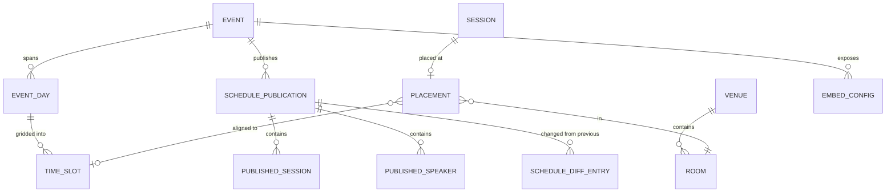
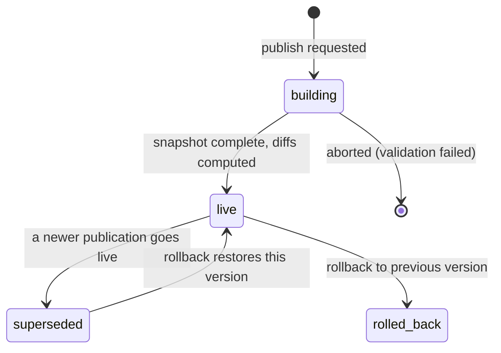

# 08 — Scheduling & Publication

**Aggregate roots:** `Placement` (scoped by event), `SchedulePublication`.

Covers J9 (place sessions without clashes) and J10 (publish something the marketing site can
embed, and change it safely afterwards).

The central idea: **the working schedule and the published schedule are different objects.**
Organizers move things around for weeks; the public sees an immutable, versioned snapshot
that only changes when someone deliberately publishes. That separation is what makes the
embed cacheable, the ICS feed stable, and "what changed since yesterday" answerable.

## TimeSlot

An optional grid. Some conferences run a strict grid (every talk 20 minutes, on the
half-hour, all rooms aligned); others place sessions freely. Both must work, so the grid is
a convenience for placement and validation, not a requirement.

<!-- entity: TimeSlot -->
| Field | Type | Req | Notes |
|---|---|---|---|
| `id` | `ulid` | Y | prefix `slt_` |
| `event_day_id` | `ref(EventDay)` | Y | |
| `starts_at` / `ends_at` | `timestamptz` | Y | stored UTC, authored in event timezone |
| `label` | `string` | N | "Morning block 2" |
| `kind` | `enum(session, keynote, break, lunch, social, registration)` | Y | |
| `room_ids` | `ref(Room)[]` | N | empty = applies to all rooms (a venue-wide lunch) |
| `is_public` | `bool` | Y | |
| `sort_order` | `int` | Y | |

## Placement

<!-- entity: Placement -->
| Field | Type | Req | Notes |
|---|---|---|---|
| `id` | `ulid` | Y | prefix `plc_` |
| `event_id` | `ref(Event)` | Y | |
| `session_id` | `ref(Session)` | Y | unique among non-cancelled (INV-08-1) |
| `room_id` | `ref(Room)` | Y | |
| `event_day_id` | `ref(EventDay)` | Y | |
| `time_slot_id` | `ref(TimeSlot)` | N | when the event uses a grid |
| `starts_at` / `ends_at` | `timestamptz` | Y | authoritative; `ends_at > starts_at` (INV-08-2) |
| `setup_minutes` / `teardown_minutes` | `int` | Y | default 0; workshops need room turnaround |
| `status` | `enum(tentative, locked)` | Y | `locked` warns loudly before it can be moved |
| `is_public` | `bool` | Y | |
| `placed_by_person_id` | `ref(Person)` | Y | |
| `notes` | `text` | N | organizer-only run-sheet notes |
| `created_at` / `updated_at` | `timestamptz` | Y | |

Times live on the placement, not the session. A session has a *duration*; a placement gives
it a *when* and a *where*. That is why moving a talk does not touch the session record and
does not invalidate its onboarding, and why a cancelled placement leaves the session
`confirmed` rather than deleting program content.

## Conflict detection

Conflicts are **computed, surfaced, and (mostly) not enforced.** The scheduler's job is to
tell the truth loudly; organizers knowingly break these rules under deadline, and a system
that refuses gets worked around in a spreadsheet — which is worse, because then it stops
knowing anything.

| Code | Severity | Condition |
|---|---|---|
| `ROOM_DOUBLE_BOOKED` | error | Two placements overlap in one room, counting setup/teardown |
| `SPEAKER_DOUBLE_BOOKED` | error | A person is a public speaker on two overlapping placements |
| `SPEAKER_NO_TRANSIT` | warning | Same speaker, back-to-back in different rooms, gap below the event's `min_transit_minutes` |
| `DURATION_MISMATCH` | error | `ends_at - starts_at != Session.duration_minutes` |
| `AV_UNSUPPORTED` | warning | `Session.av_requirements` not covered by `Room.av_capabilities` |
| `OVER_CAPACITY` | warning | Registrations or expected demand exceed `Room.capacity` |
| `TRACK_COLLISION` | warning | Two same-track sessions run concurrently |
| `SPONSOR_COLLISION` | warning | Two sessions from the same sponsor overlap |
| `SERIES_OUT_OF_ORDER` | error | A `continues_in` relation is placed before its predecessor, or in a different room |
| `OUTSIDE_EVENT_HOURS` | warning | Placement falls outside its event day's slots |
| `UNPUBLISHABLE` | error | Session has outstanding blocking onboarding tasks (INV-06-5) |

`error`-severity conflicts block **publication**, not placement. You may build a broken
draft schedule; you may not publish one without an explicit, recorded override.

<!-- entity: ScheduleConflict -->
| ScheduleConflict field | Type | Notes |
|---|---|---|
| `id` | `ulid` | derived read model, recomputed on placement change |
| `event_id` | `ref(Event)` | |
| `code` | `enum(...)` | |
| `severity` | `enum(error, warning)` | |
| `placement_ids` | `ref(Placement)[]` | the parties |
| `detail` | `json` | human-readable specifics |
| `acknowledged_by_person_id` / `acknowledged_reason` | | an accepted, deliberate conflict |

## Publication

A publication is an **immutable snapshot**. Publishing copies everything the public sees
into the snapshot — session content, speaker public profile fields, sponsor branding, room
and time — so that later edits to live records cannot silently rewrite what is on the
website, and so the embed can be served from cache with a version stamp.

<!-- entity: SchedulePublication -->
| SchedulePublication field | Type | Req | Notes |
|---|---|---|---|
| `id` | `ulid` | Y | prefix `pub_` |
| `event_id` | `ref(Event)` | Y | |
| `version` | `int` | Y | monotonic per event |
| `status` | `enum(building, live, superseded, rolled_back)` | Y | |
| `scope` | `json` | N | `{event_day_ids, track_ids}` — partial publication, e.g. day 1 only |
| `published_by_person_id` | `ref(Person)` | Y | |
| `published_at` | `timestamptz` | Y | |
| `note` | `text` | N | "Added two lightning talks, moved the keynote" |
| `override_reasons` | `json` | N | error-severity conflicts knowingly published |
| `content_etag` | `string` | D | hash of the snapshot; the embed and API cache key |
| `session_count` | `int` | D | |

<!-- entity: PublishedSession -->
| PublishedSession field | Type | Notes |
|---|---|---|
| `publication_id` / `session_id` | `ref(...)` | |
| `reference` / `title` / `subtitle` / `abstract` / `description` | copies | |
| `track` / `format` | `{id, name, slug, color}` | denormalised so the embed needs no joins |
| `room` | `{id, name, slug, floor}` | null for online sessions |
| `starts_at` / `ends_at` | `timestamptz` | |
| `duration_minutes` | `int` | |
| `audience_level` / `keywords` / `language` | copies | |
| `speaker_refs` | `ulid[]` | into `PublishedSpeaker` |
| `sponsor` | `{id, name, slug, logo_url, tier_name}` | null when not sponsored |
| `is_sponsored_content` | `bool` | **always rendered as a disclosure label** (INV-08-7) |
| `assets` | `json` | public slides/recording links, respecting `public_from` |
| `registration_url` / `capacity` | | |

<!-- entity: PublishedSpeaker -->
| PublishedSpeaker field | Notes |
|---|---|
| `publication_id` / `person_id` | |
| `display_name` / `pronouns` / `headline` / `job_title` / `company` | public fields only |
| `short_bio` / `bio` | per `SpeakerProfile.visibility` |
| `headshot_url` | resolved public asset URL |
| `links` | `is_public` profile links only |
| `session_refs` | `ulid[]` |

### Diffs

<!-- entity: ScheduleDiffEntry -->
| ScheduleDiffEntry field | Type | Notes |
|---|---|---|
| `publication_id` | `ref(SchedulePublication)` | the newer publication |
| `change_type` | `enum(session_added, session_removed, session_cancelled, time_changed, room_changed, speaker_changed, content_changed)` | |
| `session_id` | `ref(Session)` | |
| `before` / `after` | `json` | the changed fields only |

Diffs are computed at publish time against the previous `live` publication. They drive
three real things: a public "what changed" list on the schedule page, targeted notifications
to affected speakers ("your talk moved to Room 3"), and `schedule.changed` webhook payloads
that let downstream systems react without polling.

**Rollback matters.** Publishing a wrong schedule an hour before doors open is a real
event, and the fix must be one button, not a re-edit under pressure. Because publications
are immutable snapshots, rollback is just pointing `live` at an earlier version.

## The embed (J10)

<!-- entity: EmbedConfig -->
| EmbedConfig field | Type | Req | Notes |
|---|---|---|---|
| `id` | `ulid` | Y | prefix `emb_` |
| `event_id` | `ref(Event)` | Y | |
| `key` | `string` | Y | public, unguessable; appears in the embed URL |
| `name` | `string` | Y | "Main site — full schedule" |
| `allowed_origins` | `string[]` | Y | CORS + frame-ancestors allowlist (INV-08-6) |
| `filters` | `json` | N | `{event_day_ids, track_ids, format_ids, sponsor_only}` — a track-specific widget |
| `format` | `enum(js_widget, iframe, json, ics, rss)` | Y | |
| `theme` | `json` | N | `{mode, accent, font_stack, density, show_speakers, show_rooms, show_sponsor_labels}` |
| `show_unpublished` | `bool` | Y | default false; a preview embed for staging sites |
| `cache_ttl_seconds` | `int` | Y | default 300 |
| `pinned_publication_id` | `ref(SchedulePublication)` | N | freeze the embed to a version |
| `status` | `enum(active, disabled)` | Y | |
| `created_by_person_id` | `ref(Person)` | Y | |

Delivery requirements the model has to support:

- **Serve from the snapshot, never from live tables.** The embed is public and will get
  hammered on day one; it must be a cache read keyed on `content_etag`.
- **Degrade gracefully.** `iframe` and `js_widget` both fall back to server-rendered HTML
  so the schedule survives a blocked script.
- **ICS is a first-class output**, per event, per track, and per attendee-selected sessions.
  "Add to calendar" is the most-used feature of any conference schedule and it is one
  serialiser away.
- **Timezone.** The published payload carries UTC instants plus `Event.timezone`; the widget
  renders in event time by default with a viewer-local toggle. Never publish local times
  without the zone.

## Invariants

- **INV-08-1** A non-cancelled session has at most one placement.
- **INV-08-2** `ends_at > starts_at`, and a placement lies within its `event_day`'s date in
  the event timezone.
- **INV-08-3** Only sessions with `status in (confirmed, scheduled, published)` may be
  placed. Placing sets `scheduled`; removing the placement returns it to `confirmed`.
- **INV-08-4** A publication may only include sessions that are placed, public, and free of
  `error`-severity conflicts — unless an override with a reason is recorded in
  `override_reasons`.
- **INV-08-5** Publications are immutable once `live`. Corrections create a new version.
- **INV-08-6** Public embed and API responses honour `allowed_origins`; an unlisted origin
  gets no CORS headers and no frame permission.
- **INV-08-7** A published session with `is_sponsored_content = true` must expose that flag
  in every output format. Sponsored content is disclosed, always — this is not a themeable
  option.
- **INV-08-8** No publication payload may contain a field whose `audience != public`, a
  private profile field, an unlisted speaker, an internal session, a private room, or any
  field named in [INV-01-4](01-identity-and-access.md).
- **INV-08-9** Exactly one `live` publication per event at a time.
- **INV-08-10** Cancelling a published session does not remove it from an existing snapshot;
  it appears as `session_cancelled` in the next publication's diff, so links do not 404.
- **INV-08-11** `content_etag` changes if and only if the snapshot content changes, so
  caches never serve stale content and never miss unnecessarily.

## Emitted events

`placement.created`, `placement.moved`, `placement.removed`, `schedule.conflict_detected`,
`schedule.published`, `schedule.rolled_back`, `schedule.changed` (carries the diff),
`session.time_changed`, `session.room_changed`, `embed_config.created`.
