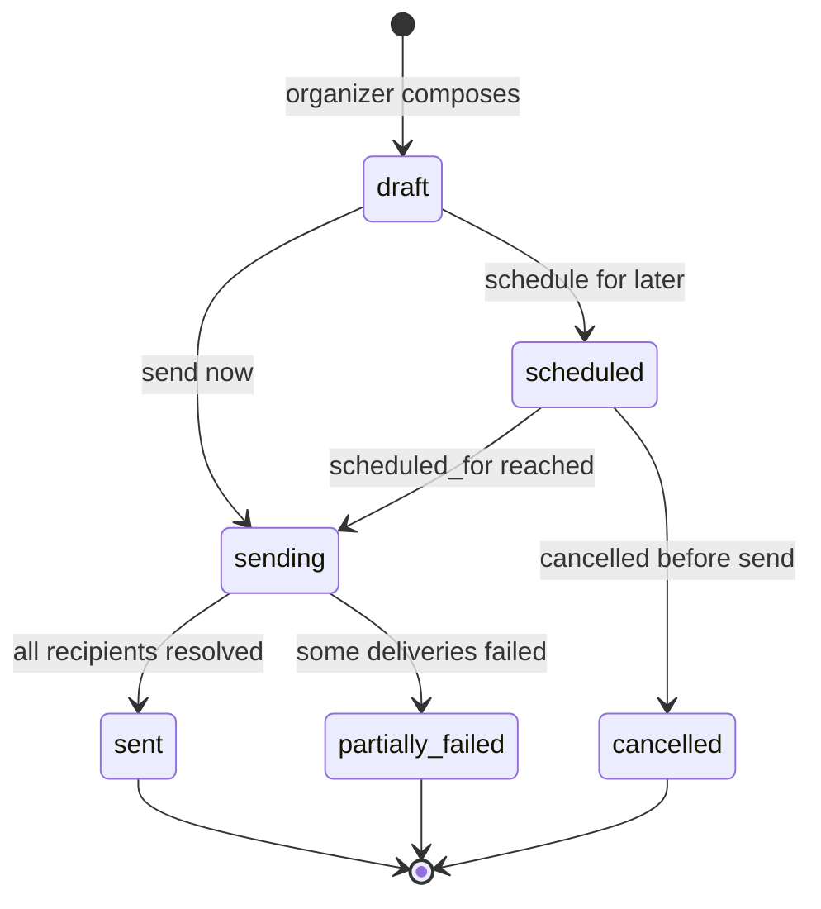

# 09 — API & Integrations

**Aggregate roots:** `ApiKey`, `Webhook`, `Integration`, `NotificationTemplate`.

Covers J11 (pull program data into other systems and react to changes). This context also
defines the **plugin contracts** — the seams where email providers, calendars, CRMs and chat
tools attach without the core knowing anything about them.

## API surfaces

Four distinct surfaces with different auth and different cache behaviour. Conflating them is
how public schedule traffic ends up authenticated and slow.

| Surface | Auth | Reads | Notes |
|---|---|---|---|
| **Public** `/v1/public/...` | none | published snapshot only | Cacheable at the edge, CORS per `EmbedConfig`, hard rate limits by IP |
| **Portal** `/v1/me/...` | session cookie | the caller's own proposals, sessions, tasks, profile | Relationship-derived scope, never role-derived |
| **Management** `/v1/...` | API key or session | everything permitted by scope/role | The integration surface |
| **Webhooks** (outbound) | HMAC signature | push | The reactive half of J11 |
| **Provider callbacks** (inbound) `/integrations/:id/inbound` | signed URL (INV-09-15) | write | Where a provider posts back — bounces and complaints |

Design rules the model must support:

- **Every write is idempotent** via a caller-supplied `Idempotency-Key`, stored with the
  response for 24h and replayed on repeat. Retries are a normal part of a Workers runtime.
- **List endpoints are cursor-paginated.** Offsets over a growing proposal table produce
  duplicates and gaps during a review round.
- **Public reads are versioned by `content_etag`** and answer conditional requests.
- **Errors are typed**, naming the invariant where one was violated
  (`entitlement_exhausted` beats `400 Bad Request`).
- **A write may carry `row_version`** to make it compare-and-set (INV-11-14). It is optional
  on the management surface — a caller that omits it gets last-write-wins, which is what
  every existing integration already assumes — and a stale value is refused with
  `409 version_conflict` carrying `expected_version`, `current_version` and `current_state`.
  The HTML surfaces always send it.

## ApiKey

<!-- entity: ApiKey -->
| Field | Type | Req | Notes |
|---|---|---|---|
| `id` | `ulid` | Y | prefix `key_` |
| `org_id` | `ref(Organization)` | Y | |
| `name` | `string` | Y | "Marketing site", "Airtable sync" |
| `prefix` | `string` | Y | first 8 chars, shown in the UI for identification |
| `secret_hash` | `string` | Y | the secret is displayed once and never stored (INV-09-1) |
| `scopes` | `enum(events:read, events:write, proposals:read, proposals:write, reviews:read, reviews:write, decisions:read, decisions:write, sessions:read, sessions:write, speakers:read, speakers:write, sponsors:read, sponsors:write, entitlements:read, entitlements:write, tasks:read, tasks:write, schedule:read, schedule:publish, webhooks:manage, pii:read)[]` | Y | see below |
| `event_ids` | `ref(Event)[]` | N | empty = all events; a key for one event cannot read another |
| `created_by_person_id` | `ref(Person)` | Y | |
| `expires_at` | `timestamptz` | N | |
| `last_used_at` / `last_used_ip` | | N | |
| `rate_limit_per_minute` | `int` | N | overrides the default |
| `revoked_at` / `revoked_by_person_id` | | N | |

### Scopes

Read and write are separate, and the sensitive reads are their own scopes so that a
marketing-site key cannot accidentally be handed the review data.

`events:read` `events:write` · `proposals:read` `proposals:write` · `reviews:read`
`reviews:write` · `decisions:read` `decisions:write` · `sessions:read` `sessions:write` ·
`speakers:read` `speakers:write` · `sponsors:read` `sponsors:write` ·
`entitlements:read` `entitlements:write` · `tasks:read` `tasks:write` ·
`schedule:read` `schedule:publish` · `webhooks:manage` · `pii:read`

**`pii:read` is a separate, additive scope.** Without it, every response redacts email
addresses, phone numbers, dietary and accessibility notes, travel details, and any answer
whose `FormField.pii` is true — including inside `proposals:read`. Most integrations want
titles and times, not personal data, and the default should reflect that.

`reviews:read` never exposes reviewer identity unless the round's `anonymity` is `open`.

## Webhook

<!-- entity: Webhook -->
| Field | Type | Req | Notes |
|---|---|---|---|
| `id` | `ulid` | Y | prefix `whk_` |
| `org_id` | `ref(Organization)` | Y | |
| `event_id` | `ref(Event)` | N | null = all events |
| `name` | `string` | Y | |
| `url` | `string` | Y | absolute https (INV-09-2) |
| `event_types` | `string[]` | Y | from the catalogue; `*` and `proposal.*` wildcards allowed |
| `secret` | `string` | Y | HMAC-SHA256 signing key, rotatable |
| `previous_secret` / `secret_rotated_at` | | N | both accepted during a rotation window |
| `include_pii` | `bool` | Y | same redaction rule as `pii:read` |
| `status` | `enum(active, paused, disabled_after_failures)` | Y | |
| `consecutive_failures` | `int` | Y | |
| `created_by_person_id` | `ref(Person)` | Y | |

<!-- entity: WebhookDelivery -->
| WebhookDelivery field | Type | Notes |
|---|---|---|
| `id` | `ulid` | prefix `whd_` |
| `webhook_id` / `domain_event_id` | `ref(...)` | |
| `attempt` | `int` | |
| `status` | `enum(pending, delivered, failed, exhausted, skipped)` | |
| `request_body_hash` / `response_status` / `response_body_excerpt` | | first 2KB only |
| `error` | `text` | |
| `scheduled_for` / `delivered_at` / `duration_ms` | | |

Delivery contract:

- **At-least-once, ordered per subject.** Consumers must be idempotent on
  `DomainEvent.id`, which is sent in the `X-Event-Id` header.
- **Signature**: `X-Signature: t=<unix>,v1=<hmac(t + "." + body)>`, with a timestamp
  tolerance to blunt replay. Both current and previous secrets are valid mid-rotation.
- **Retries**: exponential backoff (1m, 5m, 30m, 2h, 6h, 24h), then `exhausted`. Twenty
  consecutive failures pauses the webhook and notifies the org owner rather than retrying
  into the void.
- **Manual redelivery** of any delivery, and replay of an event type over a time range —
  this is what makes a consumer's outage recoverable without a support ticket.

## Integration (plugins)

The core never imports a vendor SDK. An `Integration` is an installed adapter implementing
one or more capability contracts; the core calls the contract.

<!-- entity: Integration -->
| Field | Type | Req | Notes |
|---|---|---|---|
| `id` | `ulid` | Y | prefix `itg_` |
| `org_id` | `ref(Organization)` | Y | |
| `event_id` | `ref(Event)` | N | |
| `plugin_key` | `string` | Y | `email.resend`, `email.sendgrid`, `chat.slack`, `crm.hubspot`, `calendar.google`, `analytics.ai_evaluator` |
| `capability` | `enum(email, sms, chat, calendar, crm, storage, video, analytics, identity, ticketing)` | Y | |
| `display_name` | `string` | Y | |
| `config` | `json` | Y | non-secret settings (sender name, channel id, list id) |
| `secret_ref` | `string` | Y | pointer into the secret store; **never the secret itself** (INV-09-3) |
| `is_default_for_capability` | `bool` | Y | one default per capability per scope (INV-09-4) |
| `status` | `enum(active, misconfigured, disabled)` | Y | |
| `last_health_check_at` / `last_error` | | N | |

### Capability contracts

Each is a narrow interface a plugin implements. Deliberately minimal — the widest possible
provider set should be able to satisfy them.

**`email`** — the one that matters most, since every job here ends in an email.

```
send(message: {
  to: [{email, name}], reply_to?, subject, html, text,
  headers?, tags?, idempotency_key
}) -> {provider_message_id, status}

verify_sender(domain) -> {verified: bool, records?: [...]}
handle_inbound_webhook(payload) -> DeliveryStatusUpdate[]   // bounces, complaints
```

Templating, batching, quiet hours, digesting and suppression are **core concerns**, not
provider ones. The plugin does one thing: put this rendered message on the wire. That is
what keeps "swap Resend for SES" a config change.

`handle_inbound_webhook` is reached at `/integrations/:id/inbound`, scoped to one installed
`Integration` rather than to the capability's default — the provider is answering *that*
installation's sends, and routing a Resend callback to whichever adapter currently holds the
default would attribute it to the wrong provider. The callback carries no session and no API
key, so **the URL is the credential**: it is HMAC-signed per integration under INV-09-15,
exactly like the unsubscribe link. That is deliberately weaker than verifying a provider's
own request signature — every provider signs differently (SendGrid ECDSA over timestamp and
body, Resend via Svix) while this contract takes a parsed payload and no headers — and it is
the check the core can make uniformly for every provider. A plugin that wants its provider's
native verification needs the contract to grow a headers argument first.

Callbacks are **at-least-once and unordered**, so applying one moves
`NotificationDelivery.status` forward only: a resent `delivered` never erases a `bounced`,
and a replayed bounce emits `notification.bounced` once. `complained` outranks `delivered`
because that is the only order it can occur in.

**`chat`** — `post(channel, blocks|text)`, for "new proposal submitted" into a committee
channel.
**`calendar`** — `create_or_update_event(...)`, for pushing a speaker's session and tech
check into their calendar.
**`crm`** — `upsert_company(sponsor)`, `upsert_contact(person)`, `record_activity(event)`,
so sponsor fulfilment status is visible to the sales side without a manual export.
**`storage`** — `presign_upload(...)`, `presign_download(...)`, `delete(...)`. Default
implementation is object storage; the contract exists so self-hosters can point elsewhere.
**`identity`** — OIDC discovery for orgs that want SSO for staff and reviewers.
**`ticketing`** — `get_capacity(session) -> {sold, remaining}`, and nothing else.

That one method is the entire integration, deliberately (R19 in
[`13-open-questions.md`](13-open-questions.md)). Workshop capacity is already modelled
(`capacity_policy`, `registration_url` in [`02`](02-event-configuration.md)) but
registration lives in a ticketing system, and the only thing the platform actually needs
back is whether a workshop is full — on the schedule, in real time. The count is cached
into the publication snapshot so the public page does not call the provider per render.
**Attendees are not modelled.** Importing an entire bounded context to compute one integer
is how a conference tool becomes a ticketing system nobody asked it to be.

## Notifications

Templates and delivery are core; transport is a plugin. This is what makes every
speaker-facing message auditable — "did they get the acceptance email?" is a query, not a
guess.

<!-- entity: NotificationTemplate -->
| NotificationTemplate field | Type | Req | Notes |
|---|---|---|---|
| `id` | `ulid` | Y | prefix `ntp_` |
| `org_id` / `event_id` | `ref(...)` | Y/N | event templates override org ones |
| `key` | `string` | Y | `proposal.accepted`, `task.reminder`, `schedule.changed` |
| `channel` | `enum(email, chat)` | Y | |
| `subject` | `string` | N | |
| `body_markdown` | `text` | Y | with `{{variables}}` from a declared, validated set |
| `locale` | `string` | Y | default `en` |
| `is_active` | `bool` | Y | |
| `version` | `int` | Y | |

<!-- entity: NotificationDelivery -->
| NotificationDelivery field | Type | Notes |
|---|---|---|
| `id` | `ulid` | prefix `ntd_` |
| `campaign_id` | `ref(Campaign)` | set when the message came from a bulk send |
| `template_key` / `template_version` | | |
| `recipient_person_id` / `recipient_email` | | email captured as sent, since people change addresses |
| `channel` / `integration_id` | | which provider actually sent it |
| `subject_type` / `subject_id` | | proposal, task, session |
| `status` | `enum(queued, sent, delivered, bounced, complained, failed, suppressed)` | |
| `suppressed_reason` | `enum(unsubscribed, hard_bounced, complained, duplicate, quiet_hours, digest_batched, no_provider)` | |
| `provider_message_id` / `sent_at` / `delivered_at` / `error` | | |

**Suppression is global per email address** for hard bounces and complaints, and
per-category for unsubscribes — with the deliberate exception that **transactional messages
a speaker must receive are never suppressed by an unsubscribe**: acceptance, rejection,
confirmation deadlines, and schedule changes for their own talk. Marketing preferences must
not cost someone their slot.

**The unsubscribe link needs no login** — clicking it from an inbox is the whole point — so it
is a signed URL rather than an authenticated one: the email and category are HMAC-signed with
a deployment secret, and the click is honoured only if the signature verifies. That secret is
exactly the kind of credential INV-09-3 already governs, so it follows the same rule: it lives
behind a Workers Secret, is never derived from a public or guessable configuration value (an
`ENVIRONMENT` name, a hostname), and is never logged (INV-09-15).

### Variables and preview

`body_markdown` interpolates `{{variables}}` from a declared, validated set per
`template_key` — `{{speaker.first_name}}`, `{{session.title}}`, `{{event.name}}`,
`{{portal_url}}`, `{{task.due_at}}`. Two rules, both learned the hard way:

- **Unknown variables fail at save time, not send time.** A template referencing
  `{{talk_title}}` when the variable is `{{session.title}}` must be rejected when the
  organizer writes it, while they are looking at it — not silently rendered as an empty
  string into four hundred inboxes.
- **Preview resolves against a real recipient.** The compose surface renders the message as
  one named person will receive it, chosen from the actual recipient set. A preview showing
  raw tokens proves nothing; the failure this catches is a variable that is valid but empty
  for half the list.

## Campaigns — organizer-composed bulk messaging

Templated, system-triggered notifications cover the messages the platform knows to send.
They do not cover the ones a human decides to send: *welcome to the programme*, *the venue
has changed*, *we still need three of you to upload slides*, *would you speak next year*.

Every organizer does this work. Without a first-class surface they do it from their own
mail client against a copy-pasted address list, and the platform loses the record — which
means "did we tell the speakers about the room change" becomes unanswerable, and the
person who sent it is the only one who knows.

<!-- entity: Campaign -->
| Campaign field | Type | Req | Notes |
|---|---|---|---|
| `id` | `ulid` | Y | prefix `cmp_` |
| `org_id` / `event_id` | `ref(...)` | Y/N | event-scoped for speaker comms, org-scoped for sourcing outreach |
| `name` | `string` | Y | internal label |
| `channel` | `enum(email, chat)` | Y | |
| `template_id` | `ref(NotificationTemplate)` | N | null for a one-off composed message |
| `subject` | `string` | N | |
| `body_markdown` | `text` | Y | same `{{variables}}` and the same save-time validation |
| `audience` | `json` | Y | the selection as *criteria*, not a frozen list: `{kind, event_id, participant_status[], track_ids, task_state, has_outstanding_tasks, person_ids[], segment_id}` |
| `recipient_count` | `int` | D | resolved from `audience` at send time |
| `status` | `enum(draft, scheduled, sending, sent, partially_failed, cancelled)` | Y | |
| `scheduled_for` | `timestamptz` | N | |
| `created_by_person_id` | `ref(Person)` | Y | |
| `sent_at` | `timestamptz` | N | |
| `stats` | `json` | D | `{queued, sent, delivered, bounced, suppressed, failed}` from its deliveries |

<!-- entity: CampaignRecipient -->
| CampaignRecipient field | Type | Notes |
|---|---|---|
| `campaign_id` / `person_id` | `ref(...)` | |
| `resolved_email` | `string` | captured as sent |
| `notification_id` | `ref(NotificationDelivery)` | the actual delivery |
| `status` | mirrors the delivery | |
| `suppressed_reason` | | why this recipient got nothing |



Design points that matter:

- **`audience` is criteria, resolved at send time.** "All confirmed speakers with an
  outstanding task" is a query, and storing it as a query is what makes a scheduled campaign
  correct when it fires rather than correct when it was written.
- **A campaign is a batch of ordinary deliveries.** Each recipient gets a
  `NotificationDelivery`, so bounces, suppression, quiet hours and the unsubscribe rules
  apply unchanged, and one query answers "everything we ever sent this person".
- **Sending is idempotent per `(campaign, person)`.** A retried send job never sends twice.
- **Marketing suppression applies; transactional exemption does not.** A campaign is not a
  decision notification, and INV-09-10's exemption is deliberately not extended to it.

**`CommunicationsHistory`** is the read model over all of it: every `NotificationDelivery`
for an event or a person, system-triggered and campaign alike, with template, subject,
recipient, timestamp, status and the campaign that produced it. It is reachable from the
event, from a person's record, and from a session — because the question is asked from all
three directions.

### The outbox

Every deliverable message is also written to an organizer-readable outbox — the
`CommunicationsHistory` above, plus the rendered body. This is not a debugging convenience:
it is what makes an invitation retrievable when mail bounces, what lets support answer "what
did we actually send her", and what makes the product operable in a deployment with no
email provider configured at all. Where no `email` integration is active, messages are
recorded as `queued` with `suppressed_reason = no_provider` and remain readable and
copyable rather than being silently dropped (INV-09-12).

## Platform mapping (non-normative)

Cloudflare-shaped, recorded so implementation agents share assumptions. Nothing in this
model depends on these choices.

| Concern | Service | Note |
|---|---|---|
| API + SSR | Workers | one Worker per surface, shared domain package |
| Portal / public site | Workers Assets or Pages | |
| Relational store | D1, behind a repository layer | Settled in [R16](13-open-questions.md): D1 handles conference scale, and Postgres via Hyperdrive stays a documented escape hatch. No D1-specific SQL in the domain layer. |
| Assets (headshots, slides, logos) | R2 + presigned uploads | `storage` capability |
| Published snapshot cache | KV or Cache API, keyed on `content_etag` | the embed never touches the database |
| Webhook + email delivery | Queues with retry/DLQ | maps directly onto `WebhookDelivery` |
| Reminder scheduling | Cron Triggers + Queues | |
| Placement conflict serialisation | Durable Object per event | one writer per event's schedule kills the concurrent-edit race |
| Secrets | Workers Secrets / Secrets Store | what `Integration.secret_ref` points at |
| Rate limiting | Durable Object counters or the Rate Limiting binding | |

## Invariants

- **INV-09-1** API key secrets are stored hashed and shown once. Rotation issues a new key;
  keys are never re-displayed.
- **INV-09-2** Webhook URLs must be absolute `https`. Requests to private and
  link-local address ranges are refused at delivery time (SSRF).
- **INV-09-3** `Integration.config` may never contain credentials; secrets live behind
  `secret_ref`. Config is readable by admins, secrets are not readable at all.
- **INV-09-4** At most one `is_default_for_capability` integration per capability per scope,
  with event scope overriding org scope.
- **INV-09-5** Without `pii:read` (or `include_pii`), every response and payload redacts the
  fields listed under PII in [`11-cross-cutting.md`](11-cross-cutting.md).
- **INV-09-6** Public endpoints serve programme data only from the `live`
  `SchedulePublication` and never from live program tables. The two exceptions are
  intake-side surfaces that have no snapshot to serve from and must be reachable before any
  schedule exists: `PublicCfp` ([`02`](02-event-configuration.md), governed by INV-02-12)
  and a public event landing page. Neither may expose a proposal, a review, a task, or any
  field whose `audience != public`.
- **INV-09-7** Every mutating request accepts `Idempotency-Key`; a repeat within 24h replays
  the stored response and performs no new writes.
- **INV-09-8** Webhook payloads carry `DomainEvent.id`; consumers are told, in the docs and
  the headers, that delivery is at-least-once.
- **INV-09-9** An API key scoped to specific `event_ids` cannot read or write any other
  event, regardless of its scopes.
- **INV-09-10** Transactional notifications tied to a person's own proposal, session or task
  are never suppressed by a marketing unsubscribe.
- **INV-09-11** Revoking an API key or disabling an integration takes effect immediately;
  in-flight deliveries using it are cancelled, not drained.
- **INV-09-12** Every message the platform intends to send writes a `NotificationDelivery`
  before any provider call. A message that cannot be dispatched — no provider, provider
  error, suppression — is recorded with its reason and remains readable in the outbox. No
  intended message is ever silently dropped.
- **INV-09-13** A `NotificationTemplate` or `Campaign` body referencing a variable outside
  its `template_key`'s declared set is rejected at save time.
- **INV-09-14** Campaign sending is idempotent per `(campaign_id, person_id)`; a recipient
  receives at most one delivery per campaign regardless of retries.
- **INV-09-15** A signed, no-login URL — the unsubscribe link, and the inbound
  provider-callback URL — is HMAC-signed with a deployment secret held behind a Workers
  Secret, never derived from a public or guessable configuration value such as an
  environment name, and never logged. Generating or verifying one without that secret
  configured fails closed rather than falling back to a default an attacker could reproduce.
  Each kind signs a distinct message shape, so a signature minted for one cannot be replayed
  against the other.
- **INV-09-16** An inbound provider callback only moves a `NotificationDelivery` forward:
  provider webhooks are at-least-once and unordered, so re-applying an event already
  recorded changes nothing and emits nothing.

## Emitted events

`api_key.created`, `api_key.revoked`, `webhook.created`, `webhook.delivery_failed`,
`webhook.disabled`, `integration.installed`, `integration.health_changed`,
`notification.sent`, `notification.bounced`, `campaign.created`, `campaign.sent`,
`campaign.recipient_failed`.
