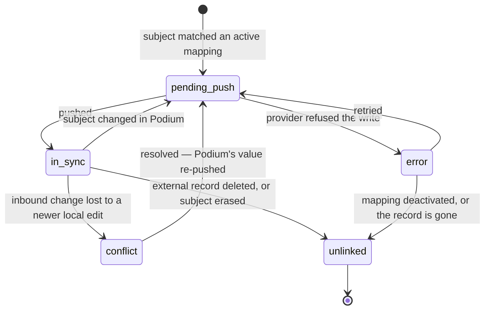
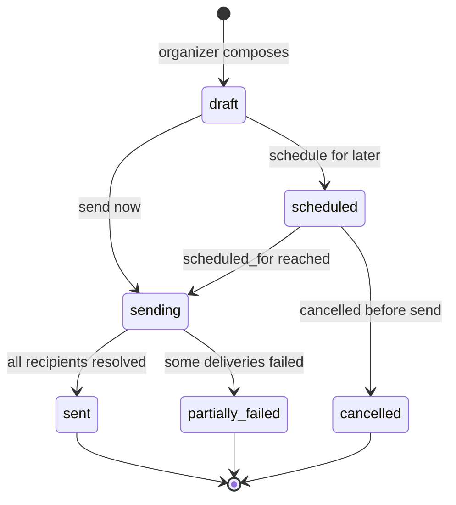

# 09 — API & Integrations

**Aggregate roots:** `ApiKey`, `Webhook`, `Integration`, `NotificationTemplate`, `SyncMapping`.

Covers J11 (pull program data into other systems and react to changes). This context also
defines the **plugin contracts** — the seams where email providers, calendars, CRMs and chat
tools attach without the core knowing anything about them.

## API surfaces

Four distinct surfaces with different auth and different cache behaviour. Conflating them is
how public schedule traffic ends up authenticated and slow.

| Surface | Auth | Reads | Notes |
|---|---|---|---|
| **Public** `/v1/public/...` | none | published snapshot only | Cacheable at the edge, CORS per `EmbedConfig`, hard rate limits by IP |
| **Portal** `/v1/me/...` | session cookie | the caller's own proposals, sessions, tasks, profile | Relationship-derived scope, never role-derived |
| **Management** `/v1/...` | API key or session | everything permitted by scope/role | The integration surface |
| **Webhooks** (outbound) | HMAC signature | push | The reactive half of J11 |
| **Provider callbacks** (inbound) `/integrations/:id/inbound` | signed URL (INV-09-15) | write | Where a provider posts back — bounces and complaints, and a `sync` provider's change ping. Dispatched on the installed integration's capability, not on the payload |

Design rules the model must support:

- **Every write is idempotent** via a caller-supplied `Idempotency-Key`, stored with the
  response for 24h and replayed on repeat. Retries are a normal part of a Workers runtime.
- **List endpoints are cursor-paginated.** Offsets over a growing proposal table produce
  duplicates and gaps during a review round.
- **Public reads are versioned by `content_etag`** and answer conditional requests.
- **Errors are typed**, naming the invariant where one was violated
  (`entitlement_exhausted` beats `400 Bad Request`).
- **A write may carry `row_version`** to make it compare-and-set (INV-11-14). It is optional
  on the management surface — a caller that omits it gets last-write-wins, which is what
  every existing integration already assumes — and a stale value is refused with
  `409 version_conflict` carrying `expected_version`, `current_version` and `current_state`.
  The HTML surfaces always send it.

## ApiKey

<!-- entity: ApiKey -->
| Field | Type | Req | Notes |
|---|---|---|---|
| `id` | `ulid` | Y | prefix `key_` |
| `org_id` | `ref(Organization)` | Y | |
| `name` | `string` | Y | "Marketing site", "Airtable sync" |
| `prefix` | `string` | Y | first 8 chars, shown in the UI for identification |
| `secret_hash` | `string` | Y | the secret is displayed once and never stored (INV-09-1) |
| `scopes` | `enum(events:read, events:write, proposals:read, proposals:write, reviews:read, reviews:write, decisions:read, decisions:write, sessions:read, sessions:write, speakers:read, speakers:write, sponsors:read, sponsors:write, entitlements:read, entitlements:write, tasks:read, tasks:write, schedule:read, schedule:publish, webhooks:manage, pii:read)[]` | Y | see below |
| `event_ids` | `ref(Event)[]` | N | empty = all events; a key for one event cannot read another |
| `created_by_person_id` | `ref(Person)` | Y | |
| `expires_at` | `timestamptz` | N | |
| `last_used_at` / `last_used_ip` | | N | |
| `rate_limit_per_minute` | `int` | N | overrides the default |
| `revoked_at` / `revoked_by_person_id` | | N | |

### Scopes

Read and write are separate, and the sensitive reads are their own scopes so that a
marketing-site key cannot accidentally be handed the review data.

`events:read` `events:write` · `proposals:read` `proposals:write` · `reviews:read`
`reviews:write` · `decisions:read` `decisions:write` · `sessions:read` `sessions:write` ·
`speakers:read` `speakers:write` · `sponsors:read` `sponsors:write` ·
`entitlements:read` `entitlements:write` · `tasks:read` `tasks:write` ·
`schedule:read` `schedule:publish` · `webhooks:manage` · `pii:read`

**`pii:read` is a separate, additive scope.** Without it, every response redacts email
addresses, phone numbers, dietary and accessibility notes, travel details, and any answer
whose `FormField.pii` is true — including inside `proposals:read`. Most integrations want
titles and times, not personal data, and the default should reflect that.

`reviews:read` never exposes reviewer identity unless the round's `anonymity` is `open`.

## Webhook

<!-- entity: Webhook -->
| Field | Type | Req | Notes |
|---|---|---|---|
| `id` | `ulid` | Y | prefix `whk_` |
| `org_id` | `ref(Organization)` | Y | |
| `event_id` | `ref(Event)` | N | null = all events |
| `name` | `string` | Y | |
| `url` | `string` | Y | absolute https (INV-09-2) |
| `event_types` | `string[]` | Y | from the catalogue; `*` and `proposal.*` wildcards allowed |
| `secret` | `string` | Y | HMAC-SHA256 signing key, rotatable |
| `previous_secret` / `secret_rotated_at` | | N | both accepted during a rotation window |
| `include_pii` | `bool` | Y | same redaction rule as `pii:read` |
| `status` | `enum(active, paused, disabled_after_failures)` | Y | |
| `consecutive_failures` | `int` | Y | |
| `created_by_person_id` | `ref(Person)` | Y | |

<!-- entity: WebhookDelivery -->
| WebhookDelivery field | Type | Notes |
|---|---|---|
| `id` | `ulid` | prefix `whd_` |
| `webhook_id` / `domain_event_id` | `ref(...)` | |
| `attempt` | `int` | |
| `status` | `enum(pending, delivered, failed, exhausted, skipped)` | |
| `request_body_hash` / `response_status` / `response_body_excerpt` | | first 2KB only |
| `error` | `text` | |
| `scheduled_for` / `delivered_at` / `duration_ms` | | |

Delivery contract:

- **At-least-once, ordered per subject.** Consumers must be idempotent on
  `DomainEvent.id`, which is sent in the `X-Event-Id` header.
- **Signature**: `X-Signature: t=<unix>,v1=<hmac(t + "." + body)>`, with a timestamp
  tolerance to blunt replay. Both current and previous secrets are valid mid-rotation.
- **Retries**: exponential backoff (1m, 5m, 30m, 2h, 6h, 24h), then `exhausted`. Twenty
  consecutive failures pauses the webhook and notifies the org owner rather than retrying
  into the void.
- **Manual redelivery** of any delivery, and replay of an event type over a time range —
  this is what makes a consumer's outage recoverable without a support ticket.

## Integration (plugins)

The core never imports a vendor SDK. An `Integration` is an installed adapter implementing
one or more capability contracts; the core calls the contract.

<!-- entity: Integration -->
| Field | Type | Req | Notes |
|---|---|---|---|
| `id` | `ulid` | Y | prefix `itg_` |
| `org_id` | `ref(Organization)` | Y | |
| `event_id` | `ref(Event)` | N | |
| `plugin_key` | `string` | Y | `email.resend`, `email.sendgrid`, `chat.slack`, `crm.hubspot`, `calendar.google`, `analytics.ai_evaluator`, `sync.airtable` |
| `capability` | `enum(email, sms, chat, calendar, crm, storage, video, analytics, identity, ticketing, sync)` | Y | |
| `display_name` | `string` | Y | |
| `config` | `json` | Y | non-secret settings (sender name, channel id, list id) |
| `secret_ref` | `string` | Y | pointer into the secret store; **never the secret itself** (INV-09-3) |
| `is_default_for_capability` | `bool` | Y | one default per capability per scope (INV-09-4) |
| `status` | `enum(active, misconfigured, disabled)` | Y | |
| `last_health_check_at` / `last_error` | | N | |

### Capability contracts

Each is a narrow interface a plugin implements. Deliberately minimal — the widest possible
provider set should be able to satisfy them.

**`email`** — the one that matters most, since every job here ends in an email.

```
send(message: {
  to: [{email, name}], reply_to?, subject, html, text,
  headers?, tags?, idempotency_key
}) -> {provider_message_id, status}

verify_sender(domain) -> {verified: bool, records?: [...]}
handle_inbound_webhook(payload) -> DeliveryStatusUpdate[]   // bounces, complaints
```

Templating, batching, quiet hours, digesting and suppression are **core concerns**, not
provider ones. The plugin does one thing: put this rendered message on the wire. That is
what keeps "swap Resend for SES" a config change.

`handle_inbound_webhook` is reached at `/integrations/:id/inbound`, scoped to one installed
`Integration` rather than to the capability's default — the provider is answering *that*
installation's sends, and routing a Resend callback to whichever adapter currently holds the
default would attribute it to the wrong provider. The callback carries no session and no API
key, so **the URL is the credential**: it is HMAC-signed per integration under INV-09-15,
exactly like the unsubscribe link. That is deliberately weaker than verifying a provider's
own request signature — every provider signs differently (SendGrid ECDSA over timestamp and
body, Resend via Svix) while this contract takes a parsed payload and no headers — and it is
the check the core can make uniformly for every provider. A plugin that wants its provider's
native verification needs the contract to grow a headers argument first.

Callbacks are **at-least-once and unordered**, so applying one moves
`NotificationDelivery.status` forward only: a resent `delivered` never erases a `bounced`,
and a replayed bounce emits `notification.bounced` once. `complained` outranks `delivered`
because that is the only order it can occur in.

**`chat`** — `post(channel, blocks|text)`, for "new proposal submitted" into a committee
channel.
**`calendar`** — `create_or_update_event(...)`, for pushing a speaker's session and tech
check into their calendar.
**`crm`** — `upsert_company(sponsor)`, `upsert_contact(person)`, `record_activity(event)`,
so sponsor fulfilment status is visible to the sales side without a manual export.
**`storage`** — `presign_upload(...)`, `presign_download(...)`, `delete(...)`. Default
implementation is object storage; the contract exists so self-hosters can point elsewhere.
**`identity`** — OIDC discovery for orgs that want SSO for staff and reviewers.
**`ticketing`** — `get_capacity(session) -> {sold, remaining}`, and nothing else.

That one method is the entire integration, deliberately (R19 in
[`13-open-questions.md`](13-open-questions.md)). Workshop capacity is already modelled
(`capacity_policy`, `registration_url` in [`02`](02-event-configuration.md)) but
registration lives in a ticketing system, and the only thing the platform actually needs
back is whether a workshop is full — on the schedule, in real time. The count is cached
into the publication snapshot so the public page does not call the provider per render.
**Attendees are not modelled.** Importing an entire bounded context to compute one integer
is how a conference tool becomes a ticketing system nobody asked it to be.

**`sync`** — a table-shaped, two-way mirror of programme data in a spreadsheet tool
(Airtable, and anything else that can satisfy the same six methods). It gets its own section
below, because two-way is a different kind of problem from every other contract here: the
others are fire-and-forget, and this one has to decide what happens when both sides changed.

## Two-way sync

Organizers keep a spreadsheet regardless. They keep it for the columns this model will never
have — *hotel booked?*, *who introduced us*, *swag size*, *legal cleared the recording* — and
for the people who will never have a login here: sponsorship sales, the AV contractor, the
volunteer coordinator. Today that spreadsheet is a stale copy somebody pasted in March. The
point of this contract is to make it a live view that they can also write to, in the few
places where writing to it is safe.

### Podium is the system of record

Not a slogan — a rule with a mechanism behind it, because "two-way sync" without one is a
data-loss feature with a friendly name.

- **Every synced field is pushed.** Some are *also* accepted back. `SyncFieldMap.direction`
  is therefore `push` or `both`, and there is deliberately no `pull` — a field the external
  tool owns outright would be a field this model cannot state the value of.
- **An inbound change is applied only against the version Podium last pushed.** The link
  remembers the subject's `row_version` at push time. If the local row has moved since, the
  inbound edit was written against a value that is no longer true, and it loses (INV-09-18).
  It is not discarded: the refused values are kept on the link, the state becomes `conflict`,
  Podium's current value is re-pushed so the spreadsheet converges, and a human is shown both.
- **Losing is visible.** A conflict is a queue an organizer works through, not a log line.
  The failure this prevents is the one every sync product has shipped at least once: an edit
  vanishes, nobody can say when, and trust in the whole integration goes with it.

### What may be written back, and what may never be

Two-way is not a property of the integration; it is a property of each field. Each subject
declares three sets — what may be pushed, what may be accepted back, and which of those are
PII — and a mapping that names anything outside them is refused at save time (INV-09-17),
while the field is still on the organizer's screen.

Three subjects are **push-only, permanently**, and one is not a subject at all (INV-09-23).
The reasons are worth stating, because each is a real incident somewhere:

| | Why |
|---|---|
| `Decision` — push-only | Publishing a decision emails every speaker (INV-05-10). A dropdown in a spreadsheet must not be able to send four hundred rejections at 2am. `feedback_for_speaker` and `rationale` are not pushed either: one is a letter to a person and the other is the committee's private reasoning. |
| `Entitlement` — push-only | `consumed_count` and `remaining` are derived from the proposals pointing at the entitlement ([`03`](03-sponsorship.md)). There is nothing to write. |
| `Placement` — push-only | Placement writes serialise through one writer per event ([`08`](08-scheduling-and-publication.md)) precisely because concurrent edits produce conflicts no retry untangles. A spreadsheet row is the opposite of that discipline. |
| `Review` — **not a subject** | Push-only would not be safe enough. Review data is *absent*, not redacted, for anyone credited on the proposal (INV-11-7), and reviewer identity is hidden unless the round is `open` — properties a spreadsheet cannot carry, since it has one visibility for everyone who opens it. A proposal's `status` and its `Decision` already say where it got to, which is what the grid is actually for. |

The general form of the rule is simpler than the list: **sync what a human types, never what
the system computes or what fires.** Derived fields are unwritable everywhere (INV-11-6), and
this is the surface most likely to forget it, because in a grid a derived column looks exactly
like any other.

One consequence is easy to miss and expensive to learn: editing approved session content
revokes the approval and writes a `SessionRevision`, in the same write (INV-06-12). That is
correct, and it means a mapping that accepts `Session.title` back will un-approve a session
the first time somebody fixes a typo in the spreadsheet. The install surface says so where
the field is chosen, rather than leaving it to be discovered.

### Mirror the shape, not just the values

A conference base is not a spreadsheet. It has a **Sessions** table whose *Speakers* column
links to a **Speakers** table, a *Track* column you can group and colour the grid by, and a
*Headshot* column that shows a face in gallery view. Those three things are most of why an
organizer chose this tool, and a sync that flattens them into text hands back the spreadsheet
they were trying to leave.

So a synced field declares what it *is*, not what it can be squeezed into, and the adapter
maps that to the provider's own type. The core never names one.

| Field kind | What it carries | Why not just text |
|---|---|---|
| `select` | one value from a small set — a track, a status | a text column cannot group, filter or colour |
| `multi_select` | keywords, tags | chips are filterable; `"ai, agents"` is a sentence |
| `link` | a relationship, as real links between two mirrored tables | answers "what else is she on this year", which a name string cannot |
| `attachment` | a file the provider fetches and keeps its own copy of | a headshot should be a face, not a URL |
| `url`, `email`, `date`, `number`, `boolean` | what they say | the provider gets to render and validate them |

Three consequences follow, and each is a rule rather than a preference:

- **A relationship is mapped from one side only.** Providers create the reverse column
  automatically, so declaring both ends would leave two mappings fighting over one pair of
  columns. `Session.speakers` is declared; `SpeakerProfile.sessions` is not.
- **A `select` whose options are rows here travels by name.** An organizer picks "Platform
  Engineering" from a dropdown, not `trk_01J…`, so the name is what crosses and the name is
  what is resolved on the way back. A name that matches nothing in the event is a conflict,
  not a silent null: somebody typing an unknown track means something, and clearing the field
  would lose both the old value and the intent.
- **Links and attachments are never accepted back** (INV-09-24). Adding a speaker to a session
  creates an invitation, a confirmation state and a set of onboarding tasks — more than a cell
  edit can mean — and a file arriving from outside would bypass the scan every upload goes
  through. Both are pushed; neither is read.

The table's **primary field** is declared too, because providers show it in every
linked-record chip and record card. It has to be the human name of the thing — a session's
title, a person's name — and never an id or a status, and it must be a plain scalar, which is
what providers accept in that position.

Setting all of this up by hand means typing twenty column names that have to match exactly,
and finding out at the first sync that one of them is a text column where a date was needed.
So the contract has `ensure_table`: the mapping already knows the names and the types, and can
just make them. Additive only — it never renames, retypes or deletes, because a column
somebody else made and a column of ours that drifted are indistinguishable from this side.

### Why the loop terminates

A push changes the external record; the external tool reports a change; the pull writes it
back; the write raises a domain event; the event schedules a push. Every naive two-way sync
contains this loop, and the fix has to be in the model rather than in a timer.

The link stores a hash of the field values **in Podium's value space** — computed after
mapping, so provider formatting differences cannot make an unchanged record look changed —
for the last push and the last accepted pull. An inbound record hashing to either one is this
system hearing its own echo, and is dropped without a write, an event, or a run counter
(INV-09-19). This is the single load-bearing mechanism in the whole design.

<!-- entity: SyncMapping -->
| Field | Type | Req | Notes |
|---|---|---|---|
| `id` | `ulid` | Y | prefix `smp_` |
| `org_id` | `ref(Organization)` | Y | |
| `integration_id` | `ref(Integration)` | Y | must hold the `sync` capability |
| `event_id` | `ref(Event)` | N | required for an event-scoped subject, null for an org-scoped one |
| `subject` | `enum(proposal, session, person, speaker_profile, event_participant, sponsor, sponsorship, entitlement, placement, decision, prospect_card)` | Y | what this table mirrors. `Review` is deliberately absent — see INV-09-23 |
| `external_table_id` | `string` | Y | opaque to the core; an Airtable table id |
| `external_table_name` | `string` | Y | for display, refreshed on health check |
| `field_map` | `json` | Y | `[{field, external_field, direction}]`, validated against the subject's declared sets (INV-09-17) |
| `include_pii` | `bool` | Y | same redaction rule as `pii:read` (INV-09-21) |
| `filter` | `json` | N | which records to mirror, as criteria — `{status[], track_ids[]}` |
| `is_active` | `bool` | Y | inactive mappings neither push nor pull |
| `last_cursor` | `string` | N | opaque provider cursor for the change feed |
| `last_push_at` / `last_pull_at` | `timestamptz` | N | |
| `created_by_person_id` | `ref(Person)` | Y | |

<!-- entity: SyncFieldMap -->
| SyncFieldMap field | Type | Req | Notes |
|---|---|---|---|
| `field` | `string` | Y | a Podium field the subject declares pushable |
| `external_field` | `string` | Y | column name in the external table |
| `direction` | `enum(push, both)` | Y | `both` only where the subject declares the field writable (INV-09-17). Never for a `link` or an `attachment` (INV-09-24) |

<!-- entity: ExternalRecordLink -->
| ExternalRecordLink field | Type | Req | Notes |
|---|---|---|---|
| `id` | `ulid` | Y | prefix `xrl_` |
| `org_id` | `ref(Organization)` | Y | |
| `mapping_id` | `ref(SyncMapping)` | Y | |
| `subject_type` / `subject_id` | | Y | the Podium record |
| `external_id` | `string` | N | null until the first push succeeds |
| `last_pushed_hash` | `string` | N | of the projected values, in Podium's value space (INV-09-19) |
| `last_pulled_hash` | `string` | N | of the last inbound change actually applied |
| `last_pushed_version` | `int` | N | the subject's `row_version` when it was last pushed — what an inbound change is compared against (INV-09-18) |
| `last_pushed_at` / `last_pulled_at` | `timestamptz` | N | |
| `status` | `enum(pending_push, in_sync, conflict, error, unlinked)` | Y | |
| `conflict_payload` | `json` | N | the inbound values that lost, kept so the organizer can see what was refused |
| `last_error` | `text` | N | |



<!-- entity: SyncRun -->
| SyncRun field | Type | Req | Notes |
|---|---|---|---|
| `id` | `ulid` | Y | prefix `syr_` |
| `org_id` | `ref(Organization)` | Y | |
| `mapping_id` | `ref(SyncMapping)` | Y | |
| `direction` | `enum(push, pull)` | Y | |
| `trigger` | `enum(event, cron, inbound, manual)` | Y | what started it, so a runaway loop is legible |
| `status` | `enum(running, completed, completed_with_errors, failed)` | Y | |
| `counts` | `json` | D | `{pushed, pulled, echoed, conflicted, skipped, failed}` from the links it touched |
| `cursor_before` / `cursor_after` | `string` | N | |
| `started_at` / `finished_at` | `timestamptz` | Y/N | |
| `error` | `text` | N | |

### The `sync` capability contract

Six methods, and none of them know what a proposal is. A provider that can list tables,
describe their columns, upsert by id and enumerate changes can satisfy this; the core supplies
every rule that matters.

```
list_tables() -> [{external_table_id, name, fields}]
describe_table(external_table_id) -> {fields: [{external_field, label, type, read_only}]}
upsert_records(external_table_id, [{external_id?, fields}]) -> [{external_id, error?}]
list_changes(external_table_id, cursor) -> {changes: [{external_id, fields, deleted}], next_cursor, has_more}
delete_records(external_table_id, [external_id])                  // erasure, INV-09-22
handle_inbound_webhook(payload) -> {external_table_ids | null}    // a ping, not a payload
ensure_table({external_table_id?, name, columns}) -> {fields}     // optional; additive only
```

Two shapes here are deliberate. `list_changes` takes a cursor because a provider with a real
change feed should use it — but a provider without one may return every record and let the
core work out what moved, since the core hash-compares regardless for echo suppression. And
`handle_inbound_webhook` returns *which tables to go and read*, not the changed data:
spreadsheet tools send a ping, and a payload that arrived out of order would be worse than a
prompt to re-read. A cron sweep backstops the ping, because an integration that only works
when a webhook lands is an integration that silently stops.

`batch_limit` on the plugin caps records per upsert call (Airtable: 10). Rate limits are a
core concern like quiet hours: a published decision over four hundred proposals must coalesce
into batches rather than four hundred calls, so pushes are debounced per `(mapping, table)`
and drained on a schedule, never fired one-per-event.

## Notifications

Templates and delivery are core; transport is a plugin. This is what makes every
speaker-facing message auditable — "did they get the acceptance email?" is a query, not a
guess.

<!-- entity: NotificationTemplate -->
| NotificationTemplate field | Type | Req | Notes |
|---|---|---|---|
| `id` | `ulid` | Y | prefix `ntp_` |
| `org_id` / `event_id` | `ref(...)` | Y/N | event templates override org ones |
| `key` | `string` | Y | `proposal.accepted`, `task.reminder`, `schedule.changed` |
| `channel` | `enum(email, chat)` | Y | |
| `subject` | `string` | N | |
| `body_markdown` | `text` | Y | with `{{variables}}` from a declared, validated set |
| `locale` | `string` | Y | default `en` |
| `is_active` | `bool` | Y | |
| `version` | `int` | Y | |

<!-- entity: NotificationDelivery -->
| NotificationDelivery field | Type | Notes |
|---|---|---|
| `id` | `ulid` | prefix `ntd_` |
| `campaign_id` | `ref(Campaign)` | set when the message came from a bulk send |
| `template_key` / `template_version` | | |
| `recipient_person_id` / `recipient_email` | | email captured as sent, since people change addresses |
| `channel` / `integration_id` | | which provider actually sent it |
| `subject_type` / `subject_id` | | proposal, task, session |
| `status` | `enum(queued, sent, delivered, bounced, complained, failed, suppressed)` | |
| `suppressed_reason` | `enum(unsubscribed, hard_bounced, complained, duplicate, quiet_hours, digest_batched, no_provider)` | |
| `provider_message_id` / `sent_at` / `delivered_at` / `error` | | |

**Suppression is global per email address** for hard bounces and complaints, and
per-category for unsubscribes — with the deliberate exception that **transactional messages
a speaker must receive are never suppressed by an unsubscribe**: acceptance, rejection,
confirmation deadlines, and schedule changes for their own talk. Marketing preferences must
not cost someone their slot.

**The unsubscribe link needs no login** — clicking it from an inbox is the whole point — so it
is a signed URL rather than an authenticated one: the email and category are HMAC-signed with
a deployment secret, and the click is honoured only if the signature verifies. That secret is
exactly the kind of credential INV-09-3 already governs, so it follows the same rule: it lives
behind a Workers Secret, is never derived from a public or guessable configuration value (an
`ENVIRONMENT` name, a hostname), and is never logged (INV-09-15).

### Variables and preview

`body_markdown` interpolates `{{variables}}` from a declared, validated set per
`template_key` — `{{speaker.first_name}}`, `{{session.title}}`, `{{event.name}}`,
`{{portal_url}}`, `{{task.due_at}}`. Two rules, both learned the hard way:

- **Unknown variables fail at save time, not send time.** A template referencing
  `{{talk_title}}` when the variable is `{{session.title}}` must be rejected when the
  organizer writes it, while they are looking at it — not silently rendered as an empty
  string into four hundred inboxes.
- **Preview resolves against a real recipient.** The compose surface renders the message as
  one named person will receive it, chosen from the actual recipient set. A preview showing
  raw tokens proves nothing; the failure this catches is a variable that is valid but empty
  for half the list.

## Campaigns — organizer-composed bulk messaging

Templated, system-triggered notifications cover the messages the platform knows to send.
They do not cover the ones a human decides to send: *welcome to the programme*, *the venue
has changed*, *we still need three of you to upload slides*, *would you speak next year*.

Every organizer does this work. Without a first-class surface they do it from their own
mail client against a copy-pasted address list, and the platform loses the record — which
means "did we tell the speakers about the room change" becomes unanswerable, and the
person who sent it is the only one who knows.

<!-- entity: Campaign -->
| Campaign field | Type | Req | Notes |
|---|---|---|---|
| `id` | `ulid` | Y | prefix `cmp_` |
| `org_id` / `event_id` | `ref(...)` | Y/N | event-scoped for speaker comms, org-scoped for sourcing outreach |
| `name` | `string` | Y | internal label |
| `channel` | `enum(email, chat)` | Y | |
| `template_id` | `ref(NotificationTemplate)` | N | null for a one-off composed message |
| `subject` | `string` | N | |
| `body_markdown` | `text` | Y | same `{{variables}}` and the same save-time validation |
| `audience` | `json` | Y | the selection as *criteria*, not a frozen list: `{kind, event_id, participant_status[], track_ids, task_state, has_outstanding_tasks, person_ids[], segment_id}` |
| `recipient_count` | `int` | D | resolved from `audience` at send time |
| `status` | `enum(draft, scheduled, sending, sent, partially_failed, cancelled)` | Y | |
| `scheduled_for` | `timestamptz` | N | |
| `created_by_person_id` | `ref(Person)` | Y | |
| `sent_at` | `timestamptz` | N | |
| `stats` | `json` | D | `{queued, sent, delivered, bounced, suppressed, failed}` from its deliveries |

<!-- entity: CampaignRecipient -->
| CampaignRecipient field | Type | Notes |
|---|---|---|
| `campaign_id` / `person_id` | `ref(...)` | |
| `resolved_email` | `string` | captured as sent |
| `notification_id` | `ref(NotificationDelivery)` | the actual delivery |
| `status` | mirrors the delivery | |
| `suppressed_reason` | | why this recipient got nothing |



Design points that matter:

- **`audience` is criteria, resolved at send time.** "All confirmed speakers with an
  outstanding task" is a query, and storing it as a query is what makes a scheduled campaign
  correct when it fires rather than correct when it was written.
- **A campaign is a batch of ordinary deliveries.** Each recipient gets a
  `NotificationDelivery`, so bounces, suppression, quiet hours and the unsubscribe rules
  apply unchanged, and one query answers "everything we ever sent this person".
- **Sending is idempotent per `(campaign, person)`.** A retried send job never sends twice.
- **Marketing suppression applies; transactional exemption does not.** A campaign is not a
  decision notification, and INV-09-10's exemption is deliberately not extended to it.

**`CommunicationsHistory`** is the read model over all of it: every `NotificationDelivery`
for an event or a person, system-triggered and campaign alike, with template, subject,
recipient, timestamp, status and the campaign that produced it. It is reachable from the
event, from a person's record, and from a session — because the question is asked from all
three directions.

### The outbox

Every deliverable message is also written to an organizer-readable outbox — the
`CommunicationsHistory` above, plus the rendered body. This is not a debugging convenience:
it is what makes an invitation retrievable when mail bounces, what lets support answer "what
did we actually send her", and what makes the product operable in a deployment with no
email provider configured at all. Where no `email` integration is active, messages are
recorded as `queued` with `suppressed_reason = no_provider` and remain readable and
copyable rather than being silently dropped (INV-09-12).

## Platform mapping (non-normative)

Cloudflare-shaped, recorded so implementation agents share assumptions. Nothing in this
model depends on these choices.

| Concern | Service | Note |
|---|---|---|
| API + SSR | Workers | one Worker per surface, shared domain package |
| Portal / public site | Workers Assets or Pages | |
| Relational store | D1, behind a repository layer | Settled in [R16](13-open-questions.md): D1 handles conference scale, and Postgres via Hyperdrive stays a documented escape hatch. No D1-specific SQL in the domain layer. |
| Assets (headshots, slides, logos) | R2 + presigned uploads | `storage` capability |
| Published snapshot cache | KV or Cache API, keyed on `content_etag` | the embed never touches the database |
| Webhook + email delivery | Queues with retry/DLQ | maps directly onto `WebhookDelivery` |
| Reminder scheduling | Cron Triggers + Queues | |
| Placement conflict serialisation | Durable Object per event | one writer per event's schedule kills the concurrent-edit race |
| Secrets | Workers Secrets / Secrets Store | what `Integration.secret_ref` points at |
| Rate limiting | Durable Object counters or the Rate Limiting binding | |

## Invariants

- **INV-09-1** API key secrets are stored hashed and shown once. Rotation issues a new key;
  keys are never re-displayed.
- **INV-09-2** Webhook URLs must be absolute `https`. Requests to private and
  link-local address ranges are refused at delivery time (SSRF).
- **INV-09-3** `Integration.config` may never contain credentials; secrets live behind
  `secret_ref`. Config is readable by admins, secrets are not readable at all.
- **INV-09-4** At most one `is_default_for_capability` integration per capability per scope,
  with event scope overriding org scope.
- **INV-09-5** Without `pii:read` (or `include_pii`), every response and payload redacts the
  fields listed under PII in [`11-cross-cutting.md`](11-cross-cutting.md).
- **INV-09-6** Public endpoints serve programme data only from the `live`
  `SchedulePublication` and never from live program tables. The two exceptions are
  intake-side surfaces that have no snapshot to serve from and must be reachable before any
  schedule exists: `PublicCfp` ([`02`](02-event-configuration.md), governed by INV-02-12)
  and a public event landing page. Neither may expose a proposal, a review, a task, or any
  field whose `audience != public`.
- **INV-09-7** Every mutating request accepts `Idempotency-Key`; a repeat within 24h replays
  the stored response and performs no new writes.
- **INV-09-8** Webhook payloads carry `DomainEvent.id`; consumers are told, in the docs and
  the headers, that delivery is at-least-once.
- **INV-09-9** An API key scoped to specific `event_ids` cannot read or write any other
  event, regardless of its scopes.
- **INV-09-10** Transactional notifications tied to a person's own proposal, session or task
  are never suppressed by a marketing unsubscribe.
- **INV-09-11** Revoking an API key or disabling an integration takes effect immediately;
  in-flight deliveries using it are cancelled, not drained.
- **INV-09-12** Every message the platform intends to send writes a `NotificationDelivery`
  before any provider call. A message that cannot be dispatched — no provider, provider
  error, suppression — is recorded with its reason and remains readable in the outbox. No
  intended message is ever silently dropped.
- **INV-09-13** A `NotificationTemplate` or `Campaign` body referencing a variable outside
  its `template_key`'s declared set is rejected at save time.
- **INV-09-14** Campaign sending is idempotent per `(campaign_id, person_id)`; a recipient
  receives at most one delivery per campaign regardless of retries.
- **INV-09-15** A signed, no-login URL — the unsubscribe link, and the inbound
  provider-callback URL — is HMAC-signed with a deployment secret held behind a Workers
  Secret, never derived from a public or guessable configuration value such as an
  environment name, and never logged. Generating or verifying one without that secret
  configured fails closed rather than falling back to a default an attacker could reproduce.
  Each kind signs a distinct message shape, so a signature minted for one cannot be replayed
  against the other.
- **INV-09-16** An inbound provider callback only moves a `NotificationDelivery` forward:
  provider webhooks are at-least-once and unordered, so re-applying an event already
  recorded changes nothing and emits nothing.
- **INV-09-17** A `SyncFieldMap` may only name a field its subject declares pushable, and may
  only set `direction = both` where the subject declares that field writable. A mapping
  naming anything else is rejected at save time, not at sync time. Derived fields
  (INV-11-6) are in neither set, for any subject.
- **INV-09-18** Podium is the system of record. An inbound change is applied only if the
  subject's `row_version` still equals `ExternalRecordLink.last_pushed_version`. Otherwise
  the link becomes `conflict`, the refused values are retained in `conflict_payload`, and
  Podium's current value is re-pushed. No inbound change ever overwrites a local edit made
  since the last push.
- **INV-09-19** An inbound record whose projected hash equals the link's `last_pushed_hash`
  or `last_pulled_hash` is an echo of a change Podium itself made. It is discarded without a
  write, an event, or a run counter. This is what stops push and pull from driving each
  other forever.
- **INV-09-20** Every inbound change is applied through the same service path as the
  equivalent API write — same invariants, same domain events, same audit row — with
  `actor.type = integration` and the `Integration.id` as the actor. A sync never writes to a
  table directly, and never bypasses a rule an organizer would have hit by hand.
- **INV-09-21** A `SyncMapping` without `include_pii` never pushes a field classified as PII
  in [`11-cross-cutting.md`](11-cross-cutting.md), and never accepts one back.
- **INV-09-22** Deactivating or erasing a `Person` deletes every external record linked to it
  on every mapping, active or not, before its links are dropped. A sync target is not a place
  personal data outlives its erasure.
- **INV-09-24** A `link` field is pushed only where its target subject also has an active
  mapping on the same `Integration`; otherwise the column is omitted from the push rather than
  written empty, since blanking it would clear links an organizer made by hand. A `link` or an
  `attachment` is never accepted back: a relationship carries consequences a cell edit cannot
  express, and a file that did not come through the upload pipeline was never scanned.
- **INV-09-23** `Decision`, `Entitlement` and `Placement` are push-only: their writable field
  set is empty and no mapping can configure otherwise, because each one either notifies
  people, is derived, or serialises through a single writer. `Review` is not a sync subject
  in either direction: its visibility differs per reader (INV-11-7, and reviewer identity
  under the round's `anonymity`), and an external table has one visibility for everyone who
  can open it.

## Emitted events

`api_key.created`, `api_key.revoked`, `webhook.created`, `webhook.delivery_failed`,
`webhook.disabled`, `integration.installed`, `integration.health_changed`,
`notification.sent`, `notification.bounced`, `campaign.created`, `campaign.sent`,
`campaign.recipient_failed`, `sync_mapping.created`, `sync_mapping.activated`,
`sync_mapping.deactivated`, `sync_link.created`, `sync_link.conflicted`,
`sync_link.resolved`, `sync_link.unlinked`, `sync_run.completed`, `sync_run.failed`.

`sync_link.conflicted` is the one an organizer actually subscribes to: it is the only signal
that somebody's edit did not take, and INV-09-18 guarantees it fires every time that happens.
