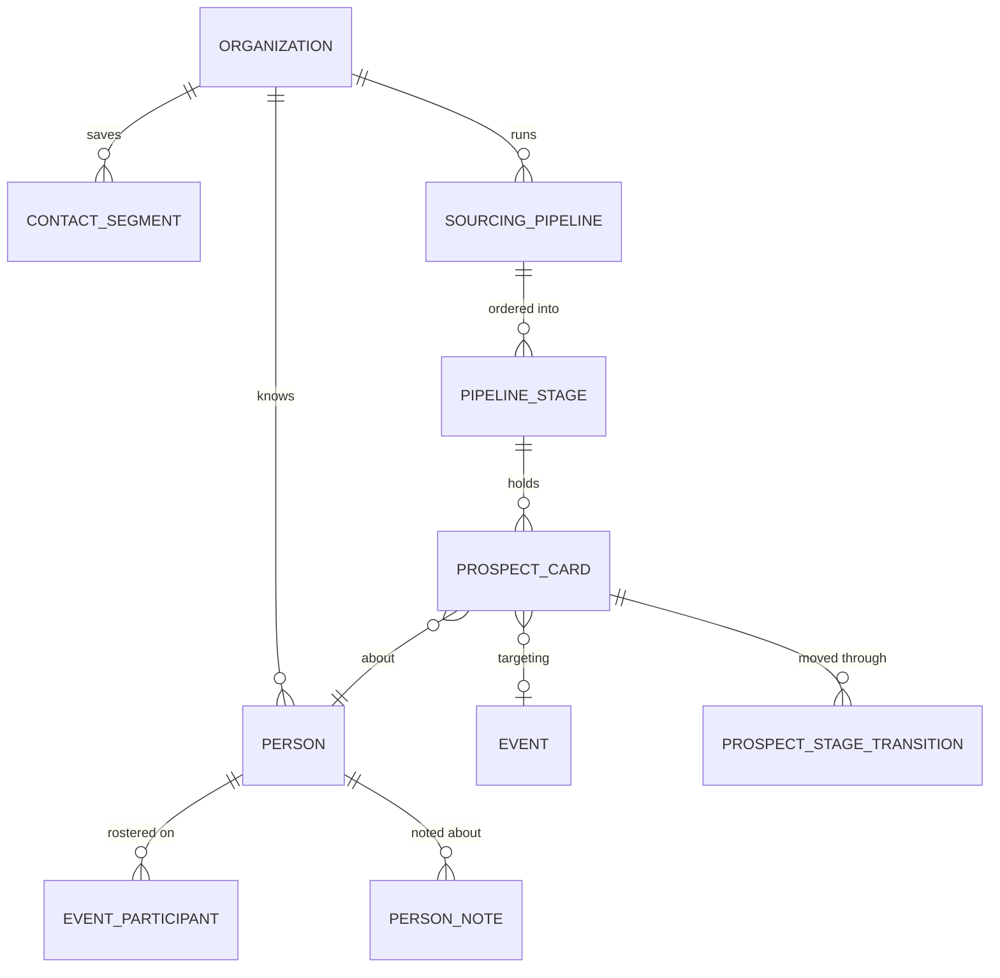
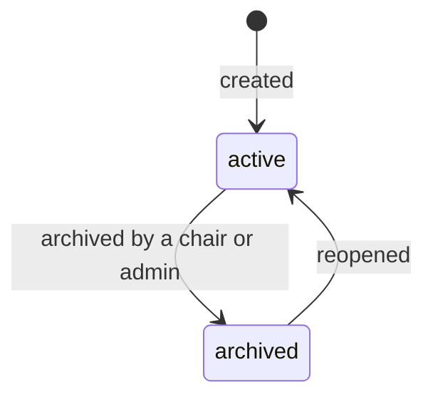
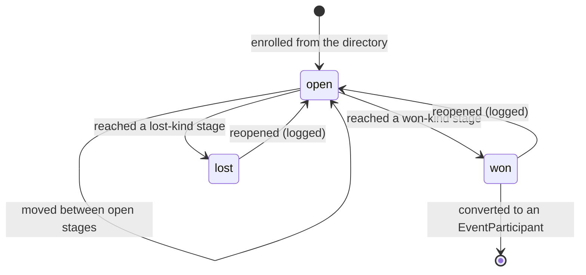

# 14 — Speaker CRM

**Aggregate roots:** `ContactSegment`, `SourcingPipeline`.

> Numbered after the reference files so that the existing cross-links in `00`–`13` keep
> working. It is a bounded context like `01`–`09`, not a reference appendix.

Covers **J12 — find and cultivate the speakers for next year's programme**, the job that
starts the day after an event ends.

Every other context in this model is scoped to an event. This one deliberately is not. The
compounding asset a conference organization builds is not its schedule, it is **the people
it knows**: who spoke well in 2025, who was excellent but unavailable, who has been on the
shortlist three years running and never been asked, who declined and said "ask me again".
That knowledge lives in one person's head and one person's inbox, and it leaves when they
do.

`Person` is already org-scoped and already accumulates `tags`, `custom_field_values`,
`PersonNote`s and — through `EventParticipant` — a history across every event the org has
run. **The directory therefore needs no new entity.** What this context adds is the three
things that turn a table of people into a working pipeline: a way to save the queries you
run repeatedly, a way to track a conversation that has not yet reached a commitment, and a
way to move somebody from the database into an event without re-typing them.

## The directory

The organization-level view over `Person`, with the fields that make it a working tool
rather than a contact dump:

| Surface | Behaviour |
|---|---|
| Columns | name, email, job title, company, tags, `custom_field_values` where `show_in_list`, events participated in, sessions given, last activity |
| Search | name, email, company, and bio text |
| Filters | company, job title, tag, custom field, event participated in, `EventParticipant.status`, has/has-not spoken, last-contacted-before |
| Row actions | open profile, add to a segment, enrol in a pipeline, add to an event, include in a campaign |

Filters compose with AND, and every filtered set is directly actionable — the same
principle as the onboarding board in [`07`](07-onboarding.md). A filter you cannot act on
is a filter you export to a spreadsheet.

**Cross-event history is the reason the directory exists.** A contact profile shows every
`EventParticipant` row, every session they gave with its event and date, every `PersonNote`
in reverse-chronological order, and their `CommunicationsHistory`
([`09`](09-api-and-integrations.md)) — so "have we talked to her, when, and what did she
say" is one screen rather than four searches.

Duplicates are surfaced by `PersonMergeCandidate` and merged through the existing person
merge ([`01`](01-identity-and-access.md)). Nothing here needs its own de-duplication: a
duplicate in the CRM *is* a duplicate person, and having two mechanisms would guarantee they
disagree.

## ContactSegment

A saved query. "AI infra people we have not asked since 2025", "everyone who declined
World's Fair", "the shortlist for the agents keynote" — organizers rebuild these filters by
hand every time, and rebuilding them slightly differently is how somebody gets emailed
twice and somebody else not at all.

<!-- entity: ContactSegment -->
| Field | Type | Req | Notes |
|---|---|---|---|
| `id` | `ulid` | Y | prefix `seg_` |
| `org_id` | `ref(Organization)` | Y | |
| `name` | `string` | Y | "AI infra — not asked since 2025" |
| `description` | `text` | N | |
| `kind` | `enum(dynamic, static)` | Y | see below |
| `criteria` | `json` | N | the saved filter, for `dynamic` |
| `member_person_ids` | `ref(Person)[]` | N | the frozen list, for `static` |
| `member_count` | `int` | D | resolved for `dynamic`, counted for `static` |
| `created_by_person_id` | `ref(Person)` | Y | |
| `visibility` | `enum(private, shared)` | Y | `shared` segments are visible to all org staff |
| `created_at` / `updated_at` | `timestamptz` | Y | |

**Both kinds are needed and they are not interchangeable.** A `dynamic` segment re-resolves
on every read, so "speakers with an outstanding task" is correct tomorrow. A `static`
segment is a decision somebody made — the twelve people on the keynote shortlist — and it
must not silently gain a thirteenth because someone edited a tag. Choosing the wrong one is
a real failure in both directions, which is why the choice is explicit at creation
(INV-14-1) rather than inferred.

Segments are the audience for a `Campaign` ([`09`](09-api-and-integrations.md)): a campaign
targeting a `dynamic` segment resolves it at send time, which is the behaviour a scheduled
"reminder to everyone still outstanding" needs.

## Sourcing pipeline

> **Not in v1** (R28 in [`13-open-questions.md`](13-open-questions.md)). The directory and
> segments above ship first; the pipeline lands after the first event has run. It is
> specified here because the decision to defer it is only defensible if the thing being
> deferred is understood — and because real usage during the run-up to a *second* event is
> what will say whether this needs a kanban board or just a `ContactSegment` plus
> `next_action_at` on the roster.

Between "we should ask her" and "she has accepted" there is a conversation that takes
weeks, involves several people, and currently lives in a shared document. A proposal record
cannot represent it — there is nothing to propose yet, and inventing a placeholder proposal
puts an unreviewed non-submission into the committee's queue.

### SourcingPipeline

<!-- entity: SourcingPipeline -->
| Field | Type | Req | Notes |
|---|---|---|---|
| `id` | `ulid` | Y | prefix `pip_` |
| `org_id` | `ref(Organization)` | Y | |
| `event_id` | `ref(Event)` | N | null = a standing pipeline not tied to one event |
| `name` | `string` | Y | "World's Fair 2027 keynotes" |
| `status` | `enum(active, archived)` | Y | |
| `created_by_person_id` | `ref(Person)` | Y | |

Archiving hides the board and stops its follow-up nudges; it deletes nothing, because next
year's pipeline starts by reading last year's.

### PipelineStage

<!-- entity: PipelineStage -->
| Field | Type | Req | Notes |
|---|---|---|---|
| `id` | `ulid` | Y | prefix `pst_` |
| `pipeline_id` | `ref(SourcingPipeline)` | Y | |
| `name` | `string` | Y | organizer-chosen wording |
| `kind` | `enum(open, won, lost)` | Y | terminal semantics, independent of the label (INV-14-2) |
| `sort_order` | `int` | Y | left-to-right order on the board |
| `wip_limit` | `int` | N | a soft cap, warned on rather than enforced |

A default set ships, because an empty board is where this feature dies:
`Researching` → `Identified` → `Contacted` → `Interested` → `Confirmed` (won) /
`Declined` (lost).

Stages are renameable and reorderable, but `kind` is what the model reasons about. "Did we
land them" must not depend on string-matching a column header that somebody renamed to
"Locked in 🎉".

### ProspectCard

<!-- entity: ProspectCard -->
| Field | Type | Req | Notes |
|---|---|---|---|
| `id` | `ulid` | Y | prefix `prc_` |
| `pipeline_id` | `ref(SourcingPipeline)` | Y | |
| `stage_id` | `ref(PipelineStage)` | Y | current column |
| `person_id` | `ref(Person)` | Y | unique with `pipeline_id` (INV-14-3) |
| `event_id` | `ref(Event)` | N | the event being sourced for |
| `topic` | `string` | N | "the eval harness talk" — what we want from them |
| `score` | `int` | N | 0–100, an organizer's own prioritisation |
| `rationale` | `text` | N | why they are worth pursuing |
| `owner_person_id` | `ref(Person)` | N | who is chasing this |
| `next_action_at` | `timestamptz` | N | drives the follow-up nudge |
| `sort_order` | `int` | Y | position within the column |
| `entered_stage_at` | `timestamptz` | Y | drives "stuck for 40 days" |
| `outcome_participant_id` | `ref(EventParticipant)` | N | set when the card converts (INV-14-4) |
| `created_by_person_id` | `ref(Person)` | Y | |
| `created_at` / `updated_at` | `timestamptz` | Y | |

Card notes are `PersonNote`s with the card's `event_id` set — deliberately, so that what was
said while sourcing somebody is still there next year when a different organizer opens their
profile. A note attached to a card that is archived with the pipeline is a note that was
written to be lost.

### ProspectStageTransition

Append-only. "When did we contact her, and how long has this been sitting in Interested"
is the question a pipeline exists to answer, and a board that stores only the current column
cannot answer it.

<!-- entity: ProspectStageTransition -->
| Field | Type | Req | Notes |
|---|---|---|---|
| `id` | `ulid` | Y | |
| `card_id` | `ref(ProspectCard)` | Y | |
| `from_stage_id` / `to_stage_id` | `ref(PipelineStage)` | N/Y | `from` is null on enrolment |
| `moved_by_person_id` | `ref(Person)` | Y | |
| `note` | `text` | N | |
| `created_at` | `timestamptz` | Y | |

## Conversion — from database to event

The handoff this whole context exists for: a contact moves into an event's roster **without
being re-typed**. Adding Marcus Okafor to DevFlow Conf 2027 creates an `EventParticipant`
with `source = crm_push` and `status = invited`; his name, email, company, job title, bio
and headshot are already on his `Person` and `SpeakerProfile` and are simply now in scope
for that event.

Nothing is copied (INV-14-5). The org-level profile stays the single source of truth, so a
speaker who updates their bio in the portal updates it everywhere, and a company change in
2027 does not silently rewrite what the 2026 programme said — that is what publication
snapshots are for ([`08`](08-scheduling-and-publication.md)).

Conversion is available from three places, because the impulse arrives in three places: the
directory row, the pipeline card, and a segment's bulk action. All three run the same
command.

## CRM dashboard

A derived read model, org-scoped:

| Signal | Definition |
|---|---|
| `contact_count` | non-deleted, non-merged people |
| `speaker_count` | people with at least one `SessionSpeaker` on a non-cancelled session |
| `returning_speaker_count` | people who spoke at more than one event |
| `event_count` | events run |
| `pipeline_summary` | cards per stage `kind`, per pipeline |
| `stalled_cards` | open cards past `next_action_at`, or in stage beyond a threshold |
| `top_companies` | contact count by company, descending |
| `top_topics` | contact count by tag or focus custom field |
| `acquisition_mix` | contacts by `EventParticipant.source` |
| `outreach_volume` | campaigns and deliveries over time |

Every counter is derived from its source rows (INV-11-6). `returning_speaker_count` in
particular is the number that justifies the whole context existing, and a stored version of
it would be wrong within a week.

Widgets drill through to a filtered directory: clicking a company shows those contacts. A
dashboard number you cannot click is a number you cannot act on.

## Invariants

- **INV-14-1** A `ContactSegment` is `dynamic` (criteria, resolved at read) or `static`
  (a frozen member list) and never both. Converting between kinds is an explicit command
  that records which it was.
- **INV-14-2** Every `PipelineStage` declares a `kind`; a pipeline must have at least one
  `open`, one `won` and one `lost` stage. Terminal semantics come from `kind`, never from
  the stage's name.
- **INV-14-3** One `ProspectCard` per `(pipeline, person)`. Enrolling somebody already on
  the board moves and annotates the existing card rather than creating a second one.
- **INV-14-4** Every stage change writes a `ProspectStageTransition`; the set of transitions
  is the card's history and is never mutated or deleted. `entered_stage_at` equals the
  latest transition's `created_at`.
- **INV-14-5** Pushing a contact to an event creates an `EventParticipant` referencing the
  existing `Person`. Profile data is never duplicated into the event, and the push confers
  no access beyond what INV-01-11 allows.
- **INV-14-6** Pipeline cards, notes, scores and rationales are organizer-only. They are
  never visible to the person they are about, never included in `GET /v1/me/export`, and
  never present in a public read model or webhook payload.
- **INV-14-7** This context reads and writes only org-scoped data. It grants no access to
  any event's proposals, reviews or decisions; an organizer's ability to see those still
  comes from a `RoleGrant` on that event.

## Emitted events

`contact_segment.created`, `contact_segment.updated`, `sourcing_pipeline.created`,
`prospect.enrolled`, `prospect.stage_changed`, `prospect.converted`, `prospect.stalled`.
Payloads in [`10-domain-events.md`](10-domain-events.md).
